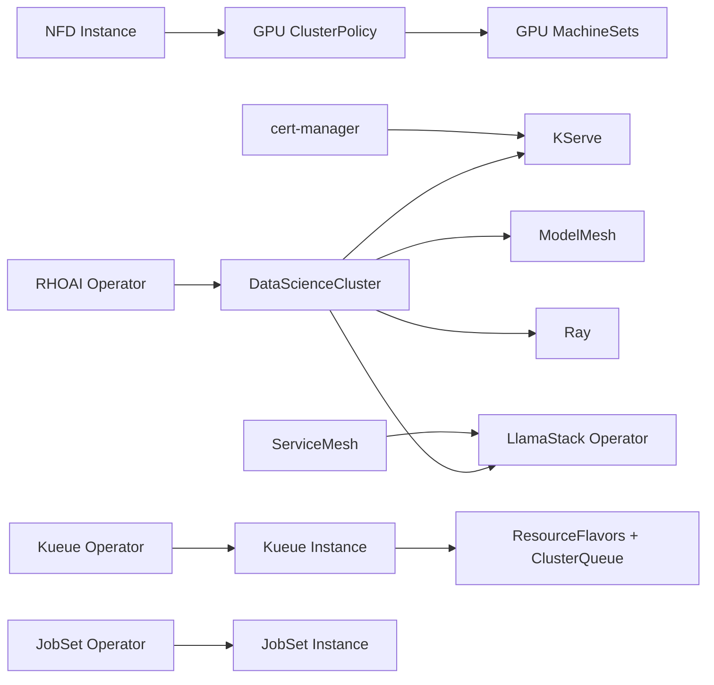

# Architecture and GitOps Patterns

The repository implements a fully declarative, GitOps-driven installation of Red Hat OpenShift AI (RHOAI) 3.4 on OpenShift. The entire platform -- from GPU drivers to the RHOAI DataScienceCluster -- is expressed as Kubernetes manifests managed by ArgoCD via an **app-of-apps pattern**. Models, services, and training workloads are managed separately in the [rhoai-usecases](https://github.com/rrbanda/rhoai-usecases) companion repository.

## Repository Structure

```
rhoai-deploy-gitops/
├── bootstrap/                        # OpenShift GitOps (ArgoCD) operator install
├── clusters/                         # Per-cluster overlays (dev, prod, etc.)
│   ├── base/                         # Common: AppSets + ArgoCD projects
│   └── overlays/dev/
│       ├── bootstrap-app.yaml        # Self-managing app-of-apps
│       └── rhoai-instance-app.yaml   # DSC with ignoreDifferences
├── components/
│   ├── argocd/                       # ArgoCD projects and ApplicationSets
│   │   ├── apps/
│   │   │   ├── cluster-operators-appset.yaml
│   │   │   └── cluster-instances-appset.yaml
│   │   └── projects/
│   ├── operators/                    # OLM operator subscriptions
│   │   ├── cert-manager/
│   │   ├── servicemesh/
│   │   ├── nfd/
│   │   ├── gpu-operator/
│   │   ├── kueue-operator/
│   │   ├── jobset-operator/
│   │   ├── leader-worker-set/
│   │   ├── opentelemetry/
│   │   ├── tempo/
│   │   ├── cluster-observability-operator/
│   │   ├── custom-metrics-autoscaler/
│   │   ├── rhcl-operator/
│   │   └── rhoai-operator/
│   └── instances/                    # Operator instance CRs
│       ├── nfd-instance/
│       ├── gpu-instance/
│       ├── gpu-workers/              # GPU MachineSets + MachineAutoscalers
│       ├── cluster-autoscaler/
│       ├── kueue-instance/
│       ├── kueue-config/             # ResourceFlavors + ClusterQueue
│       ├── jobset-instance/
│       ├── dashboard-config/         # Enables GenAI Studio in RHOAI dashboard
│       ├── mcp-servers/              # Registers MCP servers in RHOAI dashboard
│       ├── mlflow-instance/          # MLflow tracking server
│       └── rhoai-instance/           # DataScienceCluster (DSC) with composable overlays
│           ├── base/                 # Minimal DSC (Dashboard only)
│           └── overlays/             # dev, minimal, serving, training, full
```

!!! warning "Using a fork? Update the repo URL"
    All ArgoCD manifests reference `https://github.com/rrbanda/rhoai-deploy-gitops.git`. If you forked this repo, run `./setup.sh --repo <your-repo-url>` to update all `repoURL` references, or manually update them in the files listed in `clusters/overlays/dev/`, `components/argocd/apps/`, and `components/argocd/projects/base/`. See the [Quick Start](quickstart.md).

## App-of-Apps Pattern

The installation requires exactly **two** manual commands. After that, Git becomes the single source of truth.


```mermaid
graph TD
  subgraph bootstrap ["Phase 1: Bootstrap"]
    Human["oc apply -k bootstrap/"] --> GitOpsOp["OpenShift GitOps Operator"]
    GitOpsOp --> ArgoCD["ArgoCD Instance"]
  end

  subgraph appOfApps ["Phase 2: App-of-Apps"]
    Human2["oc apply -k clusters/overlays/dev/"] --> BootstrapApp["cluster-bootstrap App"]
    BootstrapApp --> OperatorsAppSet["cluster-operators AppSet"]
    BootstrapApp --> InstancesAppSet["cluster-instances AppSet"]
    BootstrapApp --> RhoaiApp["instance-rhoai App"]
  end

  subgraph operators ["Phase 3: Operators (10)"]
    OperatorsAppSet --> CertMgr["cert-manager"]
    OperatorsAppSet --> ServiceMesh["ServiceMesh"]
    OperatorsAppSet --> NFDOp["NFD ¹"]
    OperatorsAppSet --> GPUOp["GPU Operator ¹"]
    OperatorsAppSet --> KueueOp["Kueue"]
    OperatorsAppSet --> JobSetOp["JobSet"]
    OperatorsAppSet --> LWSop["Leader Worker Set"]
    OperatorsAppSet --> OTelOp["OpenTelemetry"]
    OperatorsAppSet --> TempoOp["Tempo"]
    OperatorsAppSet --> RHOAIOp["RHOAI Operator"]
  end

  subgraph instances ["Phase 4: Instances"]
    InstancesAppSet --> NFDInst["NFD Instance"]
    InstancesAppSet --> ClusterAS["ClusterAutoscaler"]
    InstancesAppSet --> KueueInst["Kueue Instance"]
    InstancesAppSet --> KueueCfg["Kueue Config"]
    InstancesAppSet --> JobSetInst["JobSet Instance"]
    InstancesAppSet --> DashConfig["Dashboard Config"]
    InstancesAppSet --> McpServers["MCP Servers"]
    InstancesAppSet --> MlflowInst["MLflow Instance"]
    RhoaiApp --> DSC["DataScienceCluster"]
  end

  subgraph platform ["Phase 5: RHOAI Platform"]
    DSC --> Dashboard["Dashboard"]
    DSC --> KServe["KServe"]
    DSC --> ModelMesh["ModelMesh"]
    DSC --> Ray["Ray/KubeRay"]
    DSC --> TrainOp["Training Operator"]
    DSC --> Pipelines["DS Pipelines"]
    DSC --> Registry["Model Registry"]
    DSC --> TrustyAI["TrustyAI"]
    DSC --> CodeFlare["CodeFlare"]
    DSC --> LlamaStack["LlamaStack"]
  end
```

!!! note "¹ NFD and GPU Operator"
    NFD and GPU Operator are excluded from the `cluster-operators` ApplicationSet and managed via explicit Applications. Similarly, `gpu-instance` and `gpu-workers` are excluded from `cluster-instances`.

## ApplicationSet Auto-Discovery

Two `ApplicationSet` resources use **Git directory generators** to auto-discover content:

| ApplicationSet | Discovers | Excludes | Naming Pattern |
|---------------|-----------|----------|---------------|
| `cluster-operators` | `components/operators/*` | `nfd`, `gpu-operator` | `operator-<dirname>` |
| `cluster-instances` | `components/instances/*` | `rhoai-instance`, `gpu-instance`, `gpu-workers` | `instance-<dirname>` |

Adding a new directory under `components/operators/` or `components/instances/` and pushing to Git automatically creates a new ArgoCD Application.

!!! info "Models and services"
    Model and service ApplicationSets (`cluster-models`, `cluster-services`) have moved to the [rhoai-usecases](https://github.com/rrbanda/rhoai-usecases) companion repository.

## Dependency Chain


```mermaid
graph LR
  CertMgr["cert-manager"] --> KServe["KServe"]
  ServiceMesh["ServiceMesh"] --> LlamaStackOp["LlamaStack Operator"]
  NFD["NFD Instance"] --> GPU["GPU ClusterPolicy"]
  GPU --> GPUWorkers["GPU MachineSets"]
  RHOAIOp["RHOAI Operator"] --> DSC["DataScienceCluster"]
  DSC --> KServe
  DSC --> ModelMesh["ModelMesh"]
  DSC --> Ray["Ray"]
  DSC --> LlamaStackOp
  KueueOp["Kueue Operator"] --> KueueInst["Kueue Instance"]
  KueueInst --> KueueCfg["ResourceFlavors + ClusterQueue"]
  JobSetOp["JobSet Operator"] --> JobSetInst["JobSet Instance"]
```

## Why RHOAI Instance Is Handled Separately

The `rhoai-instance` is **excluded** from the `cluster-instances` ApplicationSet and given its own explicit Application because:

1. **Operator mutation** -- The RHOAI operator enriches the DSC's `.spec.components.*` with additional sub-fields. ArgoCD would see these as drift.
2. **Status drift** -- The `/status` field is constantly updated by the operator.
3. **No pruning** -- `prune: false` prevents ArgoCD from deleting operator-created resources.
4. **`RespectIgnoreDifferences=true`** -- Combined with 11 `jsonPointers` ignoring operator-managed paths.

## External Dependencies

- **[redhat-cop/gitops-catalog](https://github.com/redhat-cop/gitops-catalog)** -- Kustomize bases for 4 operators (cert-manager, NFD, GPU, RHOAI). Referenced via HTTPS URLs in `kustomization.yaml` files.
- **OLM (Operator Lifecycle Manager)** -- Built into OpenShift; handles operator installation from Subscriptions.
- **RHOAI operator** -- When the DSC is created, the RHOAI operator installs ~10 sub-operators (KServe, Knative, Service Mesh, Authorino, etc.) internally. These are not declared in this repo.
- **[rhoai-usecases](https://github.com/rrbanda/rhoai-usecases)** -- Companion repository for model deployments, application services, and training workloads. Has its own ArgoCD ApplicationSets and AppProject.

## Operators

Thirteen operators are installed via OLM Subscriptions:

| Operator | Source | Channel | Purpose |
|----------|--------|---------|---------|
| cert-manager | redhat-cop catalog | `stable-v1` | TLS for KServe/Knative |
| ServiceMesh | Red Hat catalog | `stable` | Required for LlamaStack |
| NFD | redhat-cop catalog | `stable` | GPU node feature labels |
| GPU Operator | redhat-cop catalog | `stable` | NVIDIA drivers + toolkit |
| Kueue | Custom subscription | `stable-v1.2` | GPU quota management |
| JobSet | Custom subscription | `stable-v1.0` | Kubeflow Trainer v2 dependency |
| Leader Worker Set | Red Hat catalog | `stable` | llm-d / distributed inference |
| OpenTelemetry | Red Hat catalog | `stable` | Distributed tracing (Tech Preview) |
| Tempo | Red Hat catalog | `stable` | Trace storage backend (Tech Preview) |
| Cluster Observability Operator | Red Hat catalog | `stable` | Metrics, alerting, dashboards (Tech Preview) |
| Custom Metrics Autoscaler | Red Hat catalog | `stable` | KEDA-based HPA autoscaling (Tech Preview) |
| Red Hat Connectivity Link | Red Hat catalog | `stable` | Gateway API for llm-d (Tech Preview) |
| **RHOAI** | redhat-cop catalog + patch | **`fast-3.x`** | The core AI platform |

The RHOAI operator uses a Kustomize patch (`components/operators/rhoai-operator/patch-channel.yaml`) to override the channel to `fast-3.x`, required for RHOAI 3.4.
