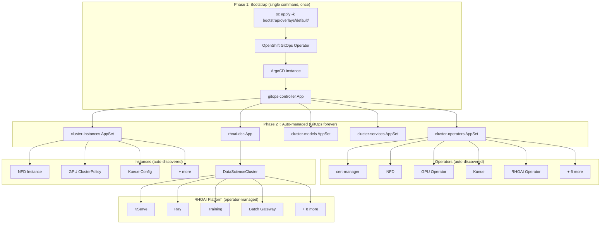
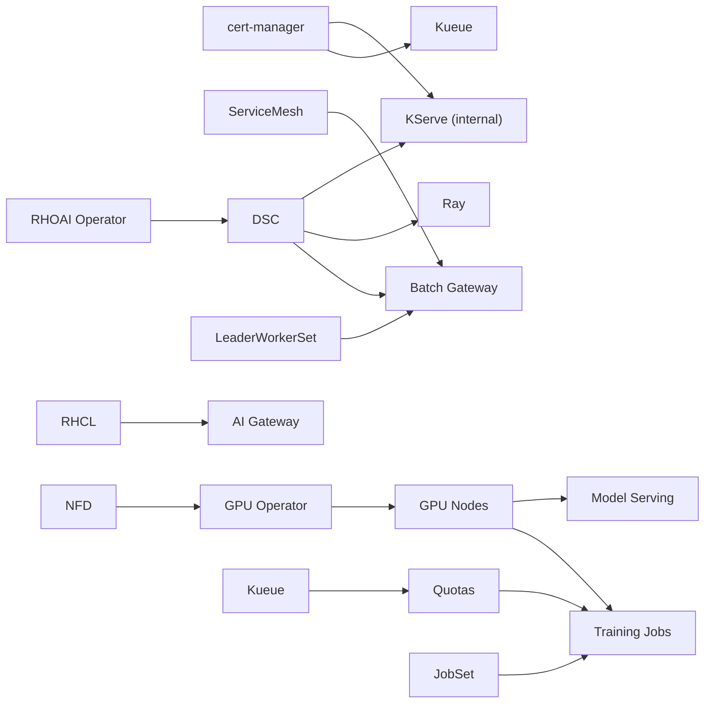

# Architecture and Repository Structure

This repository implements a fully declarative, GitOps-driven installation of Red Hat OpenShift AI (RHOAI) 3.5 on OpenShift. The entire platform -- from GPU drivers to AI model serving -- is expressed as Kubernetes manifests managed by ArgoCD via an **app-of-apps pattern**.

!!! tip "New to these concepts?"
    If terms like "app-of-apps", "ApplicationSet", or "Kustomize overlay" are unfamiliar, read the [Concepts](concepts/index.md) section first. This page assumes familiarity with those foundations.

## Repository Structure

```
rhoai-deploy-gitops/
├── bootstrap/                          # ← SINGLE ENTRY POINT
│   ├── base/                           # OpenShift GitOps operator + RBAC
│   └── overlays/default/
│       ├── kustomization.yaml          # Aggregates everything + Kustomize replacements
│       ├── argocd-instance.yaml        # ArgoCD CR configuration
│       ├── cluster-config.yaml         # ← THE ONLY FILE YOU EDIT
│       └── gitops-controller.yaml      # Self-management (ArgoCD manages itself)
├── components/
│   ├── argocd/
│   │   ├── applicationsets/            # Auto-discovery ApplicationSets
│   │   │   ├── cluster-operators-appset.yaml
│   │   │   ├── cluster-instances-appset.yaml
│   │   │   ├── cluster-models-appset.yaml
│   │   │   └── cluster-services-appset.yaml
│   │   ├── projects/                   # AppProject definitions (platform, usecases)
│   │   └── apps/                       # Standalone Applications (DSC)
│   ├── operators/                      # OLM operator subscriptions
│   │   ├── cert-manager/
│   │   ├── servicemesh/
│   │   ├── nfd/
│   │   ├── gpu-operator/
│   │   ├── kueue-operator/
│   │   ├── jobset-operator/
│   │   ├── lws-operator/
│   │   ├── cma-operator/
│   │   ├── ai-gateway-operator/
│   │   ├── rhcl-operator/
│   │   └── rhoai-operator/
│   └── instances/                      # Operator instance CRs
│       ├── nfd-instance/
│       ├── gpu-instance/
│       ├── gpu-workers/                # GPU MachineSets (cloud-specific examples)
│       ├── cluster-autoscaler/
│       ├── kueue-instance/
│       ├── kueue-config/               # ResourceFlavors + ClusterQueue
│       ├── jobset-instance/
│       ├── dashboard-config/
│       └── rhoai-instance/             # DataScienceCluster with composable overlays
│           ├── base/                   # Minimal DSC (Dashboard only)
│           └── overlays/               # dev, minimal, serving, training, full, maas
├── usecases/
│   ├── models/                         # Model deployments
│   └── services/                       # AI application services
├── docs/                               # This documentation site (MkDocs)
├── scripts/configure.sh                            # One-time configuration script
├── mkdocs.yml                          # Documentation configuration
└── .github/workflows/                  # CI/CD (validation + docs deployment)
```

## The Parameterization Layer

A key design decision: **no hardcoded repository URLs or branch names** exist in any ArgoCD manifest. Instead, a single configuration file drives everything:

```yaml
# bootstrap/overlays/default/cluster-config.yaml
apiVersion: v1
kind: ConfigMap
metadata:
  name: cluster-gitops-config
data:
  repoURL: "https://github.com/YOUR-ORG/rhoai-deploy-gitops.git"
  targetRevision: "main"
```

Kustomize **replacements** in `bootstrap/overlays/default/kustomization.yaml` inject these values into every Application and ApplicationSet at build time. This means:

- Fork the repo, run `./scripts/configure.sh`, and all references update automatically
- Switch branches by editing one field
- No find-and-replace across dozens of files

## App-of-Apps Deployment Flow


```mermaid
graph TD
  subgraph bootstrap ["Phase 1: Bootstrap (single command, once)"]
    Human["oc apply -k bootstrap/overlays/default/"] --> GitOpsOp["OpenShift GitOps Operator"]
    GitOpsOp --> ArgoCD["ArgoCD Instance"]
    ArgoCD --> BootstrapApp["gitops-controller App"]
  end

  subgraph autoManaged ["Phase 2+: Auto-managed (GitOps forever)"]
    BootstrapApp --> OperatorsAS["cluster-operators AppSet"]
    BootstrapApp --> InstancesAS["cluster-instances AppSet"]
    BootstrapApp --> ModelsAS["cluster-models AppSet"]
    BootstrapApp --> ServicesAS["cluster-services AppSet"]
    BootstrapApp --> DSCApp["rhoai-dsc App"]
  end

  subgraph operators ["Operators (auto-discovered)"]
    OperatorsAS --> CertMgr["cert-manager"]
    OperatorsAS --> NFDOp["NFD"]
    OperatorsAS --> GPUOp["GPU Operator"]
    OperatorsAS --> KueueOp["Kueue"]
    OperatorsAS --> RHOAIOp["RHOAI Operator"]
    OperatorsAS --> MoreOps["+ 6 more"]
  end

  subgraph instances ["Instances (auto-discovered)"]
    InstancesAS --> NFDInst["NFD Instance"]
    InstancesAS --> GPUInst["GPU ClusterPolicy"]
    InstancesAS --> KueueInst["Kueue Config"]
    InstancesAS --> MoreInst["+ more"]
    DSCApp --> DSC["DataScienceCluster"]
  end

  subgraph platform ["RHOAI Platform (operator-managed)"]
    DSC --> KServe["KServe"]
    DSC --> Ray["Ray"]
    DSC --> Training["Training"]
    DSC --> BatchGW["Batch Gateway"]
    DSC --> MoreComp["+ 8 more"]
  end
```

After Phase 2, you never run `oc apply` again. Git becomes the interface.

## ApplicationSet Auto-Discovery

Four ApplicationSets use Git directory generators to discover content automatically:

| ApplicationSet | Scans Path | Creates | Naming |
|---------------|-----------|---------|--------|
| `cluster-operators` | `components/operators/*/` | Operator subscriptions | `operator-<dirname>` |
| `cluster-instances` | `components/instances/*/` | Operator instance CRs | `instance-<dirname>` |
| `cluster-models` | `usecases/models/*/profiles/tier1-minimal/` | Model serving deployments | `model-<dirname>` |
| `cluster-services` | `usecases/services/*/profiles/tier1-minimal/` | AI applications | `service-<dirname>` |

**To add a new component:** Create a directory, push to Git. ArgoCD discovers it and creates an Application automatically. No manual configuration.

## Dependency Chain

Resources must be installed in order. ArgoCD handles this through retry policies -- if a resource fails because its CRD does not exist yet, ArgoCD retries until the dependency is installed.


```mermaid
graph LR
  CertMgr["cert-manager"] --> KServe["KServe (internal)"]
  CertMgr --> Kueue["Kueue"]
  ServiceMesh["ServiceMesh"] --> BatchGW["Batch Gateway"]
  NFD["NFD"] --> GPU["GPU Operator"]
  GPU --> GPUNodes["GPU Nodes"]
  GPUNodes --> Serving["Model Serving"]
  GPUNodes --> Training["Training Jobs"]
  LWS["LeaderWorkerSet"] --> BatchGW
  RHCL["RHCL"] --> AIGateway["AI Gateway"]
  RHOAIOp["RHOAI Operator"] --> DSC["DSC"]
  DSC --> KServe
  DSC --> Ray["Ray"]
  DSC --> BatchGW
  KueueOp["Kueue"] --> KueueCfg["Quotas"]
  KueueCfg --> Training
  JobSet["JobSet"] --> Training
```

## Operators Deployed

| Operator | Channel | Purpose | Required For |
|----------|---------|---------|-------------|
| cert-manager | `stable-v1` | TLS certificates | KServe, Kueue, training |
| ServiceMesh 3 | `stable` | Service mesh for batch gateway | Batch inference |
| NFD | `stable` | GPU node detection | GPU workloads |
| GPU Operator | `stable` | NVIDIA drivers + toolkit | GPU workloads |
| Kueue | `stable-v1` | GPU quota management | Training |
| JobSet | (default) | Multi-pod job orchestration | Training |
| LeaderWorkerSet | `stable` | Leader-worker topology | Distributed inference |
| CMA/KEDA | `stable` | Custom metrics autoscaling | Auto-scaling |
| AI Gateway | `beta` | API gateway for models | MaaS |
| RHCL | `stable` | Connectivity link | AI Gateway |
| **RHOAI** | `beta` | Core AI platform | Everything |

## Why the DSC Has Its Own Application

The DataScienceCluster is excluded from the `cluster-instances` ApplicationSet and managed by a dedicated Application (`rhoai-dsc`). This is because:

1. **Operator mutation** -- RHOAI enriches the DSC with sub-fields not in Git
2. **No pruning** -- `prune: false` prevents deleting operator-created resources
3. **ignoreDifferences** -- Suppresses false drift from operator-managed fields
4. **Replace sync** -- Uses `Replace=true` instead of three-way merge to avoid null-field conflicts

See [Sync Configuration](reference/sync-config.md) for the full list of `ignoreDifferences` rules.

## External Dependencies

| Dependency | Referenced How | Purpose |
|-----------|--------------|---------|
| [redhat-cop/gitops-catalog](https://github.com/redhat-cop/gitops-catalog) | HTTPS URL in kustomization.yaml | Base manifests for cert-manager, NFD, GPU, RHOAI operators |
| OLM (built into OpenShift) | Subscriptions | Operator installation |
| RHOAI operator (internal) | DSC reconciliation | Installs KServe, Knative, Authorino, etc. |
