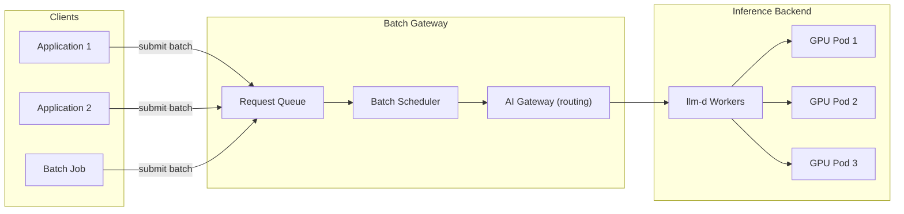
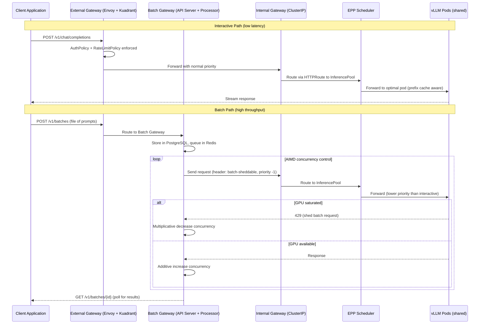

# Batch Inference

Batch inference processes large volumes of requests asynchronously, optimizing for throughput rather than latency. RHOAI introduces the **Batch Gateway** powered by llm-d, which queues inference requests and processes them efficiently using available GPU capacity.

!!! info "Default State"
    **Enabled in:** `full`, `dev` overlays.  
    **Disabled in:** `minimal`, `serving`, `training`, `maas` overlays.  
    To change, edit `rhoaiOverlay` in `cluster-config.yaml` or create a [custom overlay](../concepts/kustomize-overlays.md).

## When to Use Batch vs. Real-Time

| Characteristic | Real-Time (KServe) | Batch (Batch Gateway) |
|---------------|-------------------|----------------------|
| **Latency target** | Milliseconds to seconds | Minutes to hours |
| **Use case** | Chat, interactive apps | Document processing, evaluations, bulk scoring |
| **Scaling model** | Scale up replicas immediately | Queue requests, process when GPUs available |
| **Cost optimization** | Pays for idle capacity | Maximizes GPU utilization |
| **Request volume** | Low to moderate, steady | High volume, bursty |

**Use batch inference when:**

- You have thousands of documents to process overnight
- You are running model evaluations across large datasets
- You want to maximize GPU utilization during off-peak hours
- Latency is not critical (results within hours, not seconds)

## Architecture



## Dependencies

| Requirement | Type | Purpose |
|-------------|------|---------|
| RHOAI Operator | Operator | Core platform |
| cert-manager | Operator | TLS for internal communication |
| ServiceMesh 3 | Operator | Service routing for batch gateway |
| LeaderWorkerSet (LWS) | Operator | Leader-worker topology for llm-d |
| DSC `batchGateway: Managed` | DSC component | Enables batch inference |

## Enable It

Set `batchGateway.managementState` to `Managed` in your DSC:

```yaml
spec:
  components:
    batchGateway:
      managementState: Managed
```

This is already enabled in the `full`, `dev`, and `maas` overlays.

## Deploy

=== "GitOps"

    Batch inference is enabled automatically when using the `full` or `maas` DSC overlay. The required operators (ServiceMesh, LWS) are installed via the `cluster-operators` ApplicationSet.

=== "Manual"

    ```bash
    # 1. Install required operators
    oc apply -k components/operators/cert-manager/
    oc apply -k components/operators/servicemesh/
    oc apply -k components/operators/lws/
    oc apply -k components/operators/rhoai-operator/

    # 2. Wait for operators
    watch "oc get csv -A | grep -E 'cert-manager|servicemesh|lws|rhods'"

    # 3. Deploy DSC with batch gateway enabled
    oc apply -k components/instances/rhoai-instance/overlays/full/
    ```

## Verify

```bash
# AI Gateway operator running
oc get pods -n redhat-ods-applications -l app=ai-gateway-operator

# Batch gateway controller running
oc get pods -n redhat-ods-applications -l app=llm-d-batch-gateway-operator

# Check DSC component status
oc get datasciencecluster default-dsc -o jsonpath='{.status.components.batchGateway}'
```

## How It Works

1. **Client submits a batch** -- A set of prompts/requests sent to the batch endpoint
2. **Gateway queues requests** -- The AI Gateway accepts and queues them
3. **Scheduler optimizes** -- llm-d batches requests for optimal GPU utilization (continuous batching)
4. **Workers process** -- GPU pods process batches in parallel
5. **Results collected** -- Responses are gathered and returned to the client

The batch gateway uses **continuous batching** -- new requests are added to in-flight batches as previous tokens complete, maximizing GPU memory and compute utilization.

### Request Lifecycle (Interactive vs. Batch)

The same vLLM pods serve both interactive and batch traffic. The dual-gateway architecture ensures batch never starves interactive requests:



## Known Considerations

!!! warning "Memory requirements"
    The AI Gateway operator and llm-d batch gateway controller may need elevated memory limits. The GitOps manifests include a PostSync hook that patches memory to 1Gi and 512Mi respectively. If you see OOMKilled pods, check the memory limits on these deployments.

!!! info "ServiceMesh 3 required"
    Batch gateway uses ServiceMesh 3 (Istio-based) for request routing. This is a different operator from the deprecated ServiceMesh 2.x. Ensure `servicemeshoperator3` (not `servicemeshoperator`) is installed.
