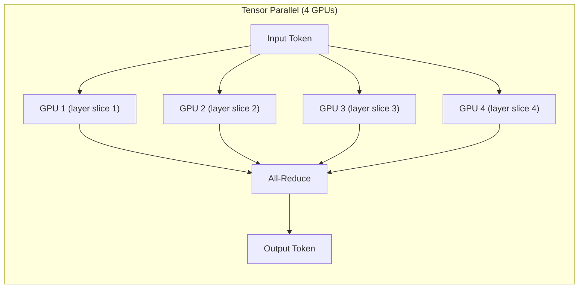
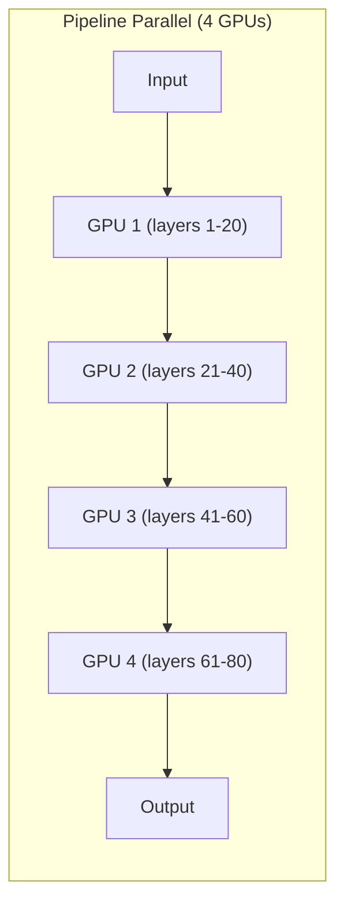
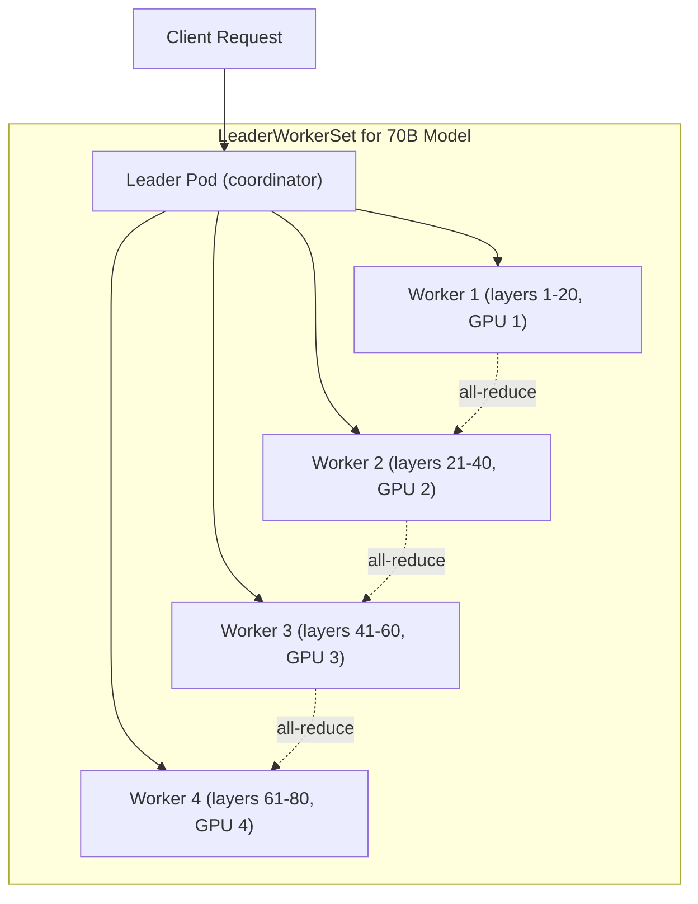

# Distributed Inference

Distributed inference splits a single large model across multiple GPUs or nodes, enabling you to serve models that do not fit in a single GPU's memory. RHOAI provides this through the `kserve` component (advanced features), which uses the **llm-d** framework for tensor parallelism and pipeline parallelism.

!!! info "Default State"
    **Enabled in:** `full`, `serving`, `maas`, `dev` overlays.  
    **Disabled in:** `minimal`, `training` overlays.  
    To change, edit `rhoaiOverlay` in `cluster-config.yaml` or create a [custom overlay](../concepts/kustomize-overlays.md).

## When You Need Distributed Inference

| Scenario | Single GPU | Distributed |
|----------|-----------|-------------|
| 7B parameter model (14 GB) | Works on 1x L4 (24 GB) | Not needed |
| 70B parameter model (140 GB) | Does not fit | 4x L40S (48 GB each) with tensor parallelism |
| 120B+ MoE model | Does not fit | 4+ GPUs with tensor + pipeline parallelism |
| Low-latency requirements for large models | N/A | Reduces per-token latency via parallelism |

## Parallelism Strategies

### Tensor Parallelism (TP)

Splits individual layers across GPUs. Each GPU holds a slice of every layer and they communicate during forward passes.



**Best for:** Reducing latency on a single node with multiple GPUs connected by NVLink.

### Pipeline Parallelism (PP)

Splits the model by layers across GPUs. Each GPU processes a subset of layers sequentially.



**Best for:** Models that span multiple nodes where inter-node bandwidth is limited.

### Combined (TP + PP)

For very large models, combine both: tensor parallelism within a node (fast NVLink) and pipeline parallelism across nodes (slower network).

## Dependencies

| Requirement | Type | Purpose |
|-------------|------|---------|
| RHOAI Operator | Operator | Core platform |
| cert-manager | Operator | TLS certificates |
| LeaderWorkerSet (LWS) | Operator | Manages leader-worker pod groups |
| RHCL | Operator | Connectivity for distributed pods |
| DSC `kserve: Managed` | DSC component | Enables distributed inference (via kserve sub-fields) |
| GPU Infrastructure | Operators + Instances | Multi-GPU nodes |

!!! warning "OpenShift 4.20+ required"
    Distributed inference with llm-d requires OpenShift 4.20 or later for the LeaderWorkerSet API.

## Enable It

Distributed inference is managed via the `kserve` component. Ensure `kserve` is set to `Managed`:

```yaml
spec:
  components:
    kserve:
      managementState: Managed
```

This is enabled in the `full`, `serving`, `maas`, and `dev` overlays.

## Deploy

=== "GitOps"

    Distributed inference is enabled automatically when using the `full` DSC overlay. The LWS and RHCL operators are installed via the `cluster-operators` ApplicationSet.

=== "Manual"

    ```bash
    # Install required operators
    oc apply -k components/operators/cert-manager/
    oc apply -k components/operators/lws/
    oc apply -k components/operators/rhcl/
    oc apply -k components/operators/rhoai-operator/

    # Deploy DSC with kserve enabled (includes distributed inference)
    oc apply -k components/instances/rhoai-instance/overlays/full/
    ```

## How llm-d Works

llm-d is the distributed inference framework used by RHOAI. It manages:

1. **Model sharding** -- Splits model weights across GPUs based on TP/PP configuration
2. **KV cache management** -- Coordinates key-value caches across distributed workers
3. **Request routing** -- Routes incoming requests to the appropriate worker group
4. **Health monitoring** -- Detects and handles worker failures

### LeaderWorkerSet Pattern

Each distributed model deployment creates a LeaderWorkerSet:

- **Leader pod** -- Coordinates inference, receives requests, returns responses
- **Worker pods** -- Hold model shards, perform computation, communicate with leader



## Example: Deploying a Large Model with TP=4

```yaml
apiVersion: serving.kserve.io/v1beta1
kind: InferenceService
metadata:
  name: llama-70b
  annotations:
    serving.kserve.io/deploymentMode: RawDeployment
spec:
  predictor:
    minReplicas: 1
    model:
      modelFormat:
        name: vLLM
      runtime: vllm-runtime
      storageUri: "pvc://model-weights/llama-70b"
      resources:
        requests:
          nvidia.com/gpu: "4"
        limits:
          nvidia.com/gpu: "4"
      args:
        - --tensor-parallel-size=4
```

The `--tensor-parallel-size=4` flag tells vLLM to shard the model across 4 GPUs using tensor parallelism.

## Verify

```bash
# Check LeaderWorkerSet resources
oc get leaderworkersets -A

# Verify all workers are running
oc get pods -l app=llama-70b -n my-namespace

# Check inference endpoint
oc get inferenceservice llama-70b -n my-namespace
```

## GPU Requirements by Model Size

| Model Size | Min GPUs | Recommended Setup | Memory per GPU |
|-----------|---------|-------------------|---------------|
| 7B | 1 | 1x L4 (24 GB) | 16 GB |
| 13B | 1 | 1x L40S (48 GB) | 28 GB |
| 34B | 2 | 2x L40S, TP=2 | 48 GB each |
| 70B | 4 | 4x L40S, TP=4 | 48 GB each |
| 120B+ MoE | 4+ | 4x L40S, TP=4 | 48 GB each |
