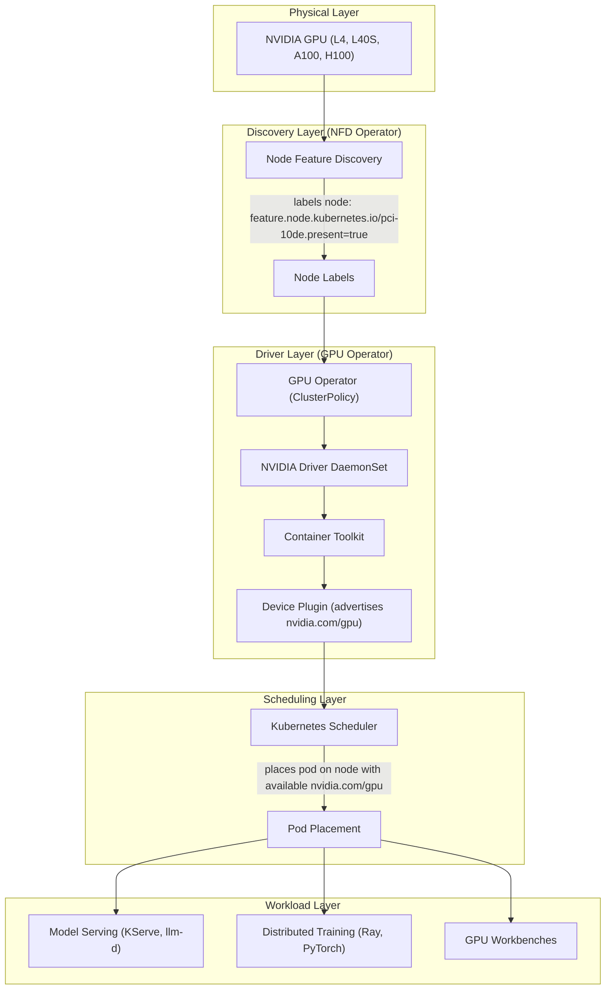
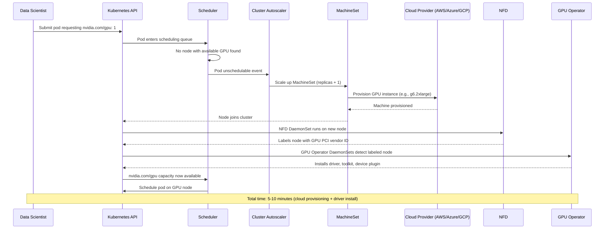

# GPU Infrastructure (NFD, GPU Operator, MachineSets)

GPU infrastructure provides the foundation for all GPU-accelerated workloads on OpenShift. This includes Node Feature Discovery (NFD) for detecting GPU hardware, the NVIDIA GPU Operator for installing drivers and container toolkit, and MachineSets for provisioning GPU worker nodes. Deploy this before any capability that requires GPU acceleration.

## How the GPU Stack Works

Each layer builds on the one below it. Without any layer, the layers above cannot function:



## Dependencies

| Requirement | Type | Path |
|-------------|------|------|
| NFD Operator | Operator | `components/operators/nfd/` |
| GPU Operator | Operator | `components/operators/gpu-operator/` |
| NFD Instance | Instance | `components/instances/nfd-instance/` |
| GPU Instance (ClusterPolicy) | Instance | `components/instances/gpu-instance/` |
| GPU Workers (MachineSets) | Instance | `components/instances/gpu-workers/` |
| Cluster Autoscaler | Instance | `components/instances/cluster-autoscaler/` |

NFD must be installed and running before the GPU Operator, as the GPU Operator
relies on NFD node labels to identify GPU hardware.

!!! warning "Cluster-specific configuration required"
    GPU worker provisioning is cloud-specific. Example MachineSet manifests are provided in `components/instances/gpu-workers/examples/aws/`. Copy and customize them for your cluster. See [Customizing for your cluster](#customizing-for-your-cluster) below.

## Deploy

=== "GitOps"

    GPU infrastructure is deployed automatically via ApplicationSet-discovered Applications:

    - `instance-nfd-instance` -- NFD NodeFeatureDiscovery CR
    - `instance-gpu-instance` -- GPU ClusterPolicy CR
    - GPU MachineSets + MachineAutoscalers (cloud-specific, not auto-deployed; see examples)
    - `instance-cluster-autoscaler` -- ClusterAutoscaler

    The operators (`operator-nfd`, `operator-gpu-operator`) are also auto-discovered.

=== "Manual"

    ```bash
    # 1. Install NFD operator and wait
    oc apply -k components/operators/nfd/
    oc get csv -n openshift-nfd | grep nfd

    # 2. Create NFD instance
    oc apply -k components/instances/nfd-instance/
    oc wait --for=jsonpath='{.status.conditions[0].type}'=Available \
      nodefeaturediscovery/nfd-instance -n openshift-nfd --timeout=300s

    # 3. Install GPU operator and wait
    oc apply -k components/operators/gpu-operator/
    oc get csv -n nvidia-gpu-operator | grep gpu

    # 4. Create GPU ClusterPolicy
    oc apply -k components/instances/gpu-instance/
    oc wait --for=jsonpath='{.status.state}'=ready \
      clusterpolicy/gpu-cluster-policy --timeout=600s

    # 5. Create GPU worker MachineSets (cloud-specific, use your cloud's example)
    oc apply -k components/instances/gpu-workers/examples/aws/

    # 6. (Optional) Create ClusterAutoscaler for auto-scaling
    oc apply -k components/instances/cluster-autoscaler/
    ```

## Verify

```bash
# NFD labels on nodes
oc get nodes -l feature.node.kubernetes.io/pci-10de.present=true

# GPU operator pods running
oc get pods -n nvidia-gpu-operator

# GPU devices available on nodes
oc describe node <gpu-node> | grep nvidia.com/gpu

# MachineSet status
oc get machinesets -n openshift-machine-api | grep gpu
```

## GPU Worker Nodes

This repo provisions two types of GPU MachineSets on AWS:

| MachineSet | Instance Type | GPU | Use Case |
|------------|---------------|-----|----------|
| L4 workers | `g6.2xlarge` | NVIDIA L4 (24GB) | Inference, light training |
| L40S workers | `g6e.2xlarge` | NVIDIA L40S (48GB) | Heavy training, large models |

### Customizing for your cluster

The MachineSet manifests contain cluster-specific values. Update these fields
in `components/instances/gpu-workers/examples/aws/gpu-machineset-*.yaml`:

- `metadata.name` -- replace `ocp-2qkbk` with your cluster's infra ID
- `spec.template.spec.providerSpec.value.ami.id` -- your RHCOS AMI
- `spec.template.spec.providerSpec.value.iamInstanceProfile.id` -- your IAM profile
- `subnet`, `securityGroups`, `tags` -- your cluster's networking config

### Scaling

The following sequence shows what happens when a GPU workload is submitted but no GPU capacity exists:



**Manual scaling via Git:**

```bash
# Edit components/instances/gpu-workers/examples/aws/gpu-machineset-l4.yaml, set spec.replicas: 5
git commit -am "Scale L4 GPU workers to 5" && git push
```

**Auto-scaling** is configured via:
- `ClusterAutoscaler` -- cluster-wide limits (max 20 nodes, max 8 GPUs)
- `MachineAutoscaler` (L4) -- min: 1, max: 6 nodes
- `MachineAutoscaler` (L40S) -- min: 0, max: 4 nodes

When a pod requests `nvidia.com/gpu` and no capacity exists, nodes are
auto-provisioned. Idle nodes are removed after 10 minutes.

## Disable It

Remove GPU workers and instances in reverse order:

```bash
oc delete -k components/instances/cluster-autoscaler/
oc delete -k components/instances/gpu-workers/examples/aws/
oc delete clusterpolicy gpu-cluster-policy
oc delete nodefeaturediscovery nfd-instance -n openshift-nfd
oc delete sub gpu-operator-certified -n nvidia-gpu-operator
oc delete sub nfd -n openshift-nfd
```
