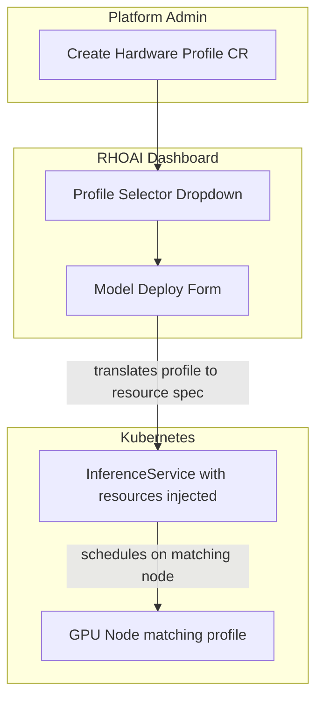

# Hardware Profiles

Hardware Profiles are RHOAI's abstraction for defining GPU resource bundles. Instead of requiring data scientists to know Kubernetes resource specs, node selectors, and tolerations, they select a named profile like "Large GPU (4x NVIDIA L40S)" from a dropdown in the Dashboard.

!!! info "Default State"
    **Available when:** Dashboard is enabled (all overlays except `minimal` include Dashboard via base).  
    Hardware Profiles are a Dashboard feature, not a standalone DSC component.  
    To change, edit `rhoaiOverlay` in `cluster-config.yaml` or create a [custom overlay](../concepts/kustomize-overlays.md).

## The Problem They Solve

Without Hardware Profiles:

```yaml
# Data scientists must know all of this:
resources:
  requests:
    nvidia.com/gpu: "4"
    cpu: "16"
    memory: "64Gi"
  limits:
    nvidia.com/gpu: "4"
    cpu: "32"
    memory: "128Gi"
nodeSelector:
  nvidia.com/gpu.product: NVIDIA-L40S
tolerations:
  - key: nvidia.com/gpu
    operator: Exists
    effect: NoSchedule
```

With Hardware Profiles, the same configuration is a single dropdown selection: **"4x L40S (Large)"**.

## How They Work

A Hardware Profile is a Kubernetes custom resource that bundles:

| Field | Purpose | Example |
|-------|---------|---------|
| Display name | What users see in the Dashboard | "4x NVIDIA L40S" |
| Description | Explains the use case | "Large language model inference, 192 GB GPU memory" |
| GPU count | Number of GPUs allocated | 4 |
| GPU type | Node selector for specific GPU | `nvidia.com/gpu.product: NVIDIA-L40S` |
| CPU/Memory | Compute resources | 16 CPU, 64 GiB |
| Tolerations | Allow scheduling on tainted GPU nodes | `nvidia.com/gpu` |
| Enabled | Whether this profile is available to users | true/false |

## Architecture



## Defining a Hardware Profile

Hardware Profiles are defined as custom resources in the `redhat-ods-applications` namespace:

```yaml
apiVersion: infrastructure.opendatahub.io/v1
kind: HardwareProfile
metadata:
  name: gpu-large-l40s
  namespace: redhat-ods-applications
spec:
  displayName: "4x NVIDIA L40S (Large)"
  description: "Large language model inference. 192 GB total GPU memory across 4 L40S GPUs."
  enabled: true
  identifiers:
    - displayName: "GPU"
      identifier: nvidia.com/gpu
      defaultCount: 4
      minCount: 1
      maxCount: 8
  nodeSelectors:
    nvidia.com/gpu.product: "NVIDIA-L40S"
  tolerations:
    - key: nvidia.com/gpu
      operator: Exists
      effect: NoSchedule
```

## Standard Profiles

Here are recommended profiles for common GPU configurations:

| Profile Name | GPUs | GPU Type | Use Case |
|-------------|------|----------|----------|
| Small (1x L4) | 1 | L4 (24 GB) | Small models (7B), notebooks |
| Medium (1x L40S) | 1 | L40S (48 GB) | Medium models (13B-34B) |
| Large (4x L40S) | 4 | L40S (48 GB) | Large models (70B, TP=4) |
| XLarge (4x A100) | 4 | A100 (80 GB) | Very large models, training |
| Training (8x A100) | 8 | A100 (80 GB) | Distributed training jobs |

## Deploy via GitOps

To manage Hardware Profiles via GitOps, add them to a dedicated directory:

```
components/instances/hardware-profiles/
├── kustomization.yaml
├── gpu-small-l4.yaml
├── gpu-medium-l40s.yaml
└── gpu-large-l40s.yaml
```

The `cluster-instances` ApplicationSet auto-discovers this directory and creates an ArgoCD Application to manage the profiles.

## Verify

```bash
# List available hardware profiles
oc get hardwareprofiles -n redhat-ods-applications

# Check a specific profile
oc describe hardwareprofile gpu-large-l40s -n redhat-ods-applications
```

In the RHOAI Dashboard, navigate to **Settings > Hardware Profiles** to see and manage profiles through the UI.

## Connection to Other Capabilities

- **Model Serving** -- When deploying a model via the Dashboard, select a Hardware Profile instead of manually specifying resources
- **MaaS** -- Platform admins use profiles to standardize how models are allocated across the organization
- **Workbenches** -- Data scientists select profiles when creating notebooks to get GPU access
- **Kueue** -- Hardware Profiles work with Kueue quotas -- the ClusterQueue still controls total GPU budget
