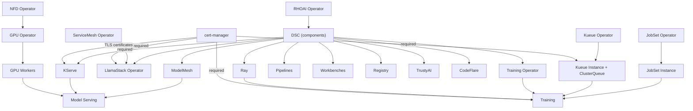

# Capabilities Guide

Red Hat OpenShift AI (RHOAI) is modular. Pick the capabilities you need, understand their dependencies, and deploy only what matters for your use case.

## Capability Map

| Capability | DataScienceCluster (DSC) Component | Required Operators | Required Instances | Guide |
|------------|---------------|--------------------|--------------------|-------|
| KServe Model Serving | `kserve` | rhoai-operator, cert-manager | rhoai-instance | [model-serving.md](model-serving.md) |
| ModelMesh Serving | `modelmeshserving` | rhoai-operator | rhoai-instance | [modelmesh.md](modelmesh.md) |
| Distributed Training | `ray`, `trainingoperator` | rhoai-operator, cert-manager, kueue-operator, jobset-operator | rhoai-instance, kueue-instance, jobset-instance | [training.md](training.md) |
| Data Science Pipelines | `datasciencepipelines` | rhoai-operator | rhoai-instance | [pipelines.md](pipelines.md) |
| Workbenches | `workbenches` | rhoai-operator | rhoai-instance | [workbenches.md](workbenches.md) |
| Model Registry | `modelregistry` | rhoai-operator | rhoai-instance, external MySQL 5.x+, S3 storage | [model-registry.md](model-registry.md) |
| GPU Infrastructure | N/A | nfd, gpu-operator | nfd-instance, gpu-instance, gpu-workers | [gpu-infrastructure.md](gpu-infrastructure.md) |
| Kueue (GPU Quotas) | `kueue` (Unmanaged) | kueue-operator, cert-manager | kueue-instance, kueue-config | [kueue.md](kueue.md) |

## Dependency Diagram



**Key takeaways:**

- Every capability requires the **RHOAI operator** and a **DataScienceCluster** (DSC)
- GPU Infrastructure (NFD + GPU Operator) is required for any GPU workload (model serving, training)
- Kueue is required for training workloads that need GPU quota management
- **JobSet** is required for distributed training (TrainJob depends on it)
- cert-manager is required for KServe (TLS via Knative), Kueue-based workloads (training), distributed inference (llm-d), and LlamaStack
- ServiceMesh Operator 3.x is required for LlamaStack
- Model Registry requires an external MySQL database (5.x+) and S3-compatible object storage
- Capabilities without GPU needs (Pipelines, Workbenches, Registry) can run on CPU-only clusters

!!! note "Additional RHOAI 3.3 capabilities not covered in this repo"
    The official RHOAI 3.3 documentation lists additional DSC components that this repository does not deploy or document in detail:

    - **`advancedkserve` (Distributed Inference with llm-d)** -- enables distributed model inference using the llm-d framework. Requires cert-manager, Red Hat Connectivity Link Operator, Red Hat Leader Worker Set Operator, and OpenShift 4.20+. Not included in this repo's manifests.
    - **`feastoperator` (Feature Store)** -- present in our base DSC as `Removed`. The Feast Operator provides a feature store for ML workloads. Enable it by setting `feastoperator.managementState: Managed` if needed.

## DSC Overlays -- Pick Your Profile

Instead of editing the DSC YAML directly, use a pre-built overlay:

| Overlay | Components Enabled | Use Case |
|---------|-------------------|----------|
| `overlays/minimal/` | Dashboard only | Exploration, start here |
| `overlays/serving/` | Dashboard, KServe, ModelMesh | Model serving only |
| `overlays/training/` | Dashboard, Ray, TrainingOperator | Distributed training only |
| `overlays/full/` | All 10 DSC components (see below) | Full platform |
| `overlays/dev/` | All 10 DSC components (same as full) | Development (current default) |

!!! info "What 'All components' means"
    The `full` and `dev` overlays enable: workbenches, kserve, ray, trainingoperator, modelregistry, trustyai, datasciencepipelines, modelmeshserving, codeflare, and llamastackoperator. The base DSC always keeps `dashboard` Managed and `kueue` Unmanaged (Red Hat Build of Kueue is deployed as a standalone operator).

### Deploy with an overlay

```bash
# GitOps: point the rhoai-instance ArgoCD app at your chosen overlay
# Manual:
oc apply -k components/instances/rhoai-instance/overlays/serving/
```

## Composing a Custom Profile

If the pre-built overlays don't match your needs, compose your own by stacking
JSON patches from the capability overlays.

**Example: serving + pipelines**

Create `components/instances/rhoai-instance/overlays/my-profile/kustomization.yaml`:

```yaml
apiVersion: kustomize.config.k8s.io/v1beta1
kind: Kustomization

resources:
  - ../../base

patches:
  - path: ../serving/patch-serving.yaml
    target:
      kind: DataScienceCluster
  - path: patch-pipelines.yaml
    target:
      kind: DataScienceCluster
```

And `patch-pipelines.yaml`:

```yaml
- op: replace
  path: /spec/components/datasciencepipelines/managementState
  value: Managed
```

Each capability overlay's patch file can be referenced from any custom overlay,
making profiles fully composable without duplication.

## Manual Installation Order

When deploying without ArgoCD, install in this order. The four phases must be
completed sequentially -- each phase depends on the previous one.

### Phase 1 -- Pre-RHOAI Operators

```bash
oc apply -k components/operators/cert-manager/       # Required for KServe, training, Kueue, LlamaStack
oc apply -k components/operators/servicemesh/         # Required for LlamaStack
oc apply -k components/operators/nfd/                 # Required for GPU
oc apply -k components/operators/gpu-operator/        # Required for GPU
oc apply -k components/operators/kueue-operator/      # Required for training
oc apply -k components/operators/jobset-operator/     # Required for training
oc apply -k components/operators/rhoai-operator/      # Always required

# Wait for all CSVs to reach Succeeded (re-run until all show Succeeded)
watch "oc get csv -A | grep -E 'cert-manager|servicemesh|nfd|gpu-operator|kueue|jobset|rhods'"

# IMPORTANT: Do NOT proceed until every CSV shows "Succeeded".
```

### Phase 2 -- Pre-DSC Instances (order matters)

```bash
oc apply -k components/instances/nfd-instance/        # NFD first (GPU depends on it)
oc apply -k components/instances/gpu-instance/         # GPU ClusterPolicy
oc apply -k components/instances/gpu-workers/examples/aws/  # GPU MachineSets (cloud-specific)
oc apply -k components/instances/cluster-autoscaler/   # Auto-scaling
oc apply -k components/instances/kueue-instance/       # Kueue
oc apply -k components/instances/kueue-config/         # GPU ResourceFlavors + ClusterQueue
oc apply -k components/instances/jobset-instance/      # JobSet
```

### Phase 3 -- DSC + Post-DSC Instances

```bash
# RHOAI DSC -- pick your overlay
oc apply -k components/instances/rhoai-instance/overlays/serving/

# Wait for DSC to be Ready before applying post-DSC instances
oc wait --for=jsonpath='{.status.conditions[?(@.type=="Ready")].status}'=True \
  datasciencecluster/default-dsc --timeout=600s

# Post-DSC instances (target the redhat-ods-applications namespace created by DSC)
oc apply -k components/instances/dashboard-config/     # Enables GenAI Studio in dashboard
oc apply -k components/instances/mcp-servers/           # Registers MCP servers in dashboard
```

### Phase 4 -- Use Cases (models before services)

```bash
# Deploy models first
oc apply -k usecases/models/orchestrator-8b/profiles/tier1-minimal/
oc apply -k usecases/models/qwen-math-7b/profiles/tier1-minimal/

# Deploy services (depend on model endpoints being reachable)
oc apply -k usecases/services/toolorchestra-app/profiles/tier1-minimal/
```

## Minimal Installs by Goal

**"I just want to serve a model"** -- install cert-manager, RHOAI operator, then
use the `serving` overlay. See [model-serving.md](model-serving.md).

**"I just want notebooks"** -- install RHOAI operator, use the `dev` or `full`
overlay (includes Dashboard + Workbenches). The `minimal` overlay only enables
Dashboard without Workbenches. See [workbenches.md](workbenches.md).

**"I need training"** -- install RHOAI, Kueue, JobSet, NFD, GPU operators,
their instances, then use the `training` overlay. See [training.md](training.md).

**"I want everything"** -- follow the [Quick Start](../quickstart.md)
with the `full` or `dev` overlay.
