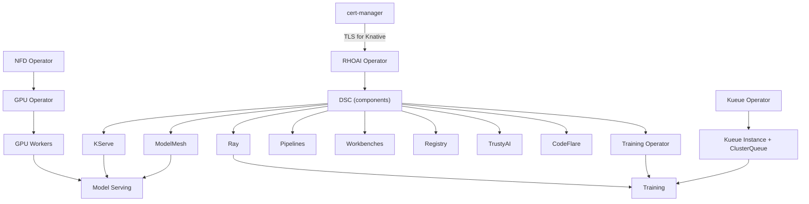

# RHOAI Capabilities Guide

Pick the capabilities you need, understand their dependencies, and deploy only what matters for your use case.

## Capability Map

| Capability | DSC Component | Required Operators | Required Instances | Guide |
|------------|---------------|--------------------|--------------------|-------|
| KServe Model Serving | `kserve` | rhoai-operator, cert-manager | rhoai-instance | [model-serving.md](model-serving.md) |
| ModelMesh Serving | `modelmeshserving` | rhoai-operator | rhoai-instance | [modelmesh.md](modelmesh.md) |
| Distributed Training | `ray`, `trainingoperator` | rhoai-operator, kueue-operator, jobset-operator | rhoai-instance, kueue-instance, jobset-instance | [training.md](training.md) |
| Data Science Pipelines | `datasciencepipelines` | rhoai-operator | rhoai-instance | [pipelines.md](pipelines.md) |
| Workbenches | `workbenches` | rhoai-operator | rhoai-instance | [workbenches.md](workbenches.md) |
| Model Registry | `modelregistry` | rhoai-operator | rhoai-instance | [model-registry.md](model-registry.md) |
| GPU Infrastructure | N/A | nfd, gpu-operator | nfd-instance, gpu-instance, gpu-workers | [gpu-infrastructure.md](gpu-infrastructure.md) |
| Kueue (GPU Quotas) | `kueue` (Unmanaged) | kueue-operator | kueue-instance, kueue-config | [kueue.md](kueue.md) |

## Dependency Diagram



**Key takeaways:**

- Every capability requires the **RHOAI operator** and a **DataScienceCluster** (DSC)
- GPU Infrastructure (NFD + GPU Operator) is required for any GPU workload (model serving, training)
- Kueue is required for training workloads that need GPU quota management
- cert-manager is required for KServe (provides TLS via Knative)
- Capabilities without GPU needs (Pipelines, Workbenches, Registry) can run on CPU-only clusters

## DSC Overlays -- Pick Your Profile

Instead of editing the DSC YAML directly, use a pre-built overlay:

| Overlay | Components Enabled | Use Case |
|---------|-------------------|----------|
| `overlays/minimal/` | Dashboard only | Exploration, start here |
| `overlays/serving/` | Dashboard, KServe, ModelMesh | Model serving only |
| `overlays/training/` | Dashboard, Ray, TrainingOperator | Distributed training only |
| `overlays/full/` | All components | Full platform |
| `overlays/dev/` | All components | Development (current default) |

### Deploy with an overlay

```bash
# GitOps: point the rhoai-instance ArgoCD app at your chosen overlay
# Manual:
oc apply -k components/instances/rhoai-instance/overlays/serving/
```

## Composing a Custom Profile

If the pre-built overlays don't match your needs, compose your own by stacking
JSON patches from the capability overlays.

**Example: serving + pipelines**

Create `components/instances/rhoai-instance/overlays/my-profile/kustomization.yaml`:

```yaml
apiVersion: kustomize.config.k8s.io/v1beta1
kind: Kustomization

resources:
  - ../../base

patches:
  - path: ../serving/patch-serving.yaml
    target:
      kind: DataScienceCluster
  - path: patch-pipelines.yaml
    target:
      kind: DataScienceCluster
```

And `patch-pipelines.yaml`:

```yaml
- op: replace
  path: /spec/components/datasciencepipelines/managementState
  value: Managed
```

Each capability overlay's patch file can be referenced from any custom overlay,
making profiles fully composable without duplication.

## Manual Installation Order

When deploying without ArgoCD, install in this order. Each step must complete
before moving to the next.

### 1. Operators (install all you need)

```bash
oc apply -k components/operators/cert-manager/       # Required for KServe
oc apply -k components/operators/nfd/                 # Required for GPU
oc apply -k components/operators/gpu-operator/        # Required for GPU
oc apply -k components/operators/kueue-operator/      # Required for training
oc apply -k components/operators/jobset-operator/     # Required for training
oc apply -k components/operators/rhoai-operator/      # Always required

# Wait for all CSVs
oc get csv -A | grep -E "cert-manager|nfd|gpu-operator|kueue|jobset|rhods"
```

### 2. Instances (order matters)

```bash
oc apply -k components/instances/nfd-instance/        # NFD first (GPU depends on it)
oc apply -k components/instances/gpu-instance/         # GPU ClusterPolicy
oc apply -k components/instances/gpu-workers/          # GPU MachineSets
oc apply -k components/instances/cluster-autoscaler/   # Auto-scaling
oc apply -k components/instances/kueue-instance/       # Kueue
oc apply -k components/instances/kueue-config/         # GPU ResourceFlavors + ClusterQueue
oc apply -k components/instances/jobset-instance/      # JobSet

# RHOAI DSC -- pick your overlay
oc apply -k components/instances/rhoai-instance/overlays/serving/
```

### 3. Use cases

```bash
oc apply -k usecases/toolorchestra/profiles/tier1-minimal/
```

## Minimal Installs by Goal

**"I just want to serve a model"** -- install cert-manager, RHOAI operator, then
use the `serving` overlay. See [model-serving.md](model-serving.md).

**"I just want notebooks"** -- install RHOAI operator, use the `minimal` overlay
(Dashboard + Workbenches). See [workbenches.md](workbenches.md).

**"I need training"** -- install RHOAI, Kueue, JobSet, NFD, GPU operators,
their instances, then use the `training` overlay. See [training.md](training.md).

**"I want everything"** -- follow the [Quick Start](../quickstart.md)
with the `full` or `dev` overlay.
