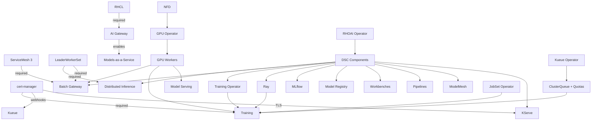

# Capabilities Guide

Red Hat OpenShift AI (RHOAI) 3.5 is modular. You choose which capabilities to enable, understand their dependencies, and deploy only what your use case requires. This guide helps you navigate the options.

## Capability Map

| Capability | DSC Component | Required External Operators | Guide |
|------------|--------------|---------------------------|-------|
| KServe Model Serving | `kserve` | cert-manager, RHOAI | [Model Serving](model-serving.md) |
| Batch Inference | `batchGateway` | cert-manager, ServiceMesh, LWS, RHOAI | [Batch Inference](batch-inference.md) |
| Distributed Inference | `advancedkserve` | cert-manager, LWS, RHCL, RHOAI | [Distributed Inference](distributed-inference.md) |
| ModelMesh Serving | `modelmeshserving` | RHOAI | [ModelMesh](modelmesh.md) |
| Distributed Training | `ray`, `trainingoperator` | cert-manager, Kueue, JobSet, RHOAI | [Training](training.md) |
| Data Science Pipelines | `datasciencepipelines` | RHOAI | [Pipelines](pipelines.md) |
| Workbenches | `workbenches` | RHOAI | [Workbenches](workbenches.md) |
| Model Registry | `modelregistry` | RHOAI | [Model Registry](model-registry.md) |
| Hardware Profiles | (Dashboard feature) | RHOAI | [Hardware Profiles](hardware-profiles.md) |
| Models-as-a-Service | (AI Gateway + Dashboard) | AI Gateway, RHCL, RHOAI | [MaaS](maas.md) |
| MLflow | `mlflowoperator` | RHOAI | [MLflow](mlflow.md) |
| GPU Infrastructure | N/A (external) | NFD, GPU Operator | [GPU Infrastructure](gpu-infrastructure.md) |
| Kueue (GPU Quotas) | `kueue: Unmanaged` | Kueue Operator, cert-manager | [Kueue](kueue.md) |

## Dependency Diagram


```mermaid
graph TD
  CertMgr["cert-manager"] -->|"TLS"| KServe["KServe"]
  CertMgr -->|"webhooks"| Kueue["Kueue"]
  CertMgr -->|"required"| Training["Training"]
  ServiceMesh["ServiceMesh 3"] -->|"required"| BatchGW["Batch Gateway"]
  LWS["LeaderWorkerSet"] -->|"required"| BatchGW
  LWS -->|"required"| DistInf["Distributed Inference"]
  RHCL["RHCL"] -->|"required"| AIGateway["AI Gateway"]
  AIGateway -->|"enables"| MaaS["Models-as-a-Service"]
  NFD["NFD"] --> GPU["GPU Operator"]
  GPU --> GPUNodes["GPU Workers"]
  GPUNodes --> Serving["Model Serving"]
  GPUNodes --> Training
  GPUNodes --> BatchGW
  RHOAI["RHOAI Operator"] --> DSC["DSC Components"]
  DSC --> KServe
  DSC --> ModelMesh["ModelMesh"]
  DSC --> Pipelines["Pipelines"]
  DSC --> Workbenches["Workbenches"]
  DSC --> Registry["Model Registry"]
  DSC --> MLflow["MLflow"]
  DSC --> Ray["Ray"]
  DSC --> TrainOp["Training Operator"]
  DSC --> BatchGW
  DSC --> DistInf
  KueueOp["Kueue Operator"] --> KueueCfg["ClusterQueue + Quotas"]
  KueueCfg --> Training
  JobSet["JobSet Operator"] --> Training
  Ray --> Training
  TrainOp --> Training
```

**Key dependencies to remember:**

- Every capability requires the **RHOAI operator** and a **DataScienceCluster**
- GPU Infrastructure (NFD + GPU Operator) is needed for any GPU workload
- **cert-manager** is needed for KServe (TLS), Kueue (webhooks), and training
- **Batch inference** requires ServiceMesh 3 and LeaderWorkerSet
- **AI Gateway / MaaS** requires Red Hat Connectivity Link
- Kueue is only required for training (not for serving)
- Capabilities without GPU needs (Pipelines, Workbenches, Registry) run on CPU-only clusters

## DSC Profiles

Instead of editing the DSC YAML directly, use a pre-built overlay that enables the right components:

| Profile | Components Enabled | Best For |
|---------|-------------------|----------|
| `overlays/minimal/` | Dashboard only | Exploration, getting started |
| `overlays/serving/` | Dashboard, KServe, ModelMesh | Teams focused on model inference |
| `overlays/training/` | Dashboard, Ray, Training Operator | Teams focused on model training |
| `overlays/maas/` | Dashboard, KServe, BatchGateway, AI Gateway | Platform teams offering MaaS |
| `overlays/full/` | All components | Complete AI platform |
| `overlays/dev/` | All components | Development and testing |

### Deploy a profile

=== "GitOps"

    Point the `rhoai-dsc` ArgoCD Application at your chosen overlay. Edit `cluster-config.yaml`:
    ```yaml
    data:
      rhoaiOverlay: "full"   # or: minimal, serving, training, maas
    ```

=== "Manual"

    ```bash
    oc apply -k components/instances/rhoai-instance/overlays/serving/
    ```

### Compose a custom profile

If no pre-built profile matches, compose your own by stacking patches. See [Kustomize and Overlays](../concepts/kustomize-overlays.md#composing-a-custom-profile) for a walkthrough.

## Installation Order

When deploying without ArgoCD, install in this order. Each phase depends on the previous.

### Phase 1: Operators

```bash
oc apply -k components/operators/cert-manager/
oc apply -k components/operators/servicemesh/
oc apply -k components/operators/nfd/
oc apply -k components/operators/gpu-operator/
oc apply -k components/operators/kueue-operator/
oc apply -k components/operators/jobset-operator/
oc apply -k components/operators/lws-operator/
oc apply -k components/operators/cma-operator/
oc apply -k components/operators/rhoai-operator/
```

!!! info "Why this order?"
    Operators are independent of each other at install time -- OLM handles them in parallel. However, installing RHOAI last ensures its dependencies (cert-manager, ServiceMesh) are already resolving.

### Phase 2: Instances (order matters)

```bash
oc apply -k components/instances/nfd-instance/        # NFD must label nodes before GPU Operator
oc apply -k components/instances/gpu-instance/         # GPU drivers on labeled nodes
oc apply -k components/instances/kueue-instance/       # Kueue controller
oc apply -k components/instances/kueue-config/         # Quotas and queues
oc apply -k components/instances/jobset-instance/      # JobSet for training
```

!!! info "Why this order?"
    NFD must label GPU nodes before the GPU Operator can install drivers. Kueue must be running before config (ClusterQueue) can be applied.

### Phase 3: DataScienceCluster

```bash
oc apply -k components/instances/rhoai-instance/overlays/full/
oc wait --for=jsonpath='{.status.conditions[?(@.type=="Ready")].status}'=True \
  datasciencecluster/default-dsc --timeout=600s
```

!!! info "Why wait?"
    The DSC triggers installation of internal sub-operators (KServe, Knative, Authorino). This takes 5-10 minutes. Subsequent steps depend on these being ready.

## Minimal Installs by Goal

| Goal | Install | Profile |
|------|---------|---------|
| "Just serve a model" | cert-manager + RHOAI | `serving` |
| "Just notebooks" | RHOAI only | `minimal` + workbenches patch |
| "Training with quotas" | cert-manager + Kueue + JobSet + NFD + GPU + RHOAI | `training` |
| "Full AI platform" | All operators | `full` |
| "MaaS for the org" | All operators + AI Gateway + RHCL | `maas` |
