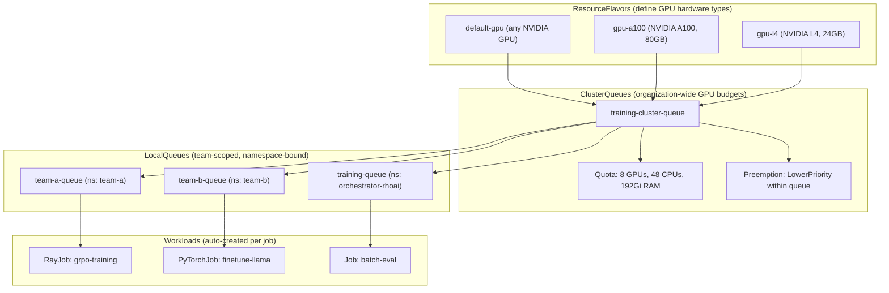
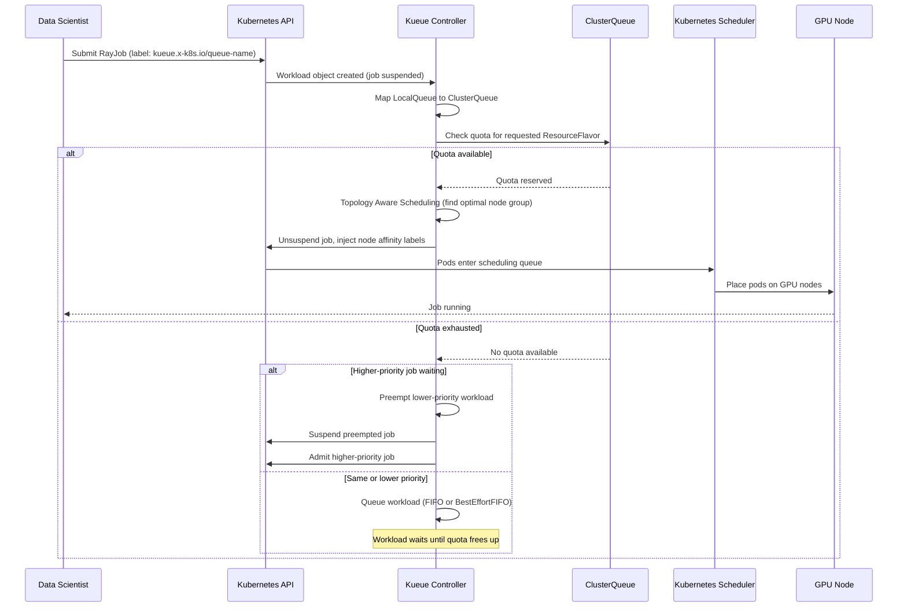

# GPU Quota Management with Kueue

Kueue provides job queuing and GPU quota management for OpenShift AI training workloads. It controls which jobs can run, how many GPUs they consume, and supports preemption for priority-based scheduling. Use Kueue when you need to share GPU resources across multiple teams or workloads with fair scheduling.

!!! info "Default State"
    **Included in:** `full`, `serving`, `training`, `maas`, `dev` overlays as `Unmanaged` (integrated with the standalone Red Hat build of Kueue Operator).  
    **Removed in:** `minimal` overlay.  
    To change, edit `rhoaiOverlay` in `cluster-config.yaml` or create a [custom overlay](../concepts/kustomize-overlays.md).

!!! warning "Managed state deprecated"
    The Managed state for Kueue is deprecated. RHOAI requires Unmanaged mode, which integrates with the standalone Red Hat build of Kueue Operator. See the [official documentation](https://docs.redhat.com/en/documentation/red_hat_openshift_ai_self-managed/3.5/html/managing_openshift_ai/managing-workloads-with-kueue).

## Dependencies

| Requirement | Type | Path |
|-------------|------|------|
| cert-manager Operator | Operator | `components/operators/cert-manager/` |
| Kueue Operator | Operator | `components/operators/kueue-operator/` |
| Kueue Instance | Instance | `components/instances/kueue-instance/` |
| Kueue Config (Flavors + Queue) | Instance | `components/instances/kueue-config/` |
| GPU Infrastructure | Operator + Instance | See [gpu-infrastructure.md](gpu-infrastructure.md) |

!!! info "cert-manager is required"
    The official RHOAI documentation lists cert-manager as a dependency for Kueue-based workloads. Install it before deploying the Kueue Operator.

## Why Standalone?

RHOAI includes a Kueue component in the DSC, but the standalone Red Hat
Build of Kueue Operator provides newer features and independent lifecycle
management. Setting `kueue: Unmanaged` in the DSC tells RHOAI not to install
its own Kueue -- the standalone operator takes over.

## Deploy

=== "GitOps"

    Kueue is deployed automatically via ApplicationSet-discovered Applications:

    - `operator-kueue-operator` -- Kueue subscription
    - `instance-kueue-instance` -- Kueue operator instance
    - `instance-kueue-config` -- ResourceFlavors + ClusterQueue

=== "Manual"

    ```bash
    # 1. Install Kueue operator
    oc apply -k components/operators/kueue-operator/
    oc get csv -n openshift-kueue-operator | grep kueue

    # 2. Create Kueue instance
    oc apply -k components/instances/kueue-instance/

    # 3. Create ResourceFlavors and ClusterQueue
    oc apply -k components/instances/kueue-config/
    ```

## Verify

```bash
# Kueue controller running
oc get pods -n openshift-kueue-operator

# ClusterQueue created
oc get clusterqueue training-cluster-queue

# ResourceFlavors created
oc get resourceflavors
```

## How It Works

Kueue uses a three-level resource hierarchy to manage GPU quotas across teams:



### ResourceFlavors

The default configuration uses a generic `default-gpu` ResourceFlavor that works with any NVIDIA GPU:

```yaml
apiVersion: kueue.x-k8s.io/v1beta1
kind: ResourceFlavor
metadata:
  name: default-gpu
spec: {}
```

For GPU-type-specific scheduling, see `components/instances/kueue-config/examples/resource-flavors-nvidia.yaml` for flavors that target specific GPU products (L4, L40S) via node labels.

### ClusterQueue

The ClusterQueue defines resource quotas:

| Resource | Quota |
|----------|-------|
| CPU | 48 |
| Memory | 192Gi |
| nvidia.com/gpu | 8 |

Preemption is enabled: `LowerPriority` within the queue, `Any` within the
cohort.

### LocalQueue

Workloads submit to a namespaced `LocalQueue` that points to the `ClusterQueue`.
The ToolOrchestra use case creates one automatically:

```yaml
apiVersion: kueue.x-k8s.io/v1beta1
kind: LocalQueue
metadata:
  name: training-queue
  namespace: orchestrator-rhoai
spec:
  clusterQueue: training-cluster-queue
```

### Submitting a job through Kueue

Add the `kueue.x-k8s.io/queue-name` label to your job:

```yaml
metadata:
  labels:
    kueue.x-k8s.io/queue-name: training-queue
```

Supported workload types (configured in Kueue instance):
- `batch/v1.Job`
- `ray.io/v1.RayJob`
- `ray.io/v1.RayCluster`
- `jobset.x-k8s.io/v1alpha2.JobSet`
- `kubeflow.org/v1.PyTorchJob`
- `trainer.kubeflow.org/v1alpha1.TrainJob`

### Admission Flow

When a job is submitted, Kueue evaluates quota, priority, and topology before admitting or queuing it:



## Customizing Quotas

Edit `components/instances/kueue-config/cluster-queue.yaml` to change quota
limits, add new flavors, or adjust preemption policies.

To use GPU-type-specific flavors instead of the generic `default-gpu`:

1. Replace `resource-flavor.yaml` with per-GPU-type flavors (see `examples/resource-flavors-nvidia.yaml`):
   ```yaml
   apiVersion: kueue.x-k8s.io/v1beta1
   kind: ResourceFlavor
   metadata:
     name: gpu-a100
   spec:
     nodeLabels:
       nvidia.com/gpu.product: NVIDIA-A100-SXM4-80GB
   ```

2. Add the flavor to the `ClusterQueue` in `cluster-queue.yaml`:
   ```yaml
   - name: gpu-a100
     resources:
       - name: "cpu"
         nominalQuota: 64
       - name: "memory"
         nominalQuota: "256Gi"
       - name: "nvidia.com/gpu"
         nominalQuota: 8
   ```

## Disable It

```bash
oc delete -k components/instances/kueue-config/
oc delete -k components/instances/kueue-instance/
oc delete sub kueue-operator -n openshift-kueue-operator
oc delete namespace openshift-kueue-operator
```
