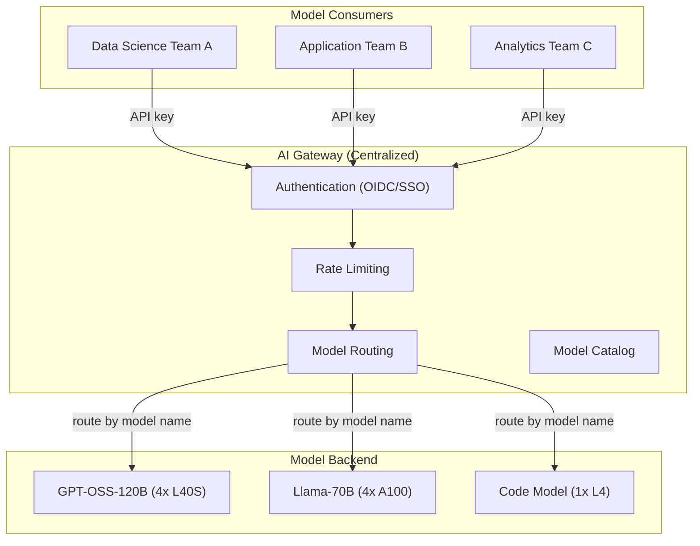
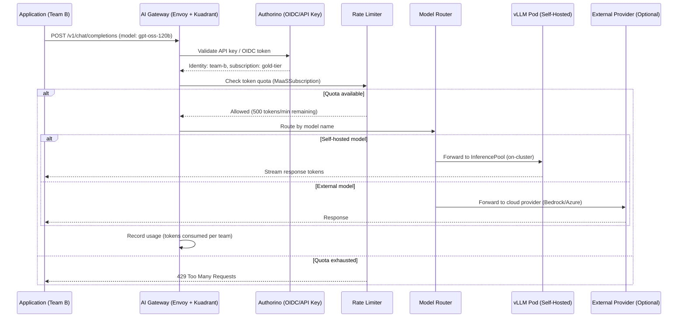

# Models-as-a-Service (MaaS)

Models-as-a-Service is a platform capability that provides centralized governance, routing, and access control for AI models across an organization. Instead of each team deploying their own models independently, MaaS offers a curated catalog of models accessible through a unified API gateway.

## The Problem MaaS Solves

Without MaaS, organizations face:

- **GPU sprawl** -- Every team deploys their own copies of popular models, wasting expensive GPU resources
- **No governance** -- No visibility into which models are being used, by whom, or how
- **Inconsistent access** -- Each team builds their own authentication and rate limiting
- **No cost allocation** -- Impossible to charge back GPU usage to consuming teams

## How MaaS Works in RHOAI



**The platform team** deploys and manages models centrally. **Consuming teams** access models via a standardized OpenAI-compatible API through the AI Gateway, with authentication, rate limiting, and usage tracking.

## Key Capabilities

| Capability | What It Does |
|-----------|-------------|
| **Model Catalog** | Curated list of approved models visible in the RHOAI Dashboard |
| **AI Gateway** | Central API endpoint with routing, auth, and rate limiting |
| **Hardware Profiles** | Define GPU resource bundles (see [Hardware Profiles](hardware-profiles.md)) |
| **Multi-tenant Access** | Teams consume models without managing infrastructure |
| **Usage Tracking** | Monitor which teams use which models and how much |
| **Connection Management** | Secure credential distribution to consuming applications |

## Dependencies

| Requirement | Type | Purpose |
|-------------|------|---------|
| RHOAI Operator | Operator | Core platform with Dashboard |
| AI Gateway Operator | Operator | API gateway for model access |
| RHCL (Red Hat Connectivity Link) | Operator | Connectivity management |
| KServe (DSC) | DSC component | Model serving backend |
| cert-manager | Operator | TLS for gateway endpoints |

## Enable It

The MaaS experience requires multiple components working together:

```yaml
spec:
  components:
    kserve:
      managementState: Managed
    batchGateway:
      managementState: Managed
    dashboard:
      managementState: Managed
```

Plus the external AI Gateway and RHCL operators. The `maas` DSC overlay enables the correct combination.

## Deploy

=== "GitOps"

    Use the `maas` DSC overlay:

    ```yaml
    # In bootstrap/overlays/default/cluster-config.yaml
    data:
      rhoaiOverlay: "maas"
    ```

    The AI Gateway and RHCL operators are installed via the `cluster-operators` ApplicationSet.

=== "Manual"

    ```bash
    # Install operators
    oc apply -k components/operators/cert-manager/
    oc apply -k components/operators/ai-gateway-operator/
    oc apply -k components/operators/rhcl-operator/
    oc apply -k components/operators/rhoai-operator/

    # Deploy MaaS-focused DSC
    oc apply -k components/instances/rhoai-instance/overlays/maas/
    ```

## End-to-End Request Flow

This sequence shows what happens when a consuming team calls a model through the MaaS gateway:



## The MaaS Workflow

### For Platform Teams (Providers)

1. Deploy models using InferenceService manifests (via GitOps or Dashboard)
2. Register models in the Model Catalog via the RHOAI Dashboard
3. Configure AI Gateway routes for each model
4. Assign Hardware Profiles to standardize resource allocation
5. Set up team access and rate limits

### For Consuming Teams (Consumers)

1. Browse the Model Catalog in the RHOAI Dashboard
2. Request access to approved models
3. Receive connection credentials (API key, endpoint URL)
4. Call models via the OpenAI-compatible API:

```bash
curl -X POST https://ai-gateway.apps.cluster.example.com/v1/chat/completions \
  -H "Authorization: Bearer $API_KEY" \
  -H "Content-Type: application/json" \
  -d '{
    "model": "gpt-oss-120b",
    "messages": [{"role": "user", "content": "Hello"}]
  }'
```

## Connection to Hardware Profiles

MaaS works with [Hardware Profiles](hardware-profiles.md) to standardize how models are deployed. A Hardware Profile bundles:

- GPU type and quantity (e.g., "4x NVIDIA L40S")
- Memory and CPU limits
- Tolerations and node selectors

When a platform admin deploys a model through the Dashboard, they select a Hardware Profile. This ensures consistent resource allocation without requiring every admin to know the exact Kubernetes resource spec.

## Governance Features

| Feature | Mechanism |
|---------|-----------|
| **Who can deploy models** | RBAC on model namespaces |
| **Who can access models** | AI Gateway API keys + OIDC |
| **Rate limiting** | AI Gateway policies per team/user |
| **Model approval** | Dashboard catalog workflow |
| **Audit trail** | Gateway access logs |
| **Cost visibility** | GPU usage per model, attributable to teams |
