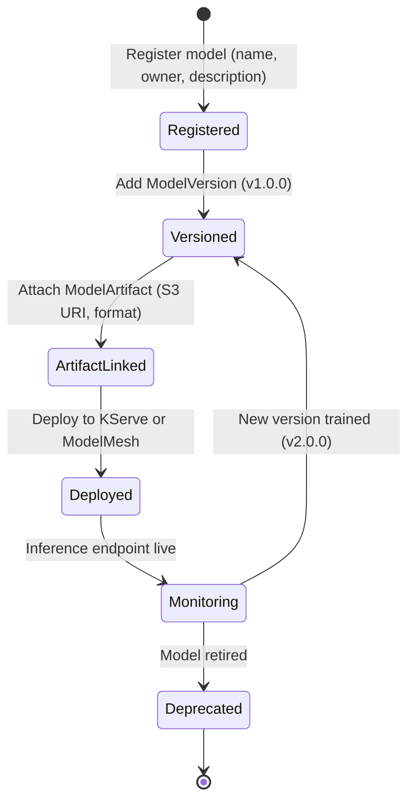

# Model Registry

The Model Registry provides a central catalog for tracking ML model versions, metadata, and artifacts. Use it when you need governance over which models are deployed, version history, and programmatic access to model metadata across your organization.

!!! info "Default State"
    **Enabled in:** `full`, `serving`, `maas`, `dev` overlays.  
    **Disabled in:** `minimal`, `training` overlays.  
    To change, edit `rhoaiOverlay` in `cluster-config.yaml` or create a [custom overlay](../concepts/kustomize-overlays.md).

## Dependencies

| Requirement | Type | Path |
|-------------|------|------|
| RHOAI Operator | Operator | `components/operators/rhoai-operator/` |
| DSC `modelregistry: Managed` | DSC component | `components/instances/rhoai-instance/` |
| External MySQL database (5.x or later, 8.x recommended) | External service | Provisioned outside the cluster |
| S3-compatible object storage | External service | Provisioned outside the cluster |

!!! warning "External database and storage required"
    The official RHOAI documentation requires an external MySQL database (version 5.x or later, 8.x recommended) and S3-compatible object storage for Model Registry. RHOAI also adds a default database solution for testing (not for production). These are **not** provisioned by the RHOAI Operator for production use -- you must set them up before enabling this component. Model Registry does not require GPU infrastructure.

## Enable It

Model Registry is enabled in the `dev` and `full` overlays.

=== "DSC Patch"

    ```yaml
    spec:
      components:
        modelregistry:
          managementState: Managed
    ```

## Deploy

=== "GitOps"

    Model Registry is enabled automatically when the `rhoai-instance` ArgoCD Application points to the `full` or `dev` overlay.

=== "Manual"

    ```bash
    # 1. Install the RHOAI operator
    oc apply -k components/operators/rhoai-operator/
    oc get csv -A | grep rhods

    # 2. Create DSC with model registry enabled
    oc apply -k components/instances/rhoai-instance/overlays/dev/

    # 3. Wait for DSC
    oc wait --for=jsonpath='{.status.conditions[?(@.type=="Ready")].status}'=True \
      datasciencecluster/default-dsc --timeout=600s
    ```

## Verify

```bash
# Model Registry operator pods
oc get pods -n redhat-ods-applications -l app=model-registry-operator

# Check the model registry namespace
oc get pods -n rhoai-model-registries
```

## Configure External Storage

After enabling Model Registry in the DSC, configure the external MySQL database and S3 storage:

1. **MySQL database** -- create a MySQL 5.x+ (8.x recommended) instance accessible from the cluster. Note the hostname, port, database name, username, and password.
2. **S3 storage** -- configure an S3-compatible bucket for model artifacts. Note the endpoint, bucket name, region, and credentials.
3. **Create a Model Registry instance** via the RHOAI Dashboard or CLI, providing the MySQL and S3 connection details.

For detailed configuration steps, see the [official RHOAI documentation on creating a model registry](https://docs.redhat.com/en/documentation/red_hat_openshift_ai_self-managed/3-latest/html/managing_models/managing-model-registry).

## Model Lifecycle

A model progresses through these stages in the registry, from initial registration to production deployment:



## Usage

1. Open the RHOAI Dashboard
2. Navigate to **Model Registry**
3. Register models with version metadata, artifact URIs, and custom properties
4. Deploy registered models directly to KServe or ModelMesh from the UI

### Programmatic access

Use the Model Registry REST API or the Python `model-registry` SDK:

```python
from model_registry import ModelRegistry

registry = ModelRegistry(
    server_address="https://model-registry-route",
    author="data-scientist",
)

model = registry.register_model(
    "my-model",
    uri="s3://bucket/model.onnx",
    version="1.0.0",
    model_format_name="onnx",
)
```

## Disable It

Set `modelregistry.managementState` to `Removed` in the DSC.
