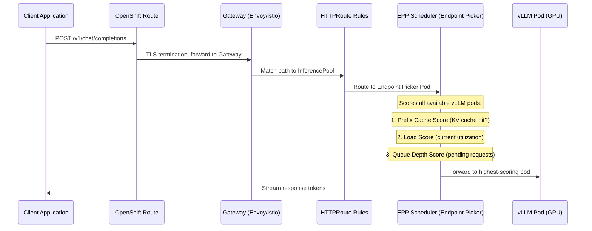
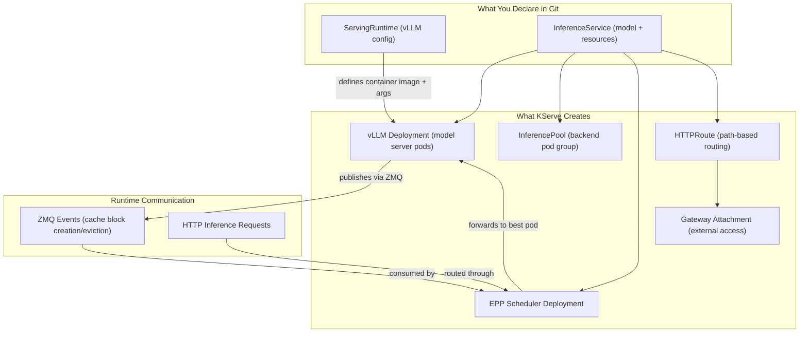

# Model Serving with KServe

KServe provides scalable, standards-based model serving on OpenShift AI. It supports popular frameworks (vLLM, TensorRT, Triton) and handles autoscaling, canary rollouts, and request batching. Use KServe when you need to deploy individual models with dedicated resources and independent scaling. It deploys models as
`InferenceService` resources with auto-scaling, canary rollouts, and an
OpenAI-compatible API. RHOAI ships a validated vLLM runtime for GPU-accelerated
LLM serving.

!!! info "Default State"
    **Enabled in:** `full`, `serving`, `maas`, `dev` overlays.  
    **Disabled in:** `minimal`, `training` overlays.  
    To change, edit `rhoaiOverlay` in `cluster-config.yaml` or create a [custom overlay](../concepts/kustomize-overlays.md).

## How Inference Requests Flow

When a client sends a request to a model endpoint, this is the path it takes through the platform:



## Component Architecture

The KServe control plane creates and manages several resources when you deploy a model:



## Dependencies

| Requirement | Type | Path |
|-------------|------|------|
| RHOAI Operator | Operator | `components/operators/rhoai-operator/` |
| cert-manager | Operator | `components/operators/cert-manager/` |
| DSC `kserve: Managed` | DSC component | `components/instances/rhoai-instance/` |
| GPU Infrastructure | Operator + Instance | See [gpu-infrastructure.md](gpu-infrastructure.md) |

cert-manager is required because KServe uses Knative Serving, which needs TLS
certificates for internal routing.

!!! tip "GPU not always required"
    KServe can serve CPU-only models. GPU infrastructure (NFD + GPU Operator) is only needed for GPU-accelerated inference.

## Enable It

=== "Overlay"

    Use the pre-built serving overlay:

    ```bash
    oc apply -k components/instances/rhoai-instance/overlays/serving/
    ```

=== "DSC Patch"

    Set `kserve.managementState` to `Managed` in your DSC YAML:

    ```yaml
    spec:
      components:
        kserve:
          managementState: Managed
    ```

## Deploy

=== "GitOps"

    KServe is enabled automatically when the `rhoai-instance` ArgoCD Application points to the `serving`, `full`, or `dev` overlay.

=== "Manual"

    ```bash
    # 1. Install required operators
    oc apply -k components/operators/cert-manager/
    oc apply -k components/operators/rhoai-operator/

    # Wait for CSVs
    oc get csv -A | grep -E "cert-manager|rhods"

    # 2. Install GPU infrastructure (if serving GPU models)
    oc apply -k components/operators/nfd/
    oc apply -k components/operators/gpu-operator/
    oc apply -k components/instances/nfd-instance/
    oc apply -k components/instances/gpu-instance/

    # 3. Create DSC with serving overlay
    oc apply -k components/instances/rhoai-instance/overlays/serving/

    # 4. Wait for DSC to be ready
    oc wait --for=jsonpath='{.status.conditions[?(@.type=="Ready")].status}'=True \
      datasciencecluster/default-dsc --timeout=600s
    ```

## Verify

```bash
# KServe controller should be running
oc get pods -n redhat-ods-applications -l app=kserve-controller-manager

# Knative Serving should be ready
oc get knativeserving -n knative-serving
```

## Example: Deploy a Model

A minimal InferenceService using the RHOAI vLLM runtime:

```yaml
apiVersion: serving.kserve.io/v1alpha1
kind: ServingRuntime
metadata:
  name: my-model-runtime
  namespace: my-namespace
spec:
  supportedModelFormats:
    - name: vLLM
      autoSelect: true
  multiModel: false
  containers:
    - name: kserve-container
      image: registry.redhat.io/rhaiis/vllm-cuda-rhel9:3.4.0
      command: ["python", "-m", "vllm.entrypoints.openai.api_server"]
      args:
        - --port=8080
        - --model=/mnt/models
        - --served-model-name={{.Name}}
      ports:
        - containerPort: 8080
          protocol: TCP
          name: http
---
apiVersion: serving.kserve.io/v1beta1
kind: InferenceService
metadata:
  name: my-model
  namespace: my-namespace
  labels:
    opendatahub.io/dashboard: "true"
  annotations:
    serving.kserve.io/deploymentMode: RawDeployment
    security.opendatahub.io/enable-auth: "false"
spec:
  predictor:
    minReplicas: 1
    maxReplicas: 1
    model:
      modelFormat:
        name: vLLM
      runtime: my-model-runtime
      storageUri: "pvc://my-model-weights/model-dir"
      resources:
        requests:
          cpu: "1"
          memory: "8Gi"
          nvidia.com/gpu: "1"
        limits:
          cpu: "4"
          memory: "24Gi"
          nvidia.com/gpu: "1"
```

Key fields:
- `serving.kserve.io/deploymentMode: RawDeployment` -- bypasses Knative for simpler
  networking (recommended for GPU models)
- `storageUri: "pvc://..."` -- loads model weights from a PVC
- `opendatahub.io/dashboard: "true"` -- makes the model visible in the RHOAI Dashboard

For complete working examples, see `usecases/models/orchestrator-8b/manifests/` and `usecases/models/gpt-oss-120b/manifests/`.

## Disable It

Set `kserve.managementState` to `Removed` in the DSC. Then clean up:

```bash
oc delete inferenceservice --all -A
oc delete servingruntime --all -A
```

The RHOAI operator will remove the KServe controller and Knative components.
