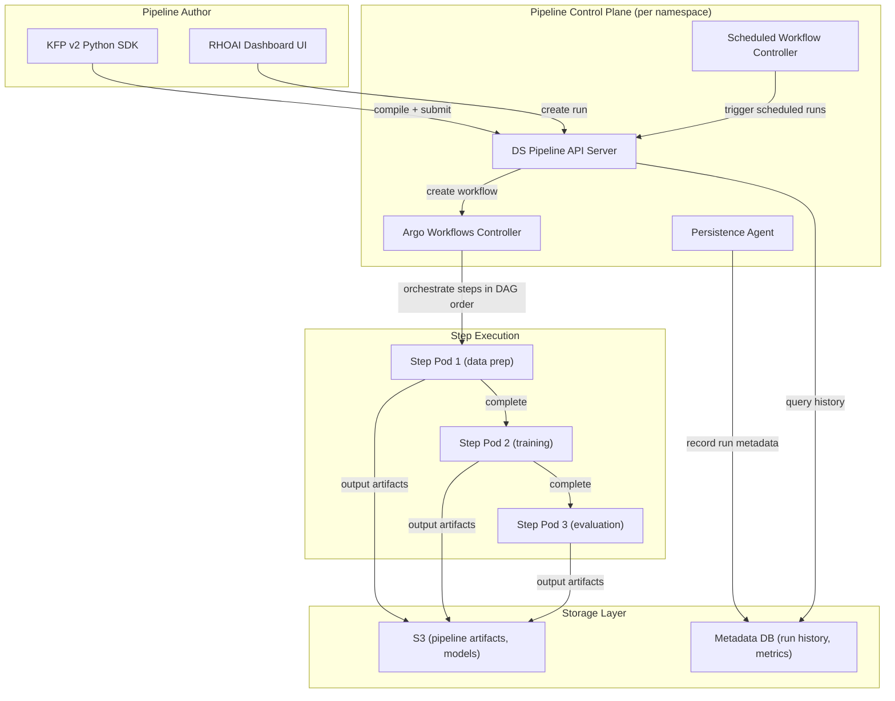

# Data Science Pipelines (DSP)

Data Science Pipelines provide a Kubeflow Pipelines-compatible platform for building and running ML workflows on OpenShift AI. Use pipelines when you need reproducible, automated ML workflows with experiment tracking, scheduling, and artifact management.

!!! info "Default State"
    **Enabled in:** `full`, `serving`, `training`, `maas`, `dev` overlays.  
    **Disabled in:** `minimal` overlay.  
    To change, edit `rhoaiOverlay` in `cluster-config.yaml` or create a [custom overlay](../concepts/kustomize-overlays.md).

## Pipeline Execution Architecture

When a pipeline runs, multiple components coordinate to execute steps as pods, store artifacts, and track metadata:



## Dependencies

| Requirement | Type | Path |
|-------------|------|------|
| RHOAI Operator | Operator | `components/operators/rhoai-operator/` |
| DSC `datasciencepipelines: Managed` | DSC component | `components/instances/rhoai-instance/` |
| S3-compatible object storage | External service | Provisioned outside the cluster |

!!! warning "S3-compatible storage required"
    Pipeline servers require S3-compatible object storage (e.g., MinIO, AWS S3, or OpenShift Data Foundation) for storing pipeline artifacts and metadata. Configure your S3 bucket before creating a pipeline server.

DSP does not require GPU infrastructure, cert-manager, or Kueue. It runs on
CPU nodes and is one of the lightest RHOAI capabilities to enable.

## Enable It

=== "DSC Patch"

    ```yaml
    spec:
      components:
        datasciencepipelines:
          managementState: Managed
    ```

=== "Custom Overlay"

    Create your own overlay referencing the base and a pipelines patch:

    ```yaml
    # components/instances/rhoai-instance/overlays/my-profile/kustomization.yaml
    apiVersion: kustomize.config.k8s.io/v1beta1
    kind: Kustomization
    resources:
      - ../../base
    patches:
      - path: patch-pipelines.yaml
        target:
          kind: DataScienceCluster
    ```

    ```yaml
    # patch-pipelines.yaml
    - op: replace
      path: /spec/components/datasciencepipelines/managementState
      value: Managed
    ```

## Deploy

=== "GitOps"

    Pipelines are enabled automatically when the `rhoai-instance` ArgoCD Application points to the `full` or `dev` overlay.

=== "Manual"

    ```bash
    # 1. Install the RHOAI operator
    oc apply -k components/operators/rhoai-operator/
    oc get csv -A | grep rhods

    # 2. Create DSC (use full, dev, or a custom overlay with pipelines enabled)
    oc apply -k components/instances/rhoai-instance/overlays/dev/

    # 3. Wait for DSC
    oc wait --for=jsonpath='{.status.conditions[?(@.type=="Ready")].status}'=True \
      datasciencecluster/default-dsc --timeout=600s
    ```

## Verify

```bash
# DSP operator should be running
oc get pods -n redhat-ods-applications -l app=ds-pipeline-ui

# Check for the DSP API server
oc get pods -n redhat-ods-applications -l app=ds-pipeline-api-server
```

!!! info "Argo Workflows controller option (DSC v2)"
    The DSC v2 API includes an `aipipelines.argoWorkflowsControllers.managementState` field that lets you configure whether RHOAI manages its own Argo Workflows controller or uses an existing one. This is relevant if you already have Argo Workflows installed and want to avoid conflicts. Note: Argo Workflows (pipeline orchestration) is distinct from ArgoCD (GitOps). This repository uses the v2 DSC API (`aipipelines`), where the Argo Workflows controller is separately configurable. See [Known Issues #3](../reference/known-issues.md) for details.

## Example: Create a Pipeline Server

After enabling DSP in the DSC, create a `DataSciencePipelinesApplication` in
your project namespace:

```yaml
apiVersion: datasciencepipelinesapplications.opendatahub.io/v1alpha1
kind: DataSciencePipelinesApplication
metadata:
  name: dspa-sample
  namespace: my-ds-project
spec:
  apiServer:
    deploy: true
  persistenceAgent:
    deploy: true
  scheduledWorkflow:
    deploy: true
  objectStorage:
    externalStorage:
      bucket: my-pipeline-bucket
      host: s3.amazonaws.com
      region: us-east-1
      s3CredentialsSecret:
        accessKey: AWS_ACCESS_KEY_ID
        secretKey: AWS_SECRET_ACCESS_KEY
        secretName: my-s3-credentials
```

Then use the KFP v2 Python SDK or the RHOAI Dashboard to create and run
pipelines in that namespace.

## Disable It

Set `datasciencepipelines.managementState` to `Removed` in the DSC.

Clean up pipeline servers first:

```bash
oc delete datasciencepipelinesapplication --all -A
```
