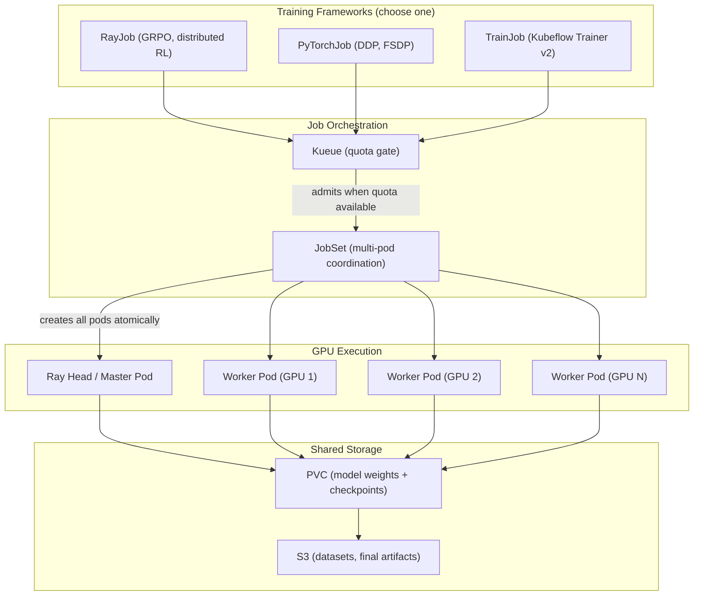
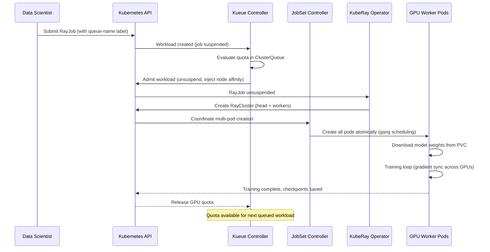

# Distributed Training with Ray and Training Operator

Distributed training enables fine-tuning and training of large models across multiple GPU nodes. This capability uses KubeRay for Ray-based distributed workloads and the Kubeflow Training Operator for PyTorchJob and TrainJob resources. Use this when your model training needs more GPU memory or compute than a single node can provide. RHOAI provides distributed training through two components:

!!! info "Default State"
    **Enabled in:** `full`, `training`, `dev` overlays.  
    **Disabled in:** `minimal`, `serving`, `maas` overlays.  
    To change, edit `rhoaiOverlay` in `cluster-config.yaml` or create a [custom overlay](../concepts/kustomize-overlays.md).

- **Ray (KubeRay)** -- distributed compute framework for RayJob workloads
  (used for GRPO reinforcement learning in this repo)
- **Training Operator** -- Kubeflow Training Operator for PyTorchJob, TrainJob,
  and other framework-specific distributed training jobs

Both integrate with **Kueue** for GPU quota management and **JobSet** for
multi-pod job orchestration.

## Training Architecture Overview

Multiple training frameworks are available, all unified through Kueue for GPU quota management:



## Job Lifecycle

From submission to completion, a training job passes through these stages:



## Dependencies

| Requirement | Type | Path |
|-------------|------|------|
| RHOAI Operator | Operator | `components/operators/rhoai-operator/` |
| cert-manager Operator | Operator | `components/operators/cert-manager/` |
| Kueue Operator | Operator | `components/operators/kueue-operator/` |
| JobSet Operator | Operator | `components/operators/jobset-operator/` |
| DSC `ray: Managed` | DSC component | `components/instances/rhoai-instance/` |
| DSC `trainingoperator: Managed` | DSC component | `components/instances/rhoai-instance/` |
| Kueue Instance + Config | Instance | `components/instances/kueue-instance/`, `kueue-config/` |
| JobSet Instance | Instance | `components/instances/jobset-instance/` |
| GPU Infrastructure | Operator + Instance | See [gpu-infrastructure.md](gpu-infrastructure.md) |

!!! info "cert-manager is required"
    The official RHOAI documentation lists cert-manager as a dependency for Kueue-based workloads (training, Ray). Install the cert-manager Operator before deploying training workloads.

## Enable It

=== "Overlay"

    Use the pre-built training overlay:

    ```bash
    oc apply -k components/instances/rhoai-instance/overlays/training/
    ```

=== "DSC Patch"

    ```yaml
    spec:
      components:
        ray:
          managementState: Managed
        trainingoperator:
          managementState: Managed
    ```

!!! note
    Kueue is set to `Unmanaged` in the DSC because it is managed by the standalone Red Hat Build of Kueue Operator. See [Kueue](kueue.md).

## Deploy

=== "GitOps"

    Training components are enabled automatically when the `rhoai-instance` ArgoCD Application points to the `training`, `full`, or `dev` overlay. The Kueue and JobSet operators are installed via their own ApplicationSet-discovered Applications.

=== "Manual"

    ```bash
    # 1. Install all required operators
    oc apply -k components/operators/cert-manager/
    oc apply -k components/operators/rhoai-operator/
    oc apply -k components/operators/kueue-operator/
    oc apply -k components/operators/jobset-operator/
    oc apply -k components/operators/nfd/
    oc apply -k components/operators/gpu-operator/

    # Wait for all CSVs to reach Succeeded before proceeding (re-run until all show Succeeded)
    watch "oc get csv -A | grep -E 'cert-manager|rhods|kueue|jobset|nfd|gpu'"

    # IMPORTANT: Do NOT proceed until every CSV shows "Succeeded".

    # 2. Install GPU infrastructure
    oc apply -k components/instances/nfd-instance/
    oc apply -k components/instances/gpu-instance/
    oc apply -k components/instances/gpu-workers/examples/aws/  # cloud-specific

    # 3. Install Kueue and JobSet instances
    oc apply -k components/instances/kueue-instance/
    oc apply -k components/instances/kueue-config/
    oc apply -k components/instances/jobset-instance/

    # 4. Create DSC with training overlay
    oc apply -k components/instances/rhoai-instance/overlays/training/

    # 5. Wait for DSC
    oc wait --for=jsonpath='{.status.conditions[?(@.type=="Ready")].status}'=True \
      datasciencecluster/default-dsc --timeout=600s
    ```

## Verify

```bash
# KubeRay operator should be running
oc get pods -n redhat-ods-applications -l app.kubernetes.io/name=kuberay-operator

# Training operator should be running
oc get pods -n redhat-ods-applications -l control-plane=kubeflow-training-operator
```

!!! warning "GPU and Kueue required"
    Distributed training requires GPU infrastructure (NFD + GPU Operator) and Kueue for quota management. Deploy these first. See [GPU Infrastructure](gpu-infrastructure.md) and [Kueue](kueue.md).

## Example: RayJob for GRPO Training

This repo includes a complete GRPO training pipeline. To run it:

```bash
# Via ArgoCD
argocd app sync usecase-toolorchestra-training

# Or manually (deploys both training infra and workloads)
oc apply -k usecases/services/toolorchestra-app/manifests/training/
```

The training pipeline uses sync waves:
- **Wave 0**: Download jobs fetch the base model and dataset
- **Wave 1**: RayJob starts GRPO training (1 head + 3 GPU workers)

Monitor progress:

```bash
oc get rayjob grpo-training -n orchestrator-rhoai -w
oc logs -f -l app.kubernetes.io/name=grpo-head -n orchestrator-rhoai
```

### Training infrastructure resources

Training infrastructure must be deployed separately before running training workloads. These resources live in `usecases/services/toolorchestra-app/manifests/training/infra/`:

- **LocalQueue** (`training-queue`) -- namespaced Kueue queue
- **PVC** (`training-checkpoints`, 100Gi) -- model + dataset + checkpoint storage
- **ConfigMap** (`grpo-training-config`) -- GRPO hyperparameters

Deploy infra and workloads together:

```bash
oc apply -k usecases/services/toolorchestra-app/manifests/training/
```

## Example: Minimal RayJob

```yaml
apiVersion: ray.io/v1
kind: RayJob
metadata:
  name: my-training-job
  namespace: my-namespace
  labels:
    kueue.x-k8s.io/queue-name: training-queue
spec:
  entrypoint: "python train.py"
  runtimeEnvYAML: |
    pip:
      - torch
  rayClusterSpec:
    headGroupSpec:
      template:
        spec:
          containers:
            - name: ray-head
              image: rayproject/ray:2.40.0-py311-gpu
              resources:
                requests:
                  cpu: "2"
                  memory: "8Gi"
    workerGroupSpecs:
      - replicas: 2
        groupName: gpu-workers
        template:
          spec:
            containers:
              - name: ray-worker
                image: rayproject/ray:2.40.0-py311-gpu
                resources:
                  requests:
                    cpu: "2"
                    memory: "16Gi"
                    nvidia.com/gpu: "1"
```

The `kueue.x-k8s.io/queue-name` label routes the job through Kueue for quota
management. See [kueue.md](kueue.md) for configuring queues and quotas.

## Disable It

Set `ray.managementState` and `trainingoperator.managementState` to `Removed`
in the DSC. Clean up any running jobs first:

```bash
oc delete rayjob --all -A
oc delete pytorchjob --all -A
```
