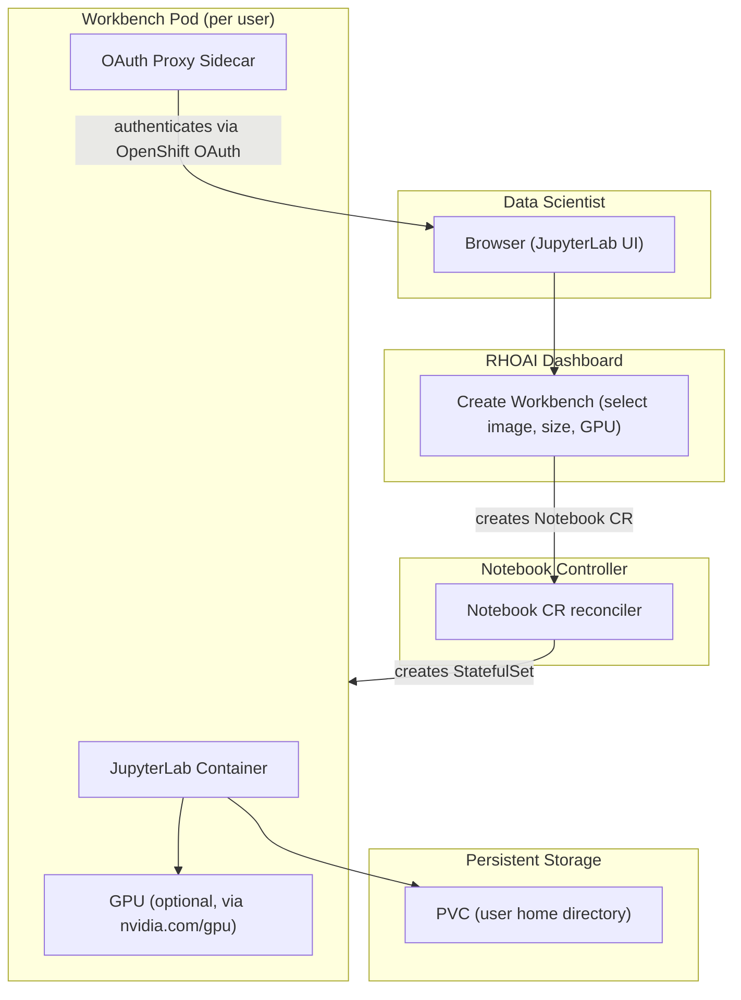

# Workbenches (Jupyter Notebooks)

Workbenches provide managed Jupyter notebook environments for data scientists.
Each workbench is a container running JupyterLab with pre-installed ML
libraries, persistent storage, and optional GPU access. Workbenches are
managed through the RHOAI Dashboard.

!!! info "Default State"
    **Enabled in:** `full`, `serving`, `training`, `maas`, `dev` overlays.  
    **Disabled in:** `minimal` overlay.  
    To change, edit `rhoaiOverlay` in `cluster-config.yaml` or create a [custom overlay](../concepts/kustomize-overlays.md).

## How Workbenches Work



## Dependencies

| Requirement | Type | Path |
|-------------|------|------|
| RHOAI Operator | Operator | `components/operators/rhoai-operator/` |
| DSC `workbenches: Managed` | DSC component | `components/instances/rhoai-instance/` |
| DSC `dashboard: Managed` | DSC component | Required for the UI to manage workbenches |
| GPU Infrastructure (optional) | Operator + Instance | See [gpu-infrastructure.md](gpu-infrastructure.md) |

Workbenches run on CPU by default. GPU access requires the GPU infrastructure
stack (NFD + GPU Operator).

## Enable It

Workbenches are enabled in the `dev` and `full` overlays. The `minimal` overlay enables Dashboard (the prerequisite).

=== "DSC Patch"

    ```yaml
    spec:
      components:
        dashboard:
          managementState: Managed
        workbenches:
          managementState: Managed
    ```

## Deploy

=== "GitOps"

    Workbenches are enabled automatically when the `rhoai-instance` ArgoCD Application points to the `full` or `dev` overlay.

=== "Manual"

    ```bash
    # 1. Install the RHOAI operator
    oc apply -k components/operators/rhoai-operator/
    oc get csv -A | grep rhods

    # 2. Create DSC with workbenches enabled (dev or full overlay)
    oc apply -k components/instances/rhoai-instance/overlays/dev/

    # 3. Wait for DSC
    oc wait --for=jsonpath='{.status.conditions[?(@.type=="Ready")].status}'=True \
      datasciencecluster/default-dsc --timeout=600s
    ```

## Verify

```bash
# Notebook controller should be running
oc get pods -n redhat-ods-applications -l app=notebook-controller

# RHOAI Dashboard should be accessible
oc get route rhods-dashboard -n redhat-ods-applications
```

## Usage

1. Open the RHOAI Dashboard (route above)
2. Navigate to **Data Science Projects** and create a project
3. Click **Create workbench** in your project
4. Select a notebook image (e.g., Standard Data Science, PyTorch, TensorFlow)
5. Choose container size and optional GPU
6. The workbench starts as a pod with persistent storage

### Pre-built notebook images

RHOAI ships several validated images:
- **Standard Data Science** -- pandas, scikit-learn, matplotlib
- **PyTorch** -- PyTorch + CUDA
- **TensorFlow** -- TensorFlow + CUDA
- **Minimal** -- JupyterLab only

## Disable It

Set `workbenches.managementState` to `Removed` in the DSC.

Stop running workbenches first:

```bash
oc delete notebook --all -A
```
