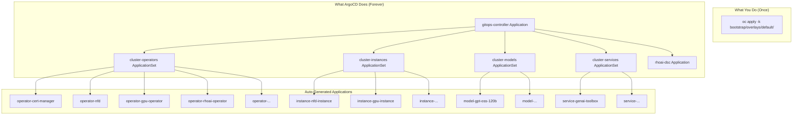
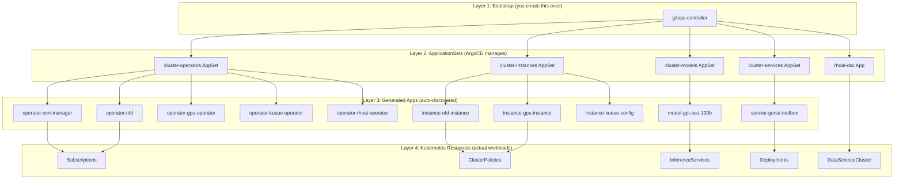

# The App-of-Apps Pattern

The app-of-apps pattern is a way to manage a complex platform with a single ArgoCD entry point. One "bootstrap" Application creates all other Applications, which in turn deploy the actual resources. This creates a self-managing hierarchy where adding new components requires only a `git push`.

## The Problem It Solves

Imagine deploying RHOAI manually: you would need to create 20+ ArgoCD Applications one by one -- one for each operator, each instance, each model. If you add a new model next month, you would need to manually create another Application. This does not scale.

The app-of-apps pattern solves this by making ArgoCD manage its own Applications:



After the single bootstrap command, you never need to create an ArgoCD Application manually again.

## How It Works Step by Step

### Step 1: Bootstrap

You run one command:

```bash
oc apply -k bootstrap/overlays/default/
```

This creates a single ArgoCD Application called `gitops-controller` that points to the `bootstrap/overlays/default/` directory in Git.

### Step 2: ArgoCD Discovers ApplicationSets

The `gitops-controller` Application syncs the contents of that directory, which includes four `ApplicationSet` resources. Each ApplicationSet is a template that generates Applications automatically.

### Step 3: ApplicationSets Auto-Discover Content

Each ApplicationSet uses a **Git directory generator** to scan specific paths in the repository:

| ApplicationSet | Scans | Creates Applications Named |
|---------------|-------|---------------------------|
| `cluster-operators` | `components/operators/*/` | `operator-<dirname>` |
| `cluster-instances` | `components/instances/*/` | `instance-<dirname>` |
| `cluster-models` | `usecases/models/*/profiles/tier1-minimal/` | `model-<dirname>` |
| `cluster-services` | `usecases/services/*/profiles/tier1-minimal/` | `service-<dirname>` |

!!! important "Opt-in for models and services"
    Unlike operators and instances, models and services use an **opt-in mechanism**. Each model/service directory contains a `config.json` file with an `"enabled"` flag. The ApplicationSet's Git file generator only creates an Application when `"enabled": "true"` is set. Pushing a new directory alone does **not** deploy it — you must explicitly enable it with `./scripts/configure.sh enable-model <name>` (or `enable-service <name>`), which sets `"enabled": "true"` in `config.json`.

### Step 4: Generated Applications Deploy Resources

Each generated Application points to its respective directory and deploys the Kubernetes resources found there (Subscriptions, CRDs, Deployments, etc.).

## Adding a New Component

This is where the pattern truly shines. To add a new operator:

1. Create `components/operators/my-new-operator/kustomization.yaml` with a Subscription
2. `git push`
3. Done.

ArgoCD's `gitops-controller` syncs, sees the `cluster-operators` ApplicationSet unchanged, but the ApplicationSet's Git directory generator finds the new directory and creates `operator-my-new-operator` automatically.

No manual ArgoCD configuration. No UI clicks. No imperative commands. Just Git.

## The Hierarchy Visualized



## Why the DSC Gets Its Own Application

The DataScienceCluster (DSC) is handled by a dedicated Application rather than through the instances ApplicationSet. This is because:

1. **The RHOAI operator mutates the DSC** -- It adds sub-fields to `.spec.components.*` that are not in your Git manifests. Without special handling, ArgoCD would see these as drift and try to remove them.

2. **Status changes constantly** -- The DSC's `/status` is updated every few seconds as components reconcile.

3. **No pruning** -- If ArgoCD pruned (deleted) resources it did not find in Git, it might delete operator-managed resources.

The dedicated Application uses `ignoreDifferences` to tell ArgoCD: "I know the operator will modify these fields -- that is expected, not drift."

## Self-Healing in Action

With `selfHeal: true` on every Application:

- If someone manually scales down a model deployment, ArgoCD scales it back up
- If a namespace is deleted, ArgoCD recreates it
- If an operator subscription is changed, ArgoCD reverts it to what Git specifies

The cluster converges to the Git state within seconds of any manual change.

## What Happens Next

The ApplicationSets reference directories that contain [Kustomize overlays](kustomize-overlays.md). Understanding how Kustomize composes manifests will show you how a single base can produce different configurations for different environments.
