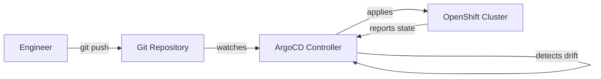
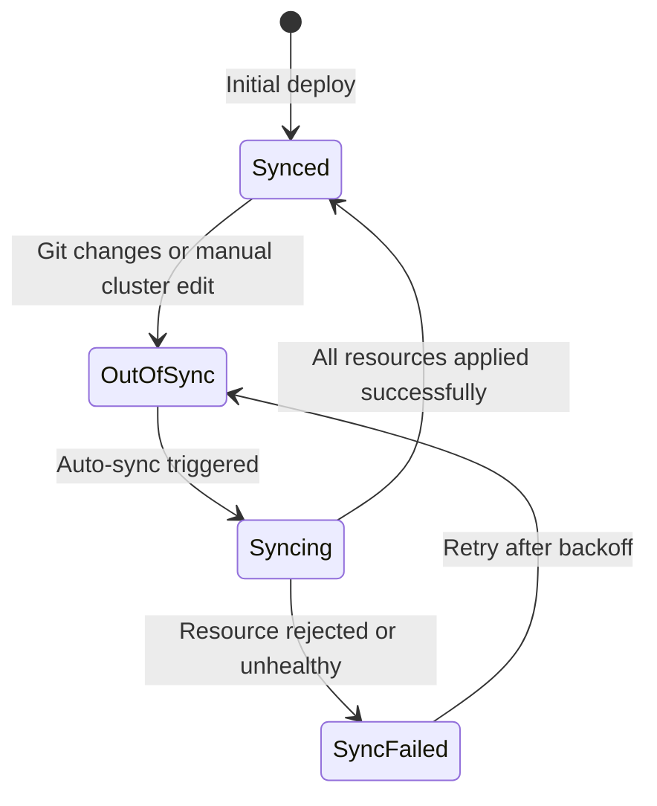

# What is GitOps?

GitOps is a way of managing infrastructure and applications where **Git is the single source of truth**. Instead of logging into a cluster and running commands, you describe your desired state in YAML files, push them to a Git repository, and a controller (ArgoCD) continuously ensures the live cluster matches what is in Git.

## The Problem GitOps Solves

Without GitOps, deploying an AI platform typically looks like this:

1. Someone SSHs into a server or runs `kubectl apply` manually
2. The commands work on their machine but nobody records exactly what was done
3. Three months later, something breaks and nobody knows what changed
4. A second cluster needs the same setup -- nobody remembers all the steps
5. An audit asks "who changed what, when?" and there is no answer

This is the **imperative** approach: you tell the system *what to do*, step by step. The steps are ephemeral -- once they execute, the knowledge of what was done lives only in someone's memory (or a wiki page that is already outdated).

## How GitOps Works

GitOps flips this around to a **declarative** approach:



1. **You declare** the desired state in YAML files (operators, configurations, models)
2. **You push** those files to a Git repository
3. **ArgoCD watches** the repository and compares it to the live cluster
4. **If they differ**, ArgoCD applies the changes to make the cluster match Git
5. **If someone manually changes** the cluster, ArgoCD detects the drift and reverts it

## Key Properties

### Self-Healing

If someone manually deletes a resource or changes a setting on the cluster, ArgoCD detects the difference within seconds and restores the correct state from Git. This is called **self-healing** and it ensures your cluster never drifts from its intended configuration.

```yaml
syncPolicy:
  automated:
    selfHeal: true   # Revert any manual changes
    prune: true      # Delete resources removed from Git
```

### Audit Trail

Every change goes through Git. This means:

- Every change has an author, timestamp, and commit message
- Pull requests provide code review for infrastructure changes
- `git log` shows the complete history of your platform
- `git revert` rolls back any change instantly

### Reproducibility

Because the entire platform is described in Git, you can:

- Deploy an identical copy on a second cluster by pointing ArgoCD at the same repo
- Recreate the platform from scratch after a disaster
- Test changes in a staging environment before applying them to production

## ArgoCD: The GitOps Controller

ArgoCD is the component that implements GitOps on OpenShift. It runs inside the cluster and continuously reconciles the live state against Git.

### Core Concepts

| Concept | What it is | Analogy |
|---------|-----------|---------|
| **Application** | A pointer from ArgoCD to a directory in Git. ArgoCD applies everything in that directory to the cluster. | A bookmark that says "keep this folder in sync" |
| **ApplicationSet** | A template that generates multiple Applications from a pattern (e.g., one Application per subdirectory). | A rule that says "create a bookmark for every folder matching this pattern" |
| **Sync** | The act of making the cluster match Git. Can be automatic or manual. | Pressing "refresh" to update |
| **Health** | Whether the deployed resources are actually working (pods running, services responding). | A green/red status light |
| **Drift** | When the live cluster differs from what Git says it should be. | A warning that someone changed something by hand |

### Sync Status Flow



## Why GitOps for AI Platforms?

AI platforms are particularly good candidates for GitOps because:

1. **Complexity** -- RHOAI installs 10+ operators with interdependencies. Declarative management prevents missed steps.
2. **GPU resources are expensive** -- Misconfigurations waste GPU time. Self-healing ensures quotas and configurations stay correct.
3. **Compliance** -- Regulated industries need audit trails for model deployment. Git provides this inherently.
4. **Multi-cluster** -- Organizations often have dev/staging/prod clusters. The same Git manifests work across all of them.
5. **Team collaboration** -- Data scientists, platform engineers, and security teams can all propose changes via pull requests.

## Imperative vs. Declarative: A Concrete Example

**Imperative** (traditional):
```bash
oc create namespace my-model
oc apply -f serving-runtime.yaml -n my-model
oc apply -f inference-service.yaml -n my-model
# Hope nothing changes...
```

**Declarative** (GitOps):
```yaml
# Git contains: namespace.yaml, serving-runtime.yaml, inference-service.yaml
# ArgoCD auto-applies all three and monitors them forever
```

The declarative approach means:

- If the namespace is accidentally deleted, it gets recreated
- If someone edits the InferenceService manually, it gets reverted
- If you need this on another cluster, just point another ArgoCD at the same repo

## What Happens Next

In this repository, we use ArgoCD's [App-of-Apps pattern](app-of-apps.md) to bootstrap the entire platform from a single command. That pattern builds on everything described here -- ArgoCD watches Git, and a hierarchy of Applications manages the full stack.
