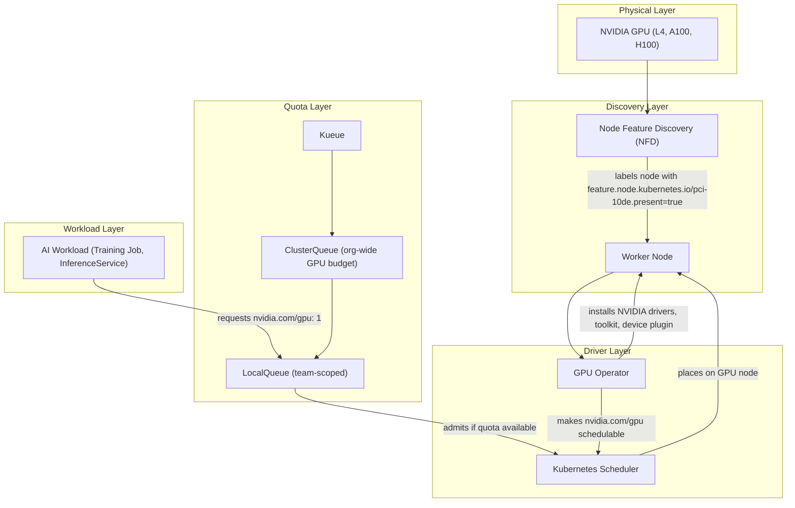
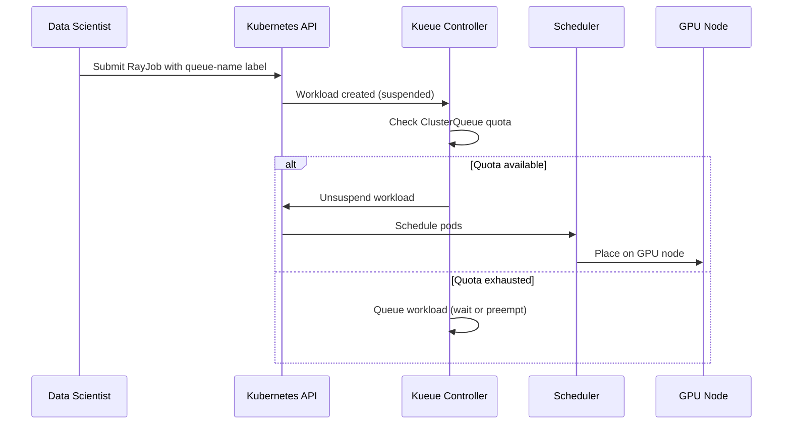

# GPU Scheduling in Kubernetes

GPUs are the most expensive and constrained resource in an AI platform. Understanding how Kubernetes discovers, allocates, and queues GPU workloads is essential for running RHOAI effectively. This page traces the lifecycle of a GPU from bare hardware to a running AI workload.

## The GPU Scheduling Stack

Four components work together to make GPUs usable and fairly shared:



## Step 1: Node Feature Discovery (NFD)

**What it does:** NFD scans every node in the cluster and applies labels describing its hardware capabilities.

**Why it matters:** Without NFD, Kubernetes has no idea which nodes have GPUs. The scheduler cannot place GPU workloads on the right nodes.

**What happens:**

1. NFD DaemonSet runs on every node
2. It detects PCI devices (NVIDIA GPUs have vendor ID `10de`)
3. It labels the node: `feature.node.kubernetes.io/pci-10de.present=true`
4. It also detects GPU product type: `nvidia.com/gpu.product=NVIDIA-A100-SXM4-80GB`

**Deployed by:** `components/operators/nfd/` + `components/instances/nfd-instance/`

## Step 2: GPU Operator

**What it does:** The NVIDIA GPU Operator installs everything needed to use GPUs on labeled nodes -- drivers, container toolkit, device plugin, and monitoring.

**Why it matters:** Kubernetes does not know how to manage GPUs natively. The device plugin tells the scheduler how many GPUs are available on each node and handles allocation.

**What happens:**

1. GPU Operator sees NFD labels on GPU nodes
2. It installs NVIDIA drivers (kernel modules)
3. It installs the NVIDIA Container Toolkit (enables GPU passthrough to containers)
4. It installs the Device Plugin (registers `nvidia.com/gpu` as a schedulable resource)
5. It installs DCGM exporter (GPU metrics for monitoring)

After this step, `nvidia.com/gpu` appears in node capacity:

```bash
$ oc describe node gpu-worker-1
Capacity:
  nvidia.com/gpu: 4
Allocatable:
  nvidia.com/gpu: 4
```

**Deployed by:** `components/operators/gpu-operator/` + `components/instances/gpu-instance/`

## Step 3: Kueue (GPU Quota Management)

**What it does:** Kueue manages a queue of GPU workloads, admitting them based on available quota and priority.

**Why it matters:** Without Kueue, any workload can consume all available GPUs immediately. There is no fairness, no priority, and no queuing. Kueue provides organizational governance over GPU usage.

**Key concepts:**

| Concept | Scope | Purpose |
|---------|-------|---------|
| **ResourceFlavor** | Cluster | Defines a type of GPU (e.g., A100 vs L4) via node labels |
| **ClusterQueue** | Cluster | Sets the total GPU budget (e.g., "8 GPUs total for training") |
| **LocalQueue** | Namespace | A team's entry point to submit workloads |
| **Workload** | Namespace | A wrapper Kueue creates around your Job/RayJob |

**How admission works:**



**Deployed by:** `components/operators/kueue-operator/` + `components/instances/kueue-instance/` + `components/instances/kueue-config/`

## Step 4: The Life of a GPU Job

Here is what happens end-to-end when a data scientist submits a training job:

### 1. Job Submission

```yaml
apiVersion: ray.io/v1
kind: RayJob
metadata:
  labels:
    kueue.x-k8s.io/queue-name: training-queue  # Routes through Kueue
spec:
  rayClusterSpec:
    workerGroupSpecs:
      - template:
          spec:
            containers:
              - resources:
                  requests:
                    nvidia.com/gpu: "1"  # Requests 1 GPU per worker
```

### 2. Kueue Intercepts

Kueue sees the `queue-name` label, creates a Workload object, and **suspends the job**. The job cannot run until Kueue admits it.

### 3. Quota Check

Kueue checks the ClusterQueue:
- Does the team's LocalQueue have enough remaining quota?
- Are GPUs of the right flavor (A100, L4) available?
- Is there a higher-priority workload waiting?

### 4. Admission

If quota is available, Kueue unsuspends the job. Kubernetes scheduler takes over and places pods on nodes with available GPUs.

### 5. Preemption (Optional)

If a higher-priority workload arrives and quota is exhausted, Kueue can preempt (stop) lower-priority workloads to free GPUs.

## GPU Scheduling Without Kueue

For model serving (InferenceServices), Kueue is typically not involved. The Kubernetes scheduler directly places inference pods on GPU nodes based on resource requests:

```yaml
spec:
  predictor:
    model:
      resources:
        requests:
          nvidia.com/gpu: "1"
        limits:
          nvidia.com/gpu: "1"
```

The scheduler finds a node with an available GPU and places the pod. There is no queuing -- if no GPU is available, the pod stays Pending until a node scales up or another pod is evicted.

## GPU Auto-Scaling

When all GPUs are occupied, the ClusterAutoscaler can provision new GPU nodes:

1. Pod requests `nvidia.com/gpu: 1` but no node has capacity
2. Scheduler marks pod as unschedulable
3. ClusterAutoscaler sees unschedulable pod matching a MachineSet
4. It scales up the GPU MachineSet (adds a new VM with GPUs)
5. New node joins, NFD labels it, GPU Operator installs drivers
6. Pod is scheduled on the new node

This process takes 5-15 minutes (VM provisioning + driver install).

**Deployed by:** `components/instances/cluster-autoscaler/` + `components/instances/gpu-workers/`

## Key Takeaways

| Layer | Component | What Fails Without It |
|-------|-----------|---------------------|
| Discovery | NFD | Scheduler cannot find GPU nodes |
| Drivers | GPU Operator | Containers cannot access GPUs |
| Quota | Kueue | No fairness, no priority, no queuing for training |
| Autoscaling | ClusterAutoscaler | Cluster cannot grow when GPUs are exhausted |

## What Happens Next

Now that you understand how GPUs are scheduled, learn how [RHOAI Architecture](rhoai-architecture.md) orchestrates all of these components -- from operators to the DataScienceCluster that ties them together.
