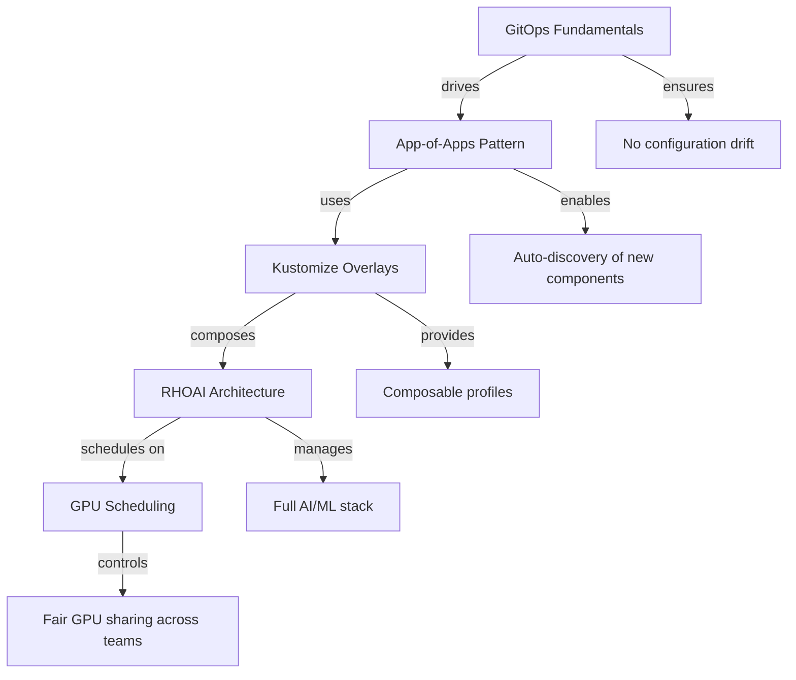

# Concepts

Before deploying anything, take a few minutes to understand the foundational ideas that make this project work. These concepts will help you troubleshoot issues, customize your deployment, and explain the architecture to others.

## Why This Section Exists

Most deployment guides tell you *what commands to run*. This section explains *why* those commands work and *what happens* when you run them. If you understand the concepts here, you will:

- Know exactly what is happening at each stage of deployment
- Be able to diagnose issues without guessing
- Confidently customize the deployment for your organization's needs
- Explain the architecture to stakeholders who need to approve it

## Reading Order

If you are new to any of these topics, read them in order:

| Page | You will learn | Time |
|------|---------------|------|
| [What is GitOps?](gitops-fundamentals.md) | Why Git drives your infrastructure, how ArgoCD keeps things in sync, and what "self-healing" actually means | 8 min |
| [App-of-Apps Pattern](app-of-apps.md) | How one ArgoCD Application bootstraps an entire platform, and why ApplicationSets auto-discover new content | 6 min |
| [Kustomize and Overlays](kustomize-overlays.md) | How this repo composes manifests from bases and overlays without templating, and how to build your own profiles | 7 min |
| [GPU Scheduling](gpu-scheduling.md) | How GPUs become schedulable in Kubernetes, how Kueue manages quotas, and the lifecycle of a GPU job from submission to completion | 10 min |
| [RHOAI Architecture](rhoai-architecture.md) | What Red Hat OpenShift AI actually installs, the operator hierarchy, the DataScienceCluster as control plane, and what this repo manages vs. what RHOAI manages internally | 8 min |

## How These Concepts Connect

Once you understand these five concepts, the [Quick Start](../quickstart.md) will make complete sense -- every command maps to a concept you already know.
