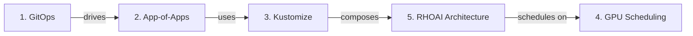

# Concepts

## What is Red Hat OpenShift AI?

Red Hat OpenShift AI (RHOAI) is a Kubernetes-native platform that provides integrated **MLOps**, **GenAIOps**, and **AgentOps** capabilities on OpenShift. It accelerates the full AI/ML lifecycle — from experimentation in notebooks through distributed training to production model serving — while giving platform teams governance, quota management, and multi-tenant isolation.

RHOAI is deployed via a single Kubernetes operator (the **Red Hat OpenShift AI Operator**) that installs and manages all platform components through a **DataScienceCluster** custom resource. You declare which capabilities you want enabled, and the operator handles installation, upgrades, and dependency resolution.

This repository deploys RHOAI and all its dependencies using **GitOps** — the entire platform is declared in Git and continuously reconciled by ArgoCD.

---

## What Problems Does RHOAI Solve?

| Challenge | Without RHOAI | With RHOAI |
|-----------|--------------|------------|
| **Model serving** | Teams build custom inference APIs, manage scaling manually, no standard endpoint format | KServe provides OpenAI-compatible endpoints, auto-scaling, canary rollouts, and GPU-aware scheduling |
| **Training at scale** | Single-node training bottlenecks, no distributed framework integration | Ray, PyTorch distributed training with Kueue-managed GPU quotas and fair scheduling |
| **GPU resource waste** | Every team hoards GPUs, no sharing or preemption | Kueue provides ClusterQueues, ResourceFlavors, and priority-based preemption across teams |
| **Experiment tracking** | Scattered notebooks, no reproducibility | MLflow tracks experiments, metrics, artifacts, and model versions with RBAC per namespace |
| **ML pipelines** | Manual scripts, no orchestration | AI Pipelines (Tekton-based) automate training, evaluation, and deployment workflows |
| **Model governance** | No catalog, no versioning, no audit trail | Model Registry provides centralized versioning, lifecycle tracking, and promotion workflows |
| **Multi-tenant model access** | Each team deploys their own copies of models | Models-as-a-Service provides a curated catalog with API gateway, rate limiting, and OIDC auth |
| **Compliance and auditability** | No record of what changed or who deployed what | TrustyAI for bias detection; GitOps provides full audit trail via Git history |

---

## RHOAI Capabilities

RHOAI is modular — each capability can be independently enabled or disabled via the DataScienceCluster. This repository provides [composable overlays](kustomize-overlays.md) that bundle capabilities into profiles (minimal, serving, training, full, maas, dev).

### Model Serving (KServe)

Deploy trained models as scalable API endpoints. KServe supports **vLLM** for GPU-accelerated LLM inference with OpenAI-compatible APIs, auto-scaling, and canary rollouts. Models are deployed as `InferenceService` resources with `RawDeployment` mode for direct GPU access.

**DSC component:** `kserve` | **[Full guide](../capabilities/model-serving.md)**

### Batch and Distributed Inference (llm-d)

Process large volumes of inference requests efficiently using the **llm-d batch gateway**. Supports prefix-cache-aware routing, load-balanced scheduling across vLLM pods, and integration with ServiceMesh for traffic management.

**DSC component:** `batchGateway` | **[Full guide](../capabilities/batch-inference.md)**

### Distributed Training

Train models across multiple nodes using **Ray** (RayJob, RayCluster) and **Kubeflow Training Operator** (PyTorchJob, TrainJob). Kueue manages GPU quotas with fair scheduling, preemption, and topology-aware placement.

**DSC components:** `ray`, `trainingoperator` | **[Full guide](../capabilities/training.md)**

### AI Pipelines

Build portable ML workflows using **Tekton-based data science pipelines**. Automate training, evaluation, model registration, and deployment as repeatable, versioned pipelines.

**DSC component:** `aipipelines` | **[Full guide](../capabilities/pipelines.md)**

### Workbenches

Self-service **JupyterLab notebooks** with pre-built images for PyTorch, TensorFlow, and data science. Data scientists create projects, connect to data sources, and develop models without platform team involvement.

**DSC component:** `workbenches` | **[Full guide](../capabilities/workbenches.md)**

### Model Registry

Centralized model versioning, lifecycle tracking, and promotion workflows. Register models from training pipelines, tag versions, and promote from staging to production with full audit history.

**DSC component:** `modelregistry` | **[Full guide](../capabilities/model-registry.md)**

### Models-as-a-Service (MaaS)

Platform teams host models centrally and provide self-service access to consuming teams through the **AI Gateway**. Includes OIDC authentication, per-team rate limiting, usage tracking, and an OpenAI-compatible API.

**DSC component:** `aigateway` | **[Full guide](../capabilities/maas.md)**

### MLflow

Experiment tracking, metric logging, artifact storage, and model registry with namespace-based multi-tenancy. Integrates with workbenches and training pipelines for end-to-end experiment management.

**DSC component:** `mlflowoperator` | **[Full guide](../capabilities/mlflow.md)**

### Hardware Profiles

Named GPU resource bundles (e.g., "4x NVIDIA L40S") that abstract Kubernetes resource specs. Data scientists select profiles from a Dashboard dropdown instead of writing raw YAML.

**Dashboard feature** | **[Full guide](../capabilities/hardware-profiles.md)**

### GPU Infrastructure

**Node Feature Discovery** (NFD) detects GPU hardware, the **NVIDIA GPU Operator** installs drivers and container toolkit, and **Kueue** manages quota allocation. This stack runs independently of the DSC.

**External operators** | **[Full guide](../capabilities/gpu-infrastructure.md)**

---

## How GitOps Deploys RHOAI

This repository uses ArgoCD to deploy the entire RHOAI platform declaratively. Understanding these implementation patterns will help you operate and customize the deployment.

### The Learning Path

Read these in order — each builds on the previous:

| # | Topic | What You'll Learn | Time |
|---|-------|-------------------|------|
| 1 | [What is GitOps?](gitops-fundamentals.md) | Why Git drives infrastructure. How ArgoCD keeps clusters in sync. What "self-healing" actually means. | 8 min |
| 2 | [App-of-Apps Pattern](app-of-apps.md) | How one ArgoCD Application bootstraps an entire platform. Why ApplicationSets auto-discover content from Git. | 6 min |
| 3 | [Kustomize and Overlays](kustomize-overlays.md) | How this repo composes manifests without templating. Bases, patches, replacements. Building custom profiles. | 7 min |
| 4 | [GPU Scheduling](gpu-scheduling.md) | The full lifecycle: NFD labels nodes, GPU Operator installs drivers, Kueue manages quotas, job runs. | 10 min |
| 5 | [RHOAI Architecture](rhoai-architecture.md) | Operators all the way down. The DSC as control plane. What RHOAI installs internally vs what this repo declares. | 8 min |

### How These Concepts Connect

Once you understand all five, the [Quick Start](../quickstart.md) will make complete sense — every command maps to a concept you already know.
