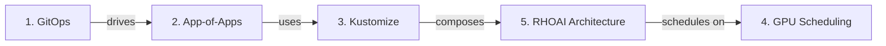

# Concepts

Before deploying, invest 30 minutes understanding the foundations. These concepts will transform you from someone running commands into someone who truly understands their AI platform.

---

## Why This Matters

Most deployment guides tell you *what commands to run*. This section explains *why* those commands work and *what happens* when you run them.

After reading these pages, you will:

- **Diagnose issues** without guessing — you will know exactly what each component does
- **Customize confidently** — compose your own profiles, add operators, change configurations
- **Explain the architecture** to stakeholders who need to approve the deployment
- **Operate the platform** knowing what self-healing and drift detection actually mean

---

## The Learning Path

Read these in order. Each builds on the previous:

<a href="gitops-fundamentals/" class="journey-card">
:material-source-branch:
<h3>1. What is GitOps?</h3>

Why Git drives infrastructure. How ArgoCD keeps clusters in sync. What "self-healing" actually means. Imperative vs declarative.

8 min read
</a>

<a href="app-of-apps/" class="journey-card">
:material-apps:
<h3>2. App-of-Apps Pattern</h3>

How one ArgoCD Application bootstraps an entire platform. Why ApplicationSets auto-discover new content from Git directories.

6 min read
</a>

<a href="kustomize-overlays/" class="journey-card">
:material-layers:
<h3>3. Kustomize and Overlays</h3>

How this repo composes manifests without templating. Bases, patches, replacements. Building your own custom profiles.

7 min read
</a>

<a href="gpu-scheduling/" class="journey-card">
:material-chip:
<h3>4. GPU Scheduling</h3>

The full lifecycle: NFD labels nodes → GPU Operator installs drivers → Kueue manages quotas → job runs on GPU. End to end.

10 min read
</a>

<a href="rhoai-architecture/" class="journey-card">
:material-cube-outline:
<h3>5. RHOAI Architecture</h3>

Operators all the way down. The DSC as control plane. What RHOAI installs internally vs what this repo declares.

8 min read
</a>

---

## How These Concepts Connect

Once you understand all five, the [Quick Start](../quickstart.md) will make complete sense — every command maps to a concept you already know.
