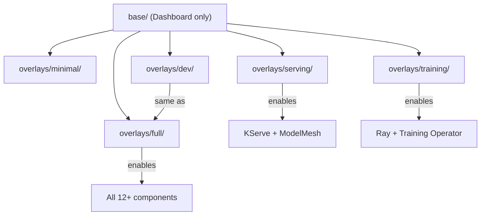

# Kustomize and Overlays

Kustomize is a tool built into `kubectl` and `oc` that lets you compose Kubernetes manifests from reusable pieces without templating. Instead of using variables like `{{ .Values.replicas }}` (Helm), you write plain YAML and layer modifications on top.

## Why Kustomize Instead of Helm?

This repository uses Kustomize rather than Helm because:

1. **No template language** -- Every file is valid YAML. You can `oc apply -f` any individual file without rendering.
2. **Composability** -- Overlay one patch on top of another. Combine capabilities by stacking patches.
3. **ArgoCD native** -- ArgoCD has first-class Kustomize support. Point an Application at a `kustomization.yaml` and it builds automatically.
4. **Transparency** -- You can always see exactly what will be applied by running `kustomize build`.

## Core Concepts

### Bases

A **base** is a directory containing foundational manifests and a `kustomization.yaml` that lists them:

```
components/instances/rhoai-instance/base/
├── kustomization.yaml          # Lists resources
├── datasciencecluster.yaml     # The DSC with Dashboard only
└── namespace.yaml              # The namespace
```

The base represents the minimal, correct version of a component. In this repo, the DSC base enables only the Dashboard -- the absolute minimum viable RHOAI installation.

### Overlays

An **overlay** extends a base by applying patches. It references the base and adds modifications:

```
components/instances/rhoai-instance/overlays/serving/
├── kustomization.yaml          # References ../../base + adds patches
└── patch-serving.yaml          # JSON patch to enable KServe + ModelMesh
```

The overlay's `kustomization.yaml`:

```yaml
apiVersion: kustomize.config.k8s.io/v1beta1
kind: Kustomization
resources:
  - ../../base
patches:
  - path: patch-serving.yaml
    target:
      kind: DataScienceCluster
```

And the patch:

```yaml
- op: replace
  path: /spec/components/kserve/managementState
  value: Managed
- op: replace
  path: /spec/components/modelmeshserving/managementState
  value: Managed
```

### The Result

When ArgoCD (or `kustomize build`) processes the `serving` overlay:

1. It reads the base DSC (Dashboard only)
2. It applies the patch (enables KServe and ModelMesh)
3. The output is a complete DSC with Dashboard + KServe + ModelMesh

No templating. No variables. Just composition.

## How This Repository Uses Overlays



Each overlay adds exactly the components needed for its use case. This means:

- **Serving teams** deploy only what they need (no training infrastructure consuming resources)
- **Training teams** get Kueue and Ray without model serving overhead
- **Platform teams** deploy everything with the `full` overlay

## Composing a Custom Profile

You are not limited to the pre-built overlays. Compose your own by combining patches:

```yaml
# components/instances/rhoai-instance/overlays/my-custom/kustomization.yaml
apiVersion: kustomize.config.k8s.io/v1beta1
kind: Kustomization
resources:
  - ../../base
patches:
  - path: ../serving/patch-serving.yaml    # Reuse the serving patch
    target:
      kind: DataScienceCluster
  - path: patch-pipelines.yaml             # Add your own
    target:
      kind: DataScienceCluster
```

This gives you serving + pipelines without training, workbenches, or model registry.

## Kustomize Replacements (Parameterization)

This repository also uses Kustomize **replacements** to inject configuration values. A single file (`clusters/overlays/dev/cluster-config.yaml`) contains your Git repository URL and branch:

```yaml
apiVersion: v1
kind: ConfigMap
metadata:
  name: cluster-gitops-config
data:
  repoURL: "https://github.com/YOUR-ORG/rhoai-deploy-gitops.git"
  targetRevision: "main"
```

Kustomize replacements then inject these values into every ArgoCD Application and ApplicationSet, replacing placeholder values. This means you configure your fork URL **once** and it propagates everywhere automatically.

## Verifying What Gets Applied

Before deploying, you can always preview the final output:

```bash
# See exactly what Kustomize will produce
kustomize build components/instances/rhoai-instance/overlays/serving/

# Or using oc
oc kustomize components/instances/rhoai-instance/overlays/serving/
```

This transparency is a major advantage over Helm charts, where the rendered output is often opaque until deployment time.

## Key Takeaways

| Concept | Purpose | Example in This Repo |
|---------|---------|---------------------|
| Base | Minimal correct starting point | DSC with Dashboard only |
| Overlay | Extends base for a specific use case | `serving/` enables KServe |
| Patch | A targeted modification to a resource | JSON patch setting `managementState: Managed` |
| Replacement | Injects dynamic values without templates | Repo URL propagated to all ArgoCD apps |

## What Happens Next

Now that you understand how manifests are composed, learn how [GPU scheduling](gpu-scheduling.md) works -- how those composed manifests translate into actual GPU workloads being queued, prioritized, and executed.
