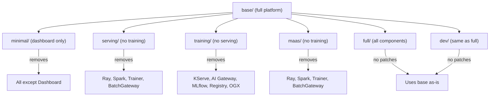

# Kustomize and Overlays

Kustomize is a tool built into `kubectl` and `oc` that lets you compose Kubernetes manifests from reusable pieces without templating. Instead of using variables like `{{ .Values.replicas }}` (Helm), you write plain YAML and layer modifications on top.

## Why Kustomize Instead of Helm?

This repository uses Kustomize rather than Helm because:

1. **No template language** -- Every file is valid YAML. You can `oc apply -f` any individual file without rendering.
2. **Composability** -- Overlay one patch on top of another. Combine capabilities by stacking patches.
3. **ArgoCD native** -- ArgoCD has first-class Kustomize support. Point an Application at a `kustomization.yaml` and it builds automatically.
4. **Transparency** -- You can always see exactly what will be applied by running `kustomize build`.

## Core Concepts

### Bases

A **base** is a directory containing foundational manifests and a `kustomization.yaml` that lists them:

```
components/instances/rhoai-instance/base/
├── kustomization.yaml          # Lists resources
├── datasciencecluster.yaml     # Full-platform DSC (all components enabled)
└── namespace.yaml              # The namespace
```

In this repo, the DSC base enables **all RHOAI components** -- KServe, Ray, training operators, pipelines, MLflow, model registry, TrustyAI, workbenches, and more. This "full by default" approach means overlays only need to **remove** what isn't needed.

### Overlays

An **overlay** extends a base by applying patches. It references the base and applies a strategic merge patch to disable specific components:

```
components/instances/rhoai-instance/overlays/serving/
├── kustomization.yaml          # References ../../base + applies patches
├── datasciencecluster.yaml     # Strategic merge patch to remove training components
└── gateway-memory-rbac.yaml    # PostSync hook for AI Gateway
```

The overlay's `kustomization.yaml`:

```yaml
apiVersion: kustomize.config.k8s.io/v1beta1
kind: Kustomization
resources:
  - ../../base
  - gateway-memory-rbac.yaml
patches:
  - path: datasciencecluster.yaml
```

And the strategic merge patch (`datasciencecluster.yaml`):

```yaml
apiVersion: datasciencecluster.opendatahub.io/v2
kind: DataScienceCluster
metadata:
  name: default-dsc
spec:
  components:
    aigateway:
      batchGateway:
        managementState: Removed
    ray:
      managementState: Removed
    sparkoperator:
      managementState: Removed
    trainer:
      managementState: Removed
    trainingoperator:
      managementState: Removed
```

### The Result

When ArgoCD (or `kustomize build`) processes the `serving` overlay:

1. It reads the base DSC (all components enabled)
2. It applies the strategic merge patch (removes training-related components)
3. The output is a DSC with everything **except** training infrastructure

No templating. No variables. Just composition.

## How This Repository Uses Overlays



Each overlay **subtracts** the components that aren't needed for its use case:

- **Serving teams** get inference without training infrastructure consuming resources
- **Training teams** get Ray and Kueue without model serving overhead
- **MaaS teams** get the same as serving, optimized for Models-as-a-Service
- **Platform teams** deploy everything with the `full` overlay

## Composing a Custom Profile

You are not limited to the pre-built overlays. Create your own by writing a strategic merge patch:

```yaml
# components/instances/rhoai-instance/overlays/my-custom/kustomization.yaml
apiVersion: kustomize.config.k8s.io/v1beta1
kind: Kustomization
resources:
  - ../../base
patches:
  - path: datasciencecluster.yaml
```

```yaml
# components/instances/rhoai-instance/overlays/my-custom/datasciencecluster.yaml
apiVersion: datasciencecluster.opendatahub.io/v2
kind: DataScienceCluster
metadata:
  name: default-dsc
spec:
  components:
    ray:
      managementState: Removed
    sparkoperator:
      managementState: Removed
    mlflowoperator:
      managementState: Removed
    workbenches:
      managementState: Removed
```

This gives you serving + pipelines + training operators without Ray, MLflow, Spark, or workbenches.

## Kustomize Replacements (Parameterization)

This repository also uses Kustomize **replacements** to inject configuration values. A single file (`bootstrap/overlays/default/cluster-config.yaml`) contains your Git repository URL and branch:

```yaml
apiVersion: v1
kind: ConfigMap
metadata:
  name: cluster-gitops-config
data:
  repoURL: "https://github.com/YOUR-ORG/rhoai-deploy-gitops.git"
  targetRevision: "main"
```

Kustomize replacements then inject these values into every ArgoCD Application and ApplicationSet, replacing placeholder values. This means you configure your fork URL **once** and it propagates everywhere automatically.

## Verifying What Gets Applied

Before deploying, you can always preview the final output:

```bash
# See exactly what Kustomize will produce
kustomize build components/instances/rhoai-instance/overlays/serving/

# Or using oc
oc kustomize components/instances/rhoai-instance/overlays/serving/
```

This transparency is a major advantage over Helm charts, where the rendered output is often opaque until deployment time.

## Key Takeaways

| Concept | Purpose | Example in This Repo |
|---------|---------|---------------------|
| Base | Full-platform starting point with all components | DSC with all 16+ components enabled |
| Overlay | Subtracts components for a specific use case | `serving/` removes training infrastructure |
| Patch | A strategic merge patch setting components to `Removed` | `datasciencecluster.yaml` in each overlay |
| Replacement | Injects dynamic values without templates | Repo URL propagated to all ArgoCD apps |

## What Happens Next

Now that you understand how manifests are composed, learn how [GPU scheduling](gpu-scheduling.md) works -- how those composed manifests translate into actual GPU workloads being queued, prioritized, and executed.
