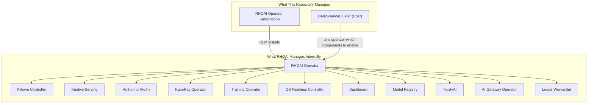
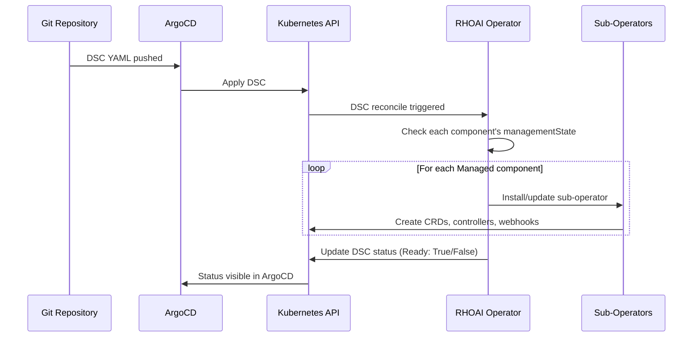

# RHOAI Architecture

This page describes **RHOAI the product's internal architecture** — how the operator, DSC components, and sub-operators work together. For how this GitOps repository is structured, see [Repository Architecture](../architecture.md).

Red Hat OpenShift AI (RHOAI) is a platform that installs and manages a complete AI/ML stack on OpenShift. Understanding its architecture -- what it installs, what it manages internally, and what this repository controls -- is crucial for operating it effectively.

## It Is Operators All the Way Down

RHOAI follows the Kubernetes operator pattern: a controller watches custom resources and reconciles the cluster to match them. But RHOAI uses **nested operators** -- the top-level operator installs sub-operators, which install their own controllers:



**Key insight:** You only declare two things in Git -- the operator Subscription and the DataScienceCluster. The RHOAI operator handles everything else internally. You never write manifests for KServe, Knative, or Authorino -- those are installed automatically when you set `kserve.managementState: Managed` in the DSC.

## The DataScienceCluster (DSC)

The DSC is the single control plane resource for RHOAI. It tells the operator which components to enable, and the operator reconciles the cluster accordingly.

```yaml
apiVersion: datasciencecluster.opendatahub.io/v2
kind: DataScienceCluster
metadata:
  name: default-dsc
spec:
  components:
    dashboard:
      managementState: Managed
    kserve:
      managementState: Managed       # Enables KServe + Knative + Authorino
    ray:
      managementState: Managed       # Enables KubeRay operator
    trainingoperator:
      managementState: Managed       # Enables Kubeflow Training Operator
    workbenches:
      managementState: Managed       # Enables JupyterHub notebooks
    aipipelines:
      managementState: Managed       # Enables Tekton-based pipelines
    modelregistry:
      managementState: Managed       # Enables Model Registry
    kueue:
      managementState: Unmanaged     # We manage Kueue separately
    batchGateway:
      managementState: Managed       # Enables batch inference via llm-d
```

### Management States

| State | Meaning |
|-------|---------|
| `Managed` | RHOAI operator installs and manages this component |
| `Removed` | RHOAI operator removes this component if it exists |
| `Unmanaged` | RHOAI operator ignores this component -- you manage it yourself |

**Why Kueue is `Unmanaged`:** The standalone Red Hat Build of Kueue Operator provides newer features and independent lifecycle management. Setting Kueue to `Unmanaged` tells RHOAI "do not install your bundled Kueue -- we have our own."

## What RHOAI Installs Behind the Scenes

When you set a component to `Managed`, the RHOAI operator installs its dependencies automatically. Here is what happens for each major component:

| DSC Component | What Gets Installed Internally |
|--------------|-------------------------------|
| `kserve` | KServe controller, Knative Serving, Knative networking (Istio or Kourier), cert-manager integration |
| `ray` | KubeRay operator, Ray CRDs |
| `trainingoperator` | Kubeflow Training Operator, TrainJob CRD |
| `dashboard` | RHOAI Dashboard, OAuth proxy, RBAC |
| `aipipelines` | Tekton pipelines, DSP controller, MariaDB for metadata |
| `workbenches` | Notebook controller, default notebook images |
| `batchGateway` | AI Gateway Operator, llm-d batch gateway controller |

## The Operator Hierarchy

The full picture of what runs on the cluster:

```mermaid
graph TD
  subgraph external_operators ["Operators You Install (via this repo)"]
    CertMgr["cert-manager"]
    NFD["NFD"]
    GPUOp["GPU Operator"]
    KueueOp["Kueue Operator"]
    JobSetOp["JobSet Operator"]
    ServiceMesh["ServiceMesh"]
    CMA["Custom Metrics Autoscaler"]
    LWS["LeaderWorkerSet"]
    RHCL["Red Hat Connectivity Link"]
  end

  subgraph rhoai_operator ["RHOAI Operator (installs sub-operators)"]
    Dashboard["Dashboard"]
    KServe["KServe + Knative"]
    Ray["KubeRay"]
    TrainOp["Training Operator"]
    Pipelines["DS Pipelines"]
    Workbenches["Workbenches"]
    Registry["Model Registry"]
    TrustyAI["TrustyAI"]
    MLflow["MLflow Operator"]
    BatchGW["Batch Gateway (llm-d)"]
    AIGateway["AI Gateway"]
  end

  subgraph instances ["Operator Instances (CRs you declare)"]
    NFDInst["NodeFeatureDiscovery"]
    GPUInst["ClusterPolicy"]
    KueueInst["Kueue + ClusterQueue"]
    JobSetInst["JobSet Instance"]
    DSCInst["DataScienceCluster"]
  end

  CertMgr -.->|"dependency"| KServe
  CertMgr -.->|"dependency"| KueueOp
  NFD --> NFDInst
  GPUOp --> GPUInst
  KueueOp --> KueueInst
  JobSetOp --> JobSetInst
  ServiceMesh -.->|"dependency"| BatchGW
  LWS -.->|"dependency"| BatchGW
  RHCL -.->|"dependency"| AIGateway
```



## What This Repository Manages vs. What It Does Not

| This Repo Manages | RHOAI Manages Internally |
|-------------------|--------------------------|
| Operator Subscriptions (OLM) | Sub-operator installation |
| DataScienceCluster (which components are enabled) | Component reconciliation |
| Kueue Operator + configuration | KServe, Knative, Authorino |
| GPU Operator + ClusterPolicy | Dashboard OAuth, RBAC |
| NFD Operator + Instance | Notebook images |
| Model deployments (InferenceService) | Internal CRD management |
| Kustomize overlays for profiles | Dependency resolution |

**The boundary is clear:** You declare WHAT should be enabled. RHOAI handles HOW it gets installed and kept running.

## DSC Lifecycle



## The DSC API (v2)

RHOAI uses the **v2 API** (`datasciencecluster.opendatahub.io/v2`). Key differences from v1:

- Component name `datasciencepipelines` became `aipipelines`
- Component `modelmeshserving` was removed
- New components: `batchGateway`, `feastoperator`, `mlflowoperator`
- New fields: `defaultClusterQueueName`, `defaultLocalQueueName`, `registriesNamespace`

## Why ArgoCD Needs Special Handling for the DSC

The RHOAI operator enriches the DSC with additional fields that are not in your Git manifests. For example, you write:

```yaml
spec:
  components:
    kserve:
      managementState: Managed
```

But the operator fills in additional sub-fields:

```yaml
spec:
  components:
    kserve:
      managementState: Managed
      serving:
        ingressGateway:
          certificate:
            type: SelfSigned
        managementState: Managed
        name: knative-serving
```

Without `ignoreDifferences`, ArgoCD would see these operator-added fields as drift and try to remove them. The dedicated DSC Application uses `ignoreDifferences` to suppress this false drift.

## Key Takeaways

1. **You manage the outer layer** -- operator subscriptions, the DSC, and workloads (models, training jobs)
2. **RHOAI manages the inner layer** -- sub-operators, internal CRDs, dependency wiring
3. **The DSC is your control plane** -- one resource that governs the entire AI platform
4. **Kueue is special** -- it is `Unmanaged` because the standalone operator is more capable
5. **ArgoCD needs ignoreDifferences** -- because the RHOAI operator mutates resources it manages
