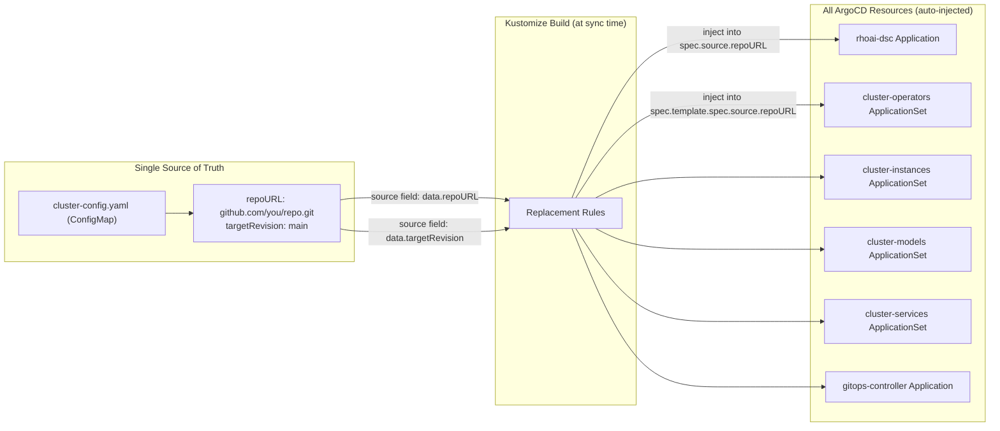

# Configuration

This repository is designed to work with any fork on any cluster. Configuration is centralized in a single file — you edit one YAML, push, and deploy with `oc apply -k`. The optional `scripts/configure.sh` helper provides a CLI convenience wrapper.

## The Configuration System

All ArgoCD Applications and ApplicationSets contain **placeholder values** for repository URL and branch:

```yaml
repoURL: REPO_URL_PLACEHOLDER
targetRevision: TARGET_REVISION_PLACEHOLDER
```

These are replaced at build time by Kustomize **replacements** that read from a single ConfigMap:

```yaml
# bootstrap/overlays/default/cluster-config.yaml
apiVersion: v1
kind: ConfigMap
metadata:
  name: cluster-gitops-config
  namespace: openshift-gitops
data:
  repoURL: "https://github.com/YOUR-ORG/rhoai-deploy-gitops.git"
  targetRevision: "main"
```

When ArgoCD builds the Kustomize output, every Application and ApplicationSet gets your repository URL and branch injected automatically.

## Using scripts/configure.sh

The `scripts/configure.sh` script updates `cluster-config.yaml` and the RHOAI operator channel:

```bash
./scripts/configure.sh --repo https://github.com/YOUR-ORG/rhoai-deploy-gitops.git \
           --branch main \
           --channel fast \
           --dsc full
```

### Options

| Flag | Default | Description |
|------|---------|-------------|
| `--repo` | (required) | Your fork's Git URL |
| `--branch` | `main` | Branch ArgoCD should track |
| `--channel` | `fast` | RHOAI operator channel (fast = GA, beta = EA, stable = LTS) |
| `--dsc` | `full` | DSC overlay (minimal, serving, training, maas, full, dev) |

### What It Changes

1. `bootstrap/overlays/default/cluster-config.yaml` -- Updates `repoURL` and `targetRevision`
2. `components/operators/rhoai-operator/patch-channel.yaml` -- Updates the operator channel
3. `components/argocd/apps/rhoai-dsc-app.yaml` -- Updates the DSC overlay path (when `--dsc` is specified)

Three files total. Everything else is derived from these through Kustomize replacements and ArgoCD ApplicationSet templates.

## Manual Configuration

If you prefer not to use the script, edit the files directly:

### 1. Set your repository URL

Edit `bootstrap/overlays/default/cluster-config.yaml`:

```yaml
data:
  repoURL: "https://github.com/YOUR-ORG/rhoai-deploy-gitops.git"
  targetRevision: "main"
```

### 2. Set the RHOAI channel

Edit `components/operators/rhoai-operator/patch-channel.yaml`:

```yaml
- op: replace
  path: /spec/channel
  value: fast
```

Channel options:
- `fast` -- RHOAI GA (General Availability) releases
- `beta` -- RHOAI EA (Early Access / preview) releases
- `stable` -- RHOAI LTS (Long Term Support) releases

### 3. Choose your DSC overlay

The `rhoai-dsc` Application points to a specific overlay. To change which profile is deployed, the overlay path in the DSC application manifest needs to match your choice.

## How Replacements Work

A single ConfigMap is the source of truth. Kustomize injects its values into every ArgoCD Application and ApplicationSet at build time:



The `bootstrap/overlays/default/kustomization.yaml` defines replacement rules:

```yaml
replacements:
  - source:
      kind: ConfigMap
      name: cluster-gitops-config
      fieldPath: data.repoURL
    targets:
      - select:
          kind: Application
        fieldPaths:
          - spec.source.repoURL
      - select:
          kind: ApplicationSet
        fieldPaths:
          - spec.template.spec.source.repoURL
```

This means: "Take the `repoURL` value from `cluster-gitops-config` and inject it into every Application's `spec.source.repoURL` and every ApplicationSet's template."

The result: configure once, apply everywhere.

## Verifying Configuration

Before deploying, verify what Kustomize will produce:

```bash
# Build the cluster overlay and inspect the output
kustomize build bootstrap/overlays/default/ | grep repoURL

# Should show YOUR repo URL in every Application/ApplicationSet
```

## Adding a New Cluster Overlay

For multiple clusters (dev, staging, production), create additional overlays:

```
bootstrap/
├── base/
└── overlays/
    ├── default/
    │   ├── cluster-config.yaml      # Default cluster config
    │   └── kustomization.yaml
    ├── staging/
    │   ├── cluster-config.yaml      # Staging cluster config
    │   └── kustomization.yaml
    └── prod/
        ├── cluster-config.yaml      # Prod cluster config
        └── kustomization.yaml
```

Each overlay can point to a different branch, use a different DSC profile, or target a different RHOAI channel.

## Deploying Models and Services (Opt-In Pattern)

By default, **no models or services are deployed**. The RHOAI platform (operators, DSC, instances) is fully enabled, but workload deployment is opt-in. This ensures the platform is portable across clusters without deploying cluster-specific workloads.

### How It Works

Each model and service directory contains a `config.json` marker file:

```
usecases/
├── models/
│   ├── gemma2-9b-fp8/
│   │   └── profiles/tier1-minimal/
│   │       ├── config.json          ← Opt-in control
│   │       └── kustomization.yaml   ← Actual manifests
│   └── qwen25-7b-instruct/
│       └── profiles/tier1-minimal/
│           ├── config.json
│           └── kustomization.yaml
└── services/
    ├── llm-d-epp/
    │   └── profiles/tier1-minimal/
    │       ├── config.json
    │       └── kustomization.yaml
    └── ...
```

The `config.json` declares whether the workload should be deployed:

```json
{
  "enabled": "false",
  "name": "gemma2-9b-fp8",
  "category": "models",
  "path": "usecases/models/gemma2-9b-fp8/profiles/tier1-minimal",
  "namespace": "models-as-a-service",
  "description": "Gemma 2 9B FP8 quantized model",
  "gpu_required": "1x NVIDIA L4/A10G (24GB VRAM)"
}
```

The ArgoCD ApplicationSets use a **Git File Generator** with a **post-selector** that only creates Applications for entries where `"enabled": "true"`:

```yaml
generators:
  - git:
      repoURL: ...
      files:
        - path: usecases/models/*/profiles/tier1-minimal/config.json
    selector:
      matchLabels:
        enabled: "true"
```

### Enabling a Model or Service

**Option A: Using scripts/configure.sh (recommended)**

```bash
# Enable a model
./scripts/configure.sh enable-model gemma2-9b-fp8

# Enable a service
./scripts/configure.sh enable-service llm-d-epp

# Check what's enabled
./scripts/configure.sh status
```

**Option B: Direct config.json edit**

```bash
# Edit the config.json directly
vi usecases/models/gemma2-9b-fp8/profiles/tier1-minimal/config.json
# Change "enabled": "false" → "enabled": "true"
```

**Option C: Using jq in a pipeline**

```bash
jq '.enabled = "true"' usecases/models/gemma2-9b-fp8/profiles/tier1-minimal/config.json \
  > tmp.json && mv tmp.json usecases/models/gemma2-9b-fp8/profiles/tier1-minimal/config.json
```

After enabling, commit and push. ArgoCD detects the config.json change, generates a new Application for the model, and syncs it.

### Disabling a Model or Service

Set `"enabled": "false"` in config.json (or use `./scripts/configure.sh disable-model <name>`), then commit and push. Because the ApplicationSets use `prune: true`, ArgoCD will automatically delete the Application and all its child resources from the cluster.

### Why This Pattern?

| Concern | How it's addressed |
|---------|-------------------|
| Portability | Platform deploys on any cluster; workloads are opt-in |
| No accidental deployments | Models with hardcoded endpoints won't auto-deploy |
| Self-service | Teams enable models via PR — no ApplicationSet edits needed |
| Declarative | Everything is in Git — no imperative ArgoCD CLI commands |
| Metadata | config.json carries description, GPU requirements, namespace |
| Reversible | Disable and push — ArgoCD prunes everything cleanly |

### Available Models

| Model | GPU Requirement | Description |
|-------|----------------|-------------|
| `gemma2-9b-fp8` | 1x L4/A10G | General-purpose instruct (FP8 quantized) |
| `qwen25-7b-instruct` | 1x L4/A10G | Multilingual reasoning and chat |
| `qwen-math-7b` | 1x L4/A10G | Mathematical reasoning specialist |
| `orchestrator-8b` | 1x L4/A10G | Multi-agent orchestration router |
| `gpt-oss-120b` | 4x A100 80GB | Large-scale model (tensor parallelism) |

### Available Services

| Service | Description | Requires Customization |
|---------|-------------|----------------------|
| `ai-gateway` | Kuadrant API gateway with OIDC auth | Yes — needs cluster URLs |
| `guardrails-gateway` | Content safety input/output filtering | No |
| `genai-toolbox` | Tool calling infrastructure for agents | No |
| `llamastack` | Meta LlamaStack inference distribution | No |
| `llm-d-epp` | Intelligent request routing (EPP) | No |
| `rhokp` | RAG-as-a-Service knowledge platform | No |
| `toolorchestra-app` | Multi-agent orchestration platform | No |

!!! warning "Services requiring customization"
    Some services (e.g., `ai-gateway`) contain cluster-specific URLs that must be updated before enabling. The `scripts/configure.sh enable-service` command will warn you if customization is needed. Check the `requires_customization` and `customization_note` fields in the service's `config.json`.

### Adding a New Model or Service

1. Create the directory structure:
   ```
   usecases/models/my-new-model/
   ├── manifests/
   │   ├── kustomization.yaml
   │   └── inference-service.yaml
   └── profiles/
       └── tier1-minimal/
           ├── config.json
           └── kustomization.yaml
   ```

2. Create `config.json` with `"enabled": "false"`:
   ```json
   {
     "enabled": "false",
     "name": "my-new-model",
     "category": "models",
     "path": "usecases/models/my-new-model/profiles/tier1-minimal",
     "namespace": "models-as-a-service",
     "description": "My custom model description",
     "gpu_required": "1x NVIDIA L4 (24GB VRAM)"
   }
   ```

3. The ApplicationSet auto-discovers new `config.json` files — no need to edit any ApplicationSet. When you set `"enabled": "true"` and push, ArgoCD generates and syncs the new Application automatically.

## Environment Variables (Advanced)

For CI/CD pipelines that configure the repo automatically:

```bash
export GITOPS_REPO="https://github.com/YOUR-ORG/rhoai-deploy-gitops.git"
export GITOPS_BRANCH="main"
export RHOAI_CHANNEL="fast"
export DSC_OVERLAY="full"

./scripts/configure.sh --repo "$GITOPS_REPO" \
           --branch "$GITOPS_BRANCH" \
           --channel "$RHOAI_CHANNEL" \
           --dsc "$DSC_OVERLAY"
```
