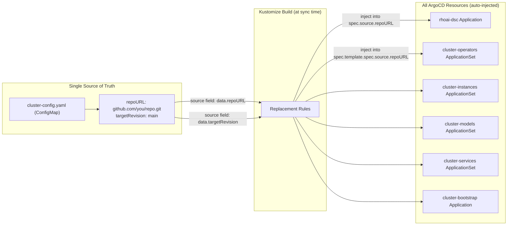

# Configuration

This repository is designed to work with any fork on any cluster. Configuration is centralized in a single file, and the `setup.sh` script handles initial setup.

## The Configuration System

All ArgoCD Applications and ApplicationSets contain **placeholder values** for repository URL and branch:

```yaml
repoURL: REPO_URL_PLACEHOLDER
targetRevision: TARGET_REVISION_PLACEHOLDER
```

These are replaced at build time by Kustomize **replacements** that read from a single ConfigMap:

```yaml
# clusters/overlays/dev/cluster-config.yaml
apiVersion: v1
kind: ConfigMap
metadata:
  name: cluster-gitops-config
  namespace: openshift-gitops
data:
  repoURL: "https://github.com/YOUR-ORG/rhoai-deploy-gitops.git"
  targetRevision: "main"
```

When ArgoCD builds the Kustomize output, every Application and ApplicationSet gets your repository URL and branch injected automatically.

## Using setup.sh

The `setup.sh` script updates `cluster-config.yaml` and the RHOAI operator channel:

```bash
./setup.sh --repo https://github.com/YOUR-ORG/rhoai-deploy-gitops.git \
           --branch main \
           --channel beta \
           --overlay full
```

### Options

| Flag | Default | Description |
|------|---------|-------------|
| `--repo` | (required) | Your fork's Git URL |
| `--branch` | `main` | Branch ArgoCD should track |
| `--channel` | `beta` | RHOAI operator channel (beta = Early Access, stable = GA) |
| `--overlay` | `full` | DSC overlay (minimal, serving, training, maas, full, dev) |

### What It Changes

1. `clusters/overlays/dev/cluster-config.yaml` -- Updates `repoURL` and `targetRevision`
2. `components/operators/rhoai-operator/patch-channel.yaml` -- Updates the operator channel

That is all. Two files. Everything else is derived from these through Kustomize replacements and ArgoCD ApplicationSet templates.

## Manual Configuration

If you prefer not to use the script, edit the files directly:

### 1. Set your repository URL

Edit `clusters/overlays/dev/cluster-config.yaml`:

```yaml
data:
  repoURL: "https://github.com/YOUR-ORG/rhoai-deploy-gitops.git"
  targetRevision: "main"
```

### 2. Set the RHOAI channel

Edit `components/operators/rhoai-operator/patch-channel.yaml`:

```yaml
- op: replace
  path: /spec/channel
  value: beta
```

Channel options:
- `beta` -- RHOAI 3.5 Early Access releases
- `stable` -- RHOAI GA releases (when available)
- `fast` -- Rapid release cycle (when available)

### 3. Choose your DSC overlay

The `rhoai-dsc` Application points to a specific overlay. To change which profile is deployed, the overlay path in the DSC application manifest needs to match your choice.

## How Replacements Work

A single ConfigMap is the source of truth. Kustomize injects its values into every ArgoCD Application and ApplicationSet at build time:



The `clusters/overlays/dev/kustomization.yaml` defines replacement rules:

```yaml
replacements:
  - source:
      kind: ConfigMap
      name: cluster-gitops-config
      fieldPath: data.repoURL
    targets:
      - select:
          kind: Application
        fieldPaths:
          - spec.source.repoURL
      - select:
          kind: ApplicationSet
        fieldPaths:
          - spec.template.spec.source.repoURL
```

This means: "Take the `repoURL` value from `cluster-gitops-config` and inject it into every Application's `spec.source.repoURL` and every ApplicationSet's template."

The result: configure once, apply everywhere.

## Verifying Configuration

Before deploying, verify what Kustomize will produce:

```bash
# Build the cluster overlay and inspect the output
kustomize build clusters/overlays/dev/ | grep repoURL

# Should show YOUR repo URL in every Application/ApplicationSet
```

## Adding a New Cluster Overlay

For multiple clusters (dev, staging, production), create additional overlays:

```
clusters/
├── base/
├── overlays/
│   ├── dev/
│   │   ├── cluster-config.yaml      # Dev cluster config
│   │   └── kustomization.yaml
│   ├── staging/
│   │   ├── cluster-config.yaml      # Staging cluster config
│   │   └── kustomization.yaml
│   └── prod/
│       ├── cluster-config.yaml      # Prod cluster config
│       └── kustomization.yaml
```

Each overlay can point to a different branch, use a different DSC profile, or target a different RHOAI channel.

## Environment Variables (Advanced)

For CI/CD pipelines that configure the repo automatically:

```bash
export GITOPS_REPO="https://github.com/YOUR-ORG/rhoai-deploy-gitops.git"
export GITOPS_BRANCH="main"
export RHOAI_CHANNEL="beta"
export DSC_OVERLAY="full"

./setup.sh --repo "$GITOPS_REPO" \
           --branch "$GITOPS_BRANCH" \
           --channel "$RHOAI_CHANNEL" \
           --overlay "$DSC_OVERLAY"
```
