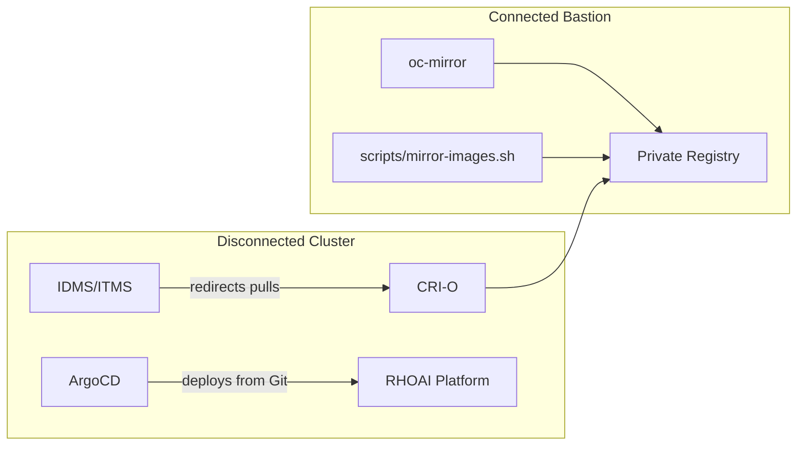

# Disconnected Deployment

Deploy RHOAI via GitOps in air-gapped or disconnected environments where the cluster cannot reach public container registries. All images are pre-mirrored to a private registry before deployment.

## Overview

Disconnected deployment requires two layers of image mirroring:

1. **RHOAI Platform Images** — the operator, notebooks, model serving runtimes, and pipeline images managed by the RHOAI operator. Mirrored using `oc-mirror` with an `ImageSetConfiguration`.
2. **Workload Images** — container images hardcoded in this repository's manifests (vLLM runtimes, PostgreSQL, download jobs, etc.). Mirrored using `scripts/mirror-images.sh`.



## Prerequisites

| Requirement | Details |
|---|---|
| Connected bastion | A machine with access to both the internet and your private registry |
| Private registry | Docker v2-2 compatible (Quay, Harbor, Artifactory, or mirror-registry) |
| `oc-mirror` v2 | OpenShift CLI plugin for image mirroring |
| `skopeo` | Container image inspection and copying tool |
| Red Hat credentials | Pull secret from [cloud.redhat.com](https://console.redhat.com/openshift/downloads#tool-pull-secret) |
| Registry credentials | Push access to your private registry |
| Storage | At least 100 GB on the bastion for image sets |

## Step-by-Step Guide

### Step 1: Review Required Images

List all container images referenced by this repository:

```bash
./scripts/mirror-images.sh list
```

To see the mirror targets for your registry:

```bash
./scripts/mirror-images.sh list --target-registry myregistry.example.com:5000
```

### Step 2: Generate the ImageSetConfiguration

Generate an `oc-mirror` configuration that includes the RHOAI operator and all workload images:

```bash
./scripts/mirror-images.sh generate-imageset \
  --target-registry myregistry.example.com:5000 \
  --channel fast \
  --version 3.5.0 \
  > imageset-config.yaml
```

A pre-built template is also available at `disconnected/imageset-config-template.yaml`.

### Step 3: Merge RHOAI Platform Images

The generated configuration only includes workload images from this repository. You must also include the RHOAI platform images (notebooks, pipeline runtimes, Ray, etc.) from the official helper:

1. Visit [rhoai-disconnected-install-helper](https://github.com/red-hat-data-services/rhoai-disconnected-install-helper)
2. Open the markdown file for your version (e.g., `rhoai-3.5.md`)
3. Copy the `additionalImages` entries
4. Paste them into the `additionalImages` section of your `imageset-config.yaml`

### Step 4: Mirror Images with oc-mirror

Run `oc-mirror` on the connected bastion:

```bash
oc mirror --config=imageset-config.yaml \
  docker://myregistry.example.com:5000
```

This mirrors:
- The RHOAI operator bundle from the Red Hat operator index
- All additional images (workloads + platform components)

It also generates IDMS (ImageDigestMirrorSet) manifests and a CatalogSource.

### Step 5: Mirror Repo-Specific Workload Images

For images not covered by oc-mirror (third-party registries), use the mirror script:

```bash
./scripts/mirror-images.sh mirror \
  --target-registry myregistry.example.com:5000 \
  --source-auth ~/.docker/config.json \
  --target-auth /run/user/1000/containers/auth.json
```

Use `--dry-run` to preview without copying.

### Step 6: Apply Mirror Configuration to Cluster

Apply the IDMS/ITMS and CatalogSource manifests generated by `oc-mirror` to the disconnected cluster:

```bash
# Apply the CatalogSource (mirrored operator index)
oc apply -f oc-mirror-workspace/results-*/catalogSource-*.yaml

# Apply the ImageDigestMirrorSet (registry redirect rules)
oc apply -f oc-mirror-workspace/results-*/imageDigestMirrorSet-*.yaml
```

These CRDs tell CRI-O to redirect image pulls from public registries to your private registry transparently.

### Step 7: Configure and Deploy

```bash
# Configure for your fork + disconnected overlay
./scripts/configure.sh \
  --repo https://gitea.internal.example.com/platform/rhoai-deploy-gitops.git \
  --overlay disconnected

# Commit and push
git add -A && git commit -m "Configure for disconnected cluster" && git push

# Bootstrap
until oc apply -k bootstrap/overlays/disconnected; do sleep 10; done
```

### Step 8: Verify

```bash
# Check that ArgoCD can pull images
oc get pods -n openshift-gitops

# Watch applications converge
watch oc get applications.argoproj.io -n openshift-gitops

# Check for ImagePullBackOff errors
oc get pods --all-namespaces --field-selector=status.phase!=Running | grep -i pull
```

## Troubleshooting

### ImagePullBackOff errors

If pods fail with `ImagePullBackOff`:

1. **Check IDMS is applied**: `oc get imagedigestmirrorset`
2. **Verify the image exists in your registry**: `skopeo inspect docker://myregistry.example.com:5000/path/to/image`
3. **Check node pull secret**: Ensure the global pull secret includes your registry credentials:
   ```bash
   oc get secret/pull-secret -n openshift-config -o jsonpath='{.data.\.dockerconfigjson}' | base64 -d | jq
   ```

### CatalogSource not ready

If the mirrored operator catalog shows errors:

```bash
oc get catalogsource -n openshift-marketplace
oc describe catalogsource <name> -n openshift-marketplace
```

Ensure the mirrored catalog image is accessible from the cluster.

### Missing platform images

If notebooks, workbenches, or serving runtimes fail to start, you likely need to merge the RHOAI platform images from the [disconnected install helper](https://github.com/red-hat-data-services/rhoai-disconnected-install-helper). Re-run `oc-mirror` with the complete image list.

## Reference

- [RHOAI Disconnected Installation Guide (official)](https://docs.redhat.com/en/documentation/red_hat_openshift_ai_self-managed/3.5/html/installing_and_uninstalling_openshift_ai_self-managed_in_a_disconnected_environment/deploying-openshift-ai-in-a-disconnected-environment_install)
- [RHOAI Disconnected Install Helper](https://github.com/red-hat-data-services/rhoai-disconnected-install-helper) — image discovery tool
- [oc-mirror Documentation](https://docs.openshift.com/container-platform/latest/installing/disconnected_install/about-installing-oc-mirror-v2.html)
- [Mirror Registry for Red Hat OpenShift](https://docs.openshift.com/container-platform/latest/installing/disconnected_install/installing-mirroring-creating-registry.html)
