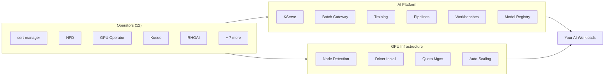

---
hide:
  - navigation
  - toc
---

# Deploy **Red Hat OpenShift AI** with GitOps

Production-ready, fully declarative AI/ML platform deployment on OpenShift.
Model serving, distributed training, batch inference, GPU quota management — 
managed entirely through Git.

<a href="quickstart/" class="cta-primary">Deploy Now</a>
<a href="concepts/" class="cta-secondary">Learn the Concepts</a>

12
Operators

6
DSC Profiles

0
Manual Steps

---

-   :material-school:{ .lg .middle } **I'm New to GitOps**

    ---

    Understand why Git drives infrastructure, how ArgoCD keeps clusters in sync, and how this repository is structured — before running a single command.

    [:octicons-arrow-right-24: Start with the Concepts](concepts/)

-   :material-rocket-launch:{ .lg .middle } **I Want to Deploy Now**

    ---

    Fork the repo, run `configure.sh`, bootstrap ArgoCD. Two commands and your entire AI platform self-assembles in 15-30 minutes.

    [:octicons-arrow-right-24: Quick Start Guide](quickstart/)

-   :material-puzzle:{ .lg .middle } **I Need Specific Capabilities**

    ---

    Pick exactly what you need — model serving, training, batch inference, MaaS, MLflow — and deploy only what matters for your team.

    [:octicons-arrow-right-24: Capabilities Guide](capabilities/)

-   :material-layers-triple:{ .lg .middle } **I'm Evaluating the Architecture**

    ---

    12 operators, 4 ApplicationSets, composable Kustomize overlays, and self-healing sync policies. See how it all fits together.

    [:octicons-arrow-right-24: Architecture Deep Dive](architecture/)

---

## Why GitOps for OpenShift AI?

Most organizations deploying AI on Kubernetes face the same challenges. GitOps eliminates them.

### :material-alert-circle: Without GitOps

- Teams run **manual installs** and forget steps
- Every cluster becomes a **unique snowflake**
- Nobody knows **what changed** or when
- GPU resources are **hoarded**, not shared
- Reproducing a setup on a **second cluster** is impossible
- **Audits** have no verifiable trail

### :material-check-circle: With This Repository

- **One command** bootstraps the entire AI platform
- **Same manifests** deploy identically on any cluster
- `git log` is your **complete audit trail**
- `git revert` **rolls back** any change instantly
- ArgoCD **self-heals** manual drift automatically
- Kueue provides **fair GPU scheduling** across teams

---

## What Gets Deployed

A single `git push` manages the complete AI/ML stack — from operators to workloads.

Operators
cert-manager · ServiceMesh · NFD · GPU Operator · Kueue · JobSet · LWS · CMA · External Secrets · RHDH · RHCL · <strong>RHOAI</strong>

AI Platform
Dashboard · KServe · Ray · Training Operator · AI Pipelines · Workbenches · Model Registry · MLflow · TrustyAI

Advanced
Batch Gateway (llm-d) · Distributed Inference · Hardware Profiles · Models-as-a-Service (AI Gateway)

Infrastructure
GPU node detection · NVIDIA driver installation · Quota management · Auto-scaling

---

## How It Works

From zero to a production AI platform in four steps.

#### Declare

Choose your profile — `minimal`, `serving`, `training`, `full`, `maas`, or `dev`. Define your desired state in YAML. Commit to Git.

#### Bootstrap

Run `configure.sh` and apply the bootstrap manifests. ArgoCD installs and starts watching your repository.

#### Converge

ArgoCD auto-discovers operators, instances, and workloads via ApplicationSets. The platform self-assembles in 15-30 minutes.

#### Operate

From this point, **Git is your interface**. Push a change, ArgoCD syncs. Self-healing, auditable, reproducible.

---

!!! info "Prerequisites"

    **OpenShift 4.19+** with cluster-admin access and internet connectivity to Red Hat registries. GPU nodes required for model serving and training workloads. See the [Quick Start](quickstart/) for the complete checklist.

!!! tip "Version Support"

    Defaults to the **`fast` channel** (latest GA release). Switch channels via `configure.sh` or Kustomize patches. See the [Configuration guide](configuration/) and the [official compatibility matrix](https://access.redhat.com/articles/rhoai-supported-configs-3.x).

---

## Ready to Deploy?

Start with the concepts to understand the architecture, or jump straight to deploying.

<a href="quickstart/" class="cta-primary">Quick Start</a>
<a href="concepts/" class="cta-secondary">Concepts</a>
<a href="capabilities/" class="cta-secondary">Capabilities</a>
<a href="usecases/" class="cta-secondary">Use Cases</a>

