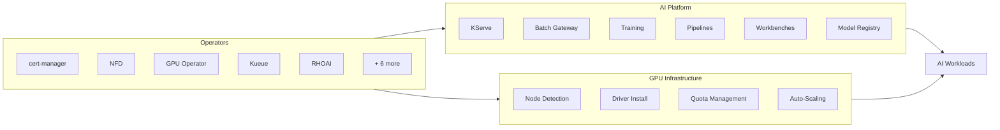

---
hide:
  - navigation
  - toc
---

# Deploy Red Hat OpenShift AI with GitOps

A production-ready, fully declarative deployment of RHOAI 3.5 on OpenShift — 
model serving, distributed training, batch inference, and GPU quota management — 
managed entirely through Git.

<a href="quickstart/" class="cta-primary">Deploy in 5 Minutes</a>
<a href="concepts/" class="cta-secondary">Learn the Concepts</a>

11
Operators Managed

12+
AI Capabilities

2
Commands to Deploy

0
Manual Steps After

---

## Choose Your Journey

Whether you are evaluating the platform, deploying for production, or building on top of it — start here.

<a href="concepts/" class="journey-card">
:material-school:
<h3>I'm New to GitOps</h3>

Understand why Git drives infrastructure, how ArgoCD works, and how this repo is structured — before running a single command.

Beginner · 30 min
</a>

<a href="quickstart/" class="journey-card">
:material-rocket-launch:
<h3>I Want to Deploy Now</h3>

Two commands bootstrap a self-healing AI platform. Fork, configure, deploy. Every step explained.

Intermediate · 15 min
</a>

<a href="capabilities/" class="journey-card">
:material-puzzle:
<h3>I Need Specific Capabilities</h3>

Pick exactly what you need: serving, training, batch inference, MaaS. Deploy only what matters for your use case.

Intermediate · 10 min
</a>

<a href="architecture/" class="journey-card">
:material-layers-triple:
<h3>I'm Evaluating Architecture</h3>

See how 11 operators, 4 ApplicationSets, and composable overlays create a self-managing AI platform.

Advanced · 20 min
</a>

---

## The Story

Most organizations deploying AI on Kubernetes face the same challenges:

<h3>The Problem</h3>

Teams run manual installs, forget steps, create snowflake clusters, and cannot reproduce their AI platform. GPU resources are wasted. Nobody knows what changed or when.

<h3>The Solution</h3>

Declare your entire AI platform in Git. Push a change, ArgoCD syncs it. Self-healing, auditable, reproducible. Same manifests work on any cluster.

<h3>The Result</h3>

A fully managed RHOAI platform deployed via GitOps. Teams get model serving, training capacity, and GPU quotas — all governed by Git with zero manual intervention.

---

## What Gets Deployed

A single `git push` manages the complete stack:

| Layer | What You Get |
|-------|-------------|
| **Operators** | cert-manager, ServiceMesh, NFD, GPU, Kueue, JobSet, LWS, CMA, AI Gateway, RHCL, RHOAI |
| **Platform** | Dashboard, KServe, ModelMesh, Ray, Training, Pipelines, Workbenches, Registry, MLflow, TrustyAI |
| **Advanced** | Batch Gateway (llm-d), Distributed Inference, Hardware Profiles, MaaS |
| **Infrastructure** | GPU node detection, driver installation, quota management, auto-scaling |

---

## How It Works

:material-numeric-1-circle:
<h3>Declare</h3>

Define your desired state in YAML. Choose your profile: serving-only, training-only, or full platform. Commit to Git.

:material-numeric-2-circle:
<h3>Bootstrap</h3>

Run two commands. ArgoCD installs and begins watching your Git repository for changes.

:material-numeric-3-circle:
<h3>Converge</h3>

ArgoCD auto-discovers operators, instances, and workloads. The platform self-assembles in 15-30 minutes.

:material-numeric-4-circle:
<h3>Operate</h3>

From this point, Git is your interface. Push changes → ArgoCD syncs → cluster updates. Self-healing, auditable, reproducible.

---

## Prerequisites

!!! warning "Verify before deploying"

    - **OpenShift 4.18+** with at least 2 worker nodes (8 CPU, 32 GiB each)
    - **GPU nodes** available for inference/training (NVIDIA L4, L40S, A100, or H100)
    - `oc` CLI authenticated as cluster-admin
    - Default StorageClass with dynamic provisioning
    - Identity provider configured (kubeadmin is not sufficient)
    - Internet access to registry.redhat.io, quay.io, cdn.redhat.com

---

## Version Support

| Version | Tag | Status |
|---------|-----|--------|
| RHOAI 3.5 EA2 | `v3.5.0-ea2` | **Current** |
| RHOAI 3.4 | `archive/v3.4.0` | Archived |

---

**Ready?** Start with the [Concepts](concepts/) to understand the architecture, or jump straight to the [Quick Start](quickstart/) to deploy.

[:material-arrow-right: Get Started](quickstart/){ .md-button .md-button--primary }

