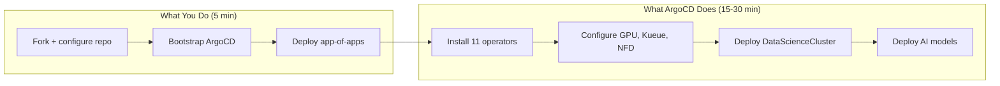

# Quick Start Guide

This guide deploys Red Hat OpenShift AI (RHOAI) 3.5 on your OpenShift cluster using GitOps. Every step includes an explanation of what is happening and why, so you are never just running commands blindly.

**Time estimate:** 5 minutes of setup, 15-30 minutes for convergence.

**What you will build:**



!!! warning "Prerequisites"
    Before starting, verify:

    - OpenShift 4.18+ cluster with at least 2 worker nodes (8 CPU, 32 GiB each)
    - `oc` CLI authenticated as cluster-admin
    - Default StorageClass with dynamic provisioning
    - Identity provider configured (not kubeadmin)
    - GPU nodes available for inference/training workloads
    - Internet access to registry.redhat.io, quay.io, cdn.redhat.com

## Step 1: Fork and Configure

=== "GitOps (Recommended)"

    Fork the repository and configure it for your cluster:

    ```bash
    # Fork on GitHub, then clone your fork
    git clone https://github.com/YOUR-ORG/rhoai-deploy-gitops.git
    cd rhoai-deploy-gitops

    # Run the setup script
    ./scripts/configure.sh --repo https://github.com/YOUR-ORG/rhoai-deploy-gitops.git \
               --branch main \
               --channel beta \
               --overlay full

    # Commit and push
    git add -A && git commit -m "Configure for my cluster" && git push
    ```

=== "Manual (no ArgoCD)"

    Clone directly -- no fork needed since you will not use ArgoCD:

    ```bash
    git clone https://github.com/rrbanda/rhoai-deploy-gitops.git
    cd rhoai-deploy-gitops
    ```

??? info "What just happened?"
    The `scripts/configure.sh` script updated one file: `bootstrap/overlays/default/cluster-config.yaml`. This ConfigMap contains your repository URL and branch. Kustomize replacements inject these values into every ArgoCD Application at build time.

    This means all ArgoCD apps will point to YOUR fork. When you push changes, YOUR cluster syncs -- not someone else's.

## Step 2: Bootstrap (Single Command)

=== "GitOps"

    ```bash
    until oc apply -k bootstrap/overlays/default; do sleep 10; done
    ```

    This single command does everything — installs the GitOps operator, configures ArgoCD, and deploys the entire platform. The `until` loop handles the timing where CRDs are not yet ready (the operator needs a few seconds to install).

    This is the **only `oc apply` you will ever need**. From this point forward, Git is your interface.

=== "Manual"

    Follow the phased installation in [Capabilities > Installation Order](capabilities/index.md#installation-order).

??? info "What just happened?"
    The bootstrap overlay applied everything in one shot:

    1. **OpenShift GitOps operator** — installed via Subscription (from `redhat-cop/gitops-catalog`)
    2. **ArgoCD instance** — configured with Kustomize + Helm support and production resource limits
    3. **cluster-config ConfigMap** — your repository URL and branch (source of truth)
    4. **AppProjects** — RBAC boundaries (platform, usecases)
    5. **4 ApplicationSets** — auto-discovery engines for operators, instances, models, services
    6. **RHOAI DSC Application** — DataScienceCluster configuration
    7. **gitops-controller Application** — ArgoCD manages its own configuration from Git

    The `until/do/done` loop is standard in the community (see christianh814, gnunn-gitops). It handles the chicken-and-egg timing where ArgoCD CRDs are not registered until the operator finishes installing. The loop retries every 10 seconds until all resources are accepted.

    Once ArgoCD starts, each ApplicationSet scans Git directories and **auto-generates Applications**:
        - `cluster-operators` → creates an app for each operator subscription
        - `cluster-instances` → creates an app for each instance configuration
        - `cluster-models` → creates an app for each model deployment
        - `cluster-services` → creates an app for each AI service

    Within minutes, ArgoCD is managing 20+ Applications. Each one syncs its respective directory from Git and deploys resources to the cluster.

## Step 4: Monitor Convergence

Watch the Applications come online:

```bash
# See all ArgoCD Applications and their sync/health status
watch oc get applications.argoproj.io -n openshift-gitops

# Expected output (initially):
# NAME                    SYNC STATUS   HEALTH STATUS   
# cluster-bootstrap       Synced        Healthy         
# operator-cert-manager   Synced        Healthy         
# operator-nfd            OutOfSync     Progressing     
# operator-rhoai-operator Synced        Progressing     
# ...
```

??? info "What to expect during convergence"
    The platform deploys in waves due to dependencies:

    | Time | What is Happening |
    |------|------------------|
    | 0-2 min | Operator subscriptions created, OLM begins installing |
    | 2-5 min | Operators reach `Succeeded`, instances start deploying |
    | 5-10 min | NFD labels nodes, GPU Operator installs drivers |
    | 10-15 min | RHOAI operator installs, DSC begins reconciling |
    | 15-25 min | Sub-operators (KServe, Knative, etc.) installed by RHOAI |
    | 25-30 min | All components healthy, models begin downloading |

    **Normal states during convergence:**

    - `OutOfSync` + `Progressing` → Resource applied, waiting for it to become healthy
    - `SyncFailed` → CRD not yet available; ArgoCD will retry automatically
    - `Degraded` → Dependency not ready; will self-resolve as upstream completes

## Step 5: Verify

Once all Applications show `Synced` + `Healthy`:

```bash
# Verify DSC is ready
oc get datasciencecluster default-dsc -o jsonpath='{.status.conditions[?(@.type=="Ready")].status}'
# Expected: True

# Verify RHOAI Dashboard is accessible
oc get route rhods-dashboard -n redhat-ods-applications -o jsonpath='{.spec.host}'
# Open this URL in your browser

# Verify GPU nodes are detected
oc get nodes -l nvidia.com/gpu.present=true

# Verify Kueue quotas
oc get clusterqueue
```

??? info "What does healthy look like?"
    A fully converged cluster has:

    - All ArgoCD Applications in `Synced` + `Healthy`
    - DSC status `Ready: True`
    - RHOAI Dashboard accessible via browser
    - GPU nodes labeled and drivers installed
    - Kueue ClusterQueue with available quota

## What Next?

You now have a fully GitOps-managed RHOAI platform. Here is what you can do:

| Goal | Action |
|------|--------|
| **Deploy a model** | Add a directory under `usecases/models/`, push to Git |
| **Change the profile** | Edit the DSC overlay, push to Git |
| **Add GPU quotas** | Edit `components/instances/kueue-config/`, push to Git |
| **Scale GPU nodes** | Configure MachineSets in `components/instances/gpu-workers/` |
| **Remove a component** | Set its `managementState: Removed` in the DSC overlay |

Every change goes through Git → ArgoCD → Cluster. No more `oc apply` needed.

## Troubleshooting

| Symptom | Likely Cause | Fix |
|---------|-------------|-----|
| Application stuck `OutOfSync` | CRD not yet installed | Wait -- ArgoCD retries automatically |
| Operator `InstallPlan` pending | Manual approval required | Check if approval mode is `Automatic` |
| DSC stuck `Ready: False` | Dependency operator not ready | Check operator pods in relevant namespace |
| GPU nodes not detected | NFD not running | Verify `oc get pods -n openshift-nfd` |

See [Troubleshooting](reference/troubleshooting.md) for comprehensive diagnosis guidance.
