# ArgoCD Applications

After bootstrap, ArgoCD manages **25 Applications** across four layers.

## Application Hierarchy

The entire platform cascades from a single bootstrap application:

```mermaid
graph TD
  subgraph layer1 ["Layer 1: Bootstrap (you create once)"]
    Boot["cluster-bootstrap"]
  end

  subgraph layer2 ["Layer 2: ApplicationSets + DSC App (ArgoCD manages)"]
    OAS["cluster-operators AppSet"]
    IAS["cluster-instances AppSet"]
    MAS["cluster-models AppSet"]
    SAS["cluster-services AppSet"]
    DSC["rhoai-dsc App"]
  end

  subgraph layer3ops ["Layer 3a: Operator Applications (auto-discovered)"]
    O1["operator-cert-manager"]
    O2["operator-nfd"]
    O3["operator-gpu-operator"]
    O4["operator-kueue-operator"]
    O5["operator-rhoai-operator"]
    O6["operator-servicemesh"]
    O7["operator-jobset-operator"]
  end

  subgraph layer3inst ["Layer 3b: Instance Applications"]
    I1["instance-nfd-instance"]
    I2["instance-gpu-instance"]
    I3["instance-kueue-config"]
    I4["instance-mlflow-instance"]
    I5["instance-maas-gateway"]
  end

  subgraph layer3wl ["Layer 3c: Workload Applications"]
    M1["model-orchestrator-8b"]
    M2["model-gpt-oss-120b"]
    S1["service-genai-toolbox"]
    S2["service-toolorchestra-app"]
  end

  subgraph layer4 ["Layer 4: Kubernetes Resources (actual workloads)"]
    R1["Subscriptions, OperatorGroups"]
    R2["ClusterPolicy, NFD CR, Kueue CR"]
    R3["DataScienceCluster"]
    R4["InferenceServices, ServingRuntimes"]
    R5["Deployments, Routes, PVCs"]
  end

  Boot --> OAS
  Boot --> IAS
  Boot --> MAS
  Boot --> SAS
  Boot --> DSC

  OAS --> O1
  OAS --> O2
  OAS --> O3
  OAS --> O4
  OAS --> O5
  OAS --> O6
  OAS --> O7

  IAS --> I1
  IAS --> I2
  IAS --> I3
  IAS --> I4
  IAS --> I5

  MAS --> M1
  MAS --> M2
  SAS --> S1
  SAS --> S2

  DSC --> R3
  O1 --> R1
  I1 --> R2
  M1 --> R4
  S1 --> R5
```

## Application Table

| Application | Source | Sync Policy | Purpose |
|-------------|--------|-------------|---------|
| `cluster-bootstrap` | `clusters/overlays/dev/` | Auto (selfHeal) | Self-manages the dev overlay: AppSets, explicit Apps |
| `operator-cert-manager` | `components/operators/cert-manager/` | Auto (selfHeal) | cert-manager operator subscription |
| `operator-nfd` | `components/operators/nfd/` | Auto (selfHeal) | Node Feature Discovery operator |
| `operator-gpu-operator` | `components/operators/gpu-operator/` | Auto (selfHeal) | NVIDIA GPU Operator |
| `operator-kueue-operator` | `components/operators/kueue-operator/` | Auto (selfHeal) | Red Hat Build of Kueue |
| `operator-jobset-operator` | `components/operators/jobset-operator/` | Auto (selfHeal) | JobSet Operator |
| `operator-rhoai-operator` | `components/operators/rhoai-operator/` | Auto (selfHeal) | Red Hat OpenShift AI operator |
| `operator-servicemesh` | `components/operators/servicemesh/` | Auto (selfHeal) | Red Hat OpenShift Service Mesh 3 operator (required for batch gateway) |
| `instance-nfd-instance` | `components/instances/nfd-instance/` | Auto (selfHeal) | NFD NodeFeatureDiscovery CR |
| `instance-gpu-instance` | `components/instances/gpu-instance/` | Auto (selfHeal) | GPU ClusterPolicy CR |
| `instance-kueue-instance` | `components/instances/kueue-instance/` | Auto (selfHeal) | Kueue operator instance |
| `instance-cluster-autoscaler` | `components/instances/cluster-autoscaler/` | Auto (selfHeal) | ClusterAutoscaler for GPU node auto-scaling |
| `instance-kueue-config` | `components/instances/kueue-config/` | Auto (selfHeal) | GPU ResourceFlavors + ClusterQueue |
| `instance-jobset-instance` | `components/instances/jobset-instance/` | Auto (selfHeal) | JobSet operator instance |
| `instance-rhoai` | `components/instances/rhoai-instance/overlays/dev/` | Auto (selfHeal, no prune) | DataScienceCluster with ignoreDifferences |
| `instance-dashboard-config` | `components/instances/dashboard-config/` | Auto (selfHeal) | Enables genAiStudio in the RHOAI dashboard |
| `instance-mcp-servers` | `components/instances/mcp-servers/` | Auto (selfHeal) | Registers MCP servers (GenAI Toolbox, OKP) in the RHOAI dashboard |
| `model-orchestrator-8b` | `usecases/models/orchestrator-8b/profiles/tier1-minimal/` | Auto (selfHeal, prune) | Nemotron-Orchestrator-8B model serving |
| `model-qwen-math-7b` | `usecases/models/qwen-math-7b/profiles/tier1-minimal/` | Auto (selfHeal, prune) | Qwen2.5-Math-7B-Instruct model serving |
| `model-gpt-oss-120b` | `usecases/models/gpt-oss-120b/profiles/tier1-minimal/` | Auto (selfHeal, prune) | GPT-OSS-120B model serving (ModelCar) |
| `service-toolorchestra-app` | `usecases/services/toolorchestra-app/profiles/tier1-minimal/` | Auto (selfHeal, prune) | ToolOrchestra UI + training infra |
| `service-llamastack` | `usecases/services/llamastack/profiles/tier1-minimal/` | Auto (selfHeal, prune) | LlamaStack Distribution + PostgreSQL (legacy, uses OGX operator) |
| `service-genai-toolbox` | `usecases/services/genai-toolbox/profiles/tier1-minimal/` | Auto (selfHeal, prune) | GenAI Toolbox MCP Server |
| `service-rhokp` | `usecases/services/rhokp/profiles/tier1-minimal/` | Auto (selfHeal, prune) | Red Hat OKP MCP Server (Solr + MCP) |
| `usecase-toolorchestra-training` | `usecases/services/toolorchestra-app/manifests/training/workloads/` | **Manual only** | Download jobs + RayJob (on-demand) |

## Sync Wave Ordering

Within the `service-toolorchestra-app` and `model-*` apps, sync waves ensure correct resource ordering:

| Wave | Resources | Purpose |
|------|-----------|---------|
| -1 (default) | Namespace, RBAC, ConfigMaps, PVCs, ServingRuntimes, Service, Route, NetworkPolicy, LocalQueue | Infrastructure created first |
| 0 | `download-orchestrator-8b`, `download-qwen-math-7b` Jobs | Model download jobs run and complete before predictors start |
| 1 | `orchestrator-8b`, `qwen-math-7b` InferenceServices | Predictors created only after models are downloaded to PVCs |

Download jobs are idempotent (check for `.download_complete` marker) and have no TTL, so completed jobs persist as Synced/Healthy in ArgoCD without being recreated.

## App-of-Apps Bootstrap

The `cluster-bootstrap` Application watches `clusters/overlays/dev/` and auto-syncs any changes. This means:

- Adding a new `Application` YAML to `clusters/overlays/dev/` and pushing to Git automatically creates the new ArgoCD Application
- Adding a new operator directory to `components/operators/` automatically creates a new operator Application via the `cluster-operators` ApplicationSet
- Same for `components/instances/*`, `usecases/models/*/profiles/tier1-minimal`, and `usecases/services/*/profiles/tier1-minimal`

The only manual `oc apply` ever needed is the initial bootstrap.

## Adding a New Operator

1. Create `components/operators/my-operator/kustomization.yaml` with a Subscription resource
2. Create `components/instances/my-instance/kustomization.yaml` with the instance CR
3. Push to Git -- `cluster-bootstrap` auto-syncs the AppSets, which auto-discover the new directories and create ArgoCD Applications
