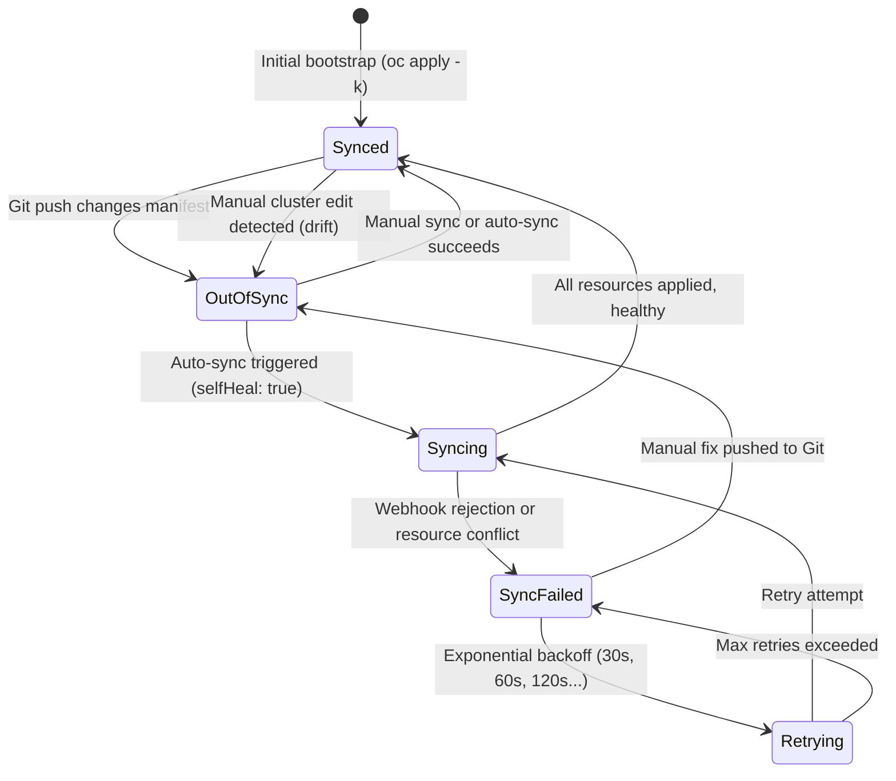

# Sync Configuration

The ArgoCD ApplicationSets use production-grade sync options validated through testing.

## Sync Lifecycle

ArgoCD continuously reconciles declared state (Git) against live state (cluster). This state diagram shows how applications transition between sync states:



## Sync Options

| Option | Purpose |
|--------|---------|
| `ServerSideApply=true` | Handles large CRDs (DSC, InferenceService, ClusterPolicy) and prevents annotation size limits |
| `SkipDryRunOnMissingResource=true` | Allows retry-based convergence when CRDs don't exist yet |
| `CreateNamespace=true` | ArgoCD manages namespace lifecycle for use cases |
| `RespectIgnoreDifferences=true` | Honors configured `ignoreDifferences` rules |

## ignoreDifferences Rules

**OLM Subscriptions** -- Prevents perpetual drift on `.status` and `.spec.startingCSV`:

```yaml
ignoreDifferences:
  - group: operators.coreos.com
    kind: Subscription
    jsonPointers:
      - /spec/startingCSV
      - /status
```

**InferenceService, ServingRuntime, Route** (model and service ApplicationSets) -- Prevents drift from KServe controllers and OpenShift router:

```yaml
ignoreDifferences:
  - group: serving.kserve.io
    kind: InferenceService
    jsonPointers:
      - /status
      - /metadata/annotations
  - group: serving.kserve.io
    kind: ServingRuntime
    jsonPointers:
      - /status
  - group: route.openshift.io
    kind: Route
    jsonPointers:
      - /spec/host
      - /status
```

**ClusterPolicy, NodeFeatureDiscovery** (instances ApplicationSet) -- Prevents drift from operator-managed status:

```yaml
ignoreDifferences:
  - group: nvidia.com
    kind: ClusterPolicy
    jsonPointers:
      - /status
  - group: nfd.openshift.io
    kind: NodeFeatureDiscovery
    jsonPointers:
      - /status
```

**DataScienceCluster** -- Prevents drift on `/status` and operator-managed component fields:

```yaml
ignoreDifferences:
  - group: datasciencecluster.opendatahub.io
    kind: DataScienceCluster
    jsonPointers:
      - /status
      - /spec/components/dashboard
      - /spec/components/kserve
      - /spec/components/ray
      - /spec/components/trainingoperator
      - /spec/components/aipipelines
      - /spec/components/workbenches
      - /spec/components/modelregistry
      - /spec/components/trustyai
      - /spec/components/mlflowoperator
      - /spec/components/llamastackoperator
      - /spec/components/trainer
      - /spec/components/feastoperator
```

## Retry Policies

| Layer | Max Retries | Backoff | Max Duration |
|-------|------------|---------|-------------|
| Operators | 5 | 30s (factor 2) | 5 min |
| Instances | 10 | 60s (factor 2) | 10 min |
| Models | 10 | 60s (factor 2) | 10 min |
| Services | 10 | 60s (factor 2) | 10 min |

The higher retry count for instances and use cases gives operators time to install their CRDs before ArgoCD attempts to apply instance resources.

## Version-Specific Notes

| Setting | Value | Notes |
|---------|-------|-------|
| RHOAI channel | `fast` | Latest GA release (default) |
| DSC API | `datasciencecluster.opendatahub.io/v2` | Required API for 3.5 |
| Kueue | `Unmanaged` in DSC | `Managed` is not supported in 3.5; standalone operator required |
| Batch Gateway | `Managed` in DSC | Requires ServiceMesh 3 + LWS operators |
| DSC sync | `Replace=true` | Avoids null-field conflicts from three-way merge |
| JobSet | Standalone operator | Required for Kubeflow Trainer v2 |
| GPU Operator | Requires `spec.daemonsets` and `spec.dcgm` | Validated with v25.x |
| Kueue instance | Requires `spec.config.integrations.frameworks` | List of supported job frameworks |
