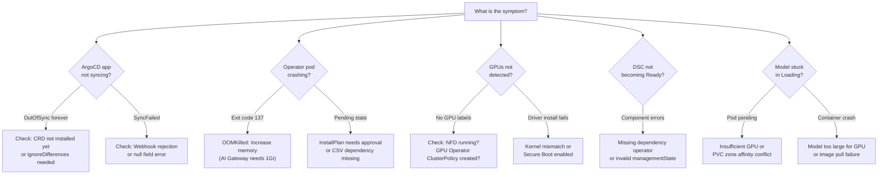

# Troubleshooting

This guide covers common issues encountered when deploying and operating RHOAI via GitOps. Each issue includes the symptom, root cause explanation, and resolution steps.

## Quick Navigation

Use this decision tree to jump to the right section:



## ArgoCD Issues

### Application Stuck in OutOfSync

**Symptom:** An ArgoCD Application shows `OutOfSync` indefinitely and does not self-correct.

**Common causes:**

1. **CRD not yet installed** -- The Application tries to apply a custom resource before its CRD exists.
    - **Diagnosis:** Check the sync error message in ArgoCD UI or:
      ```bash
      oc get application <name> -n openshift-gitops -o jsonpath='{.status.conditions[*].message}'
      ```
    - **Fix:** Wait. ArgoCD retries automatically (configured with exponential backoff). The CRD will be installed by the operator Application, which syncs in parallel.

2. **ignoreDifferences misconfigured** -- The RHOAI operator adds fields to the DSC that ArgoCD sees as drift.
    - **Diagnosis:** The diff shows fields you did not write (e.g., `/spec/components/kserve/serving`).
    - **Fix:** Ensure the `rhoai-dsc` Application includes proper `ignoreDifferences` for operator-managed paths. See [Sync Configuration](sync-config.md).

3. **Resource owned by another controller** -- A resource has an ownerReference pointing to an operator-managed resource.
    - **Diagnosis:** ArgoCD shows "resource is managed by another Application" or field manager conflicts.
    - **Fix:** Add the conflicting fields to `ignoreDifferences` or remove the resource from Git (let the operator manage it).

### Application Shows SyncFailed

**Symptom:** Application repeatedly fails to sync with error messages.

**Common causes:**

1. **Webhook rejection** -- The RHOAI admission webhook rejects a malformed DSC.
    - **Diagnosis:** Check the sync error:
      ```bash
      oc get application rhoai-dsc -n openshift-gitops -o jsonpath='{.status.sync.revision}'
      oc get application rhoai-dsc -n openshift-gitops -o jsonpath='{.status.conditions[*].message}'
      ```
    - **Fix:** Fix the DSC YAML (common issues: `kueue.managementState: Managed` is not allowed in 3.5, use `Unmanaged`).

2. **Null field errors with ServerSideApply** -- Three-way merge produces null values for nested objects.
    - **Diagnosis:** Error contains "Invalid value: null" for a nested field.
    - **Fix:** Use `Replace=true` in syncOptions instead of `ServerSideApply=true` for the affected Application.

### Application Healthy but OutOfSync

**Symptom:** Resources are running correctly but ArgoCD shows OutOfSync.

**Cause:** The live state differs from Git due to operator mutations (e.g., default values added, status fields populated).

**Fix:** Add the mutated paths to `ignoreDifferences`:

```yaml
spec:
  ignoreDifferences:
    - group: your.api.group
      kind: YourResource
      jsonPointers:
        - /path/to/operator/managed/field
```

## Operator Issues

### Operator CrashLoopBackOff (OOMKilled)

**Symptom:** Operator pod repeatedly crashes with exit code 137.

**Diagnosis:**
```bash
# Check pod events
oc describe pod <pod-name> -n <namespace> | grep -A5 "Last State"

# Check if OOMKilled
oc get pod <pod-name> -n <namespace> -o jsonpath='{.status.containerStatuses[0].lastState.terminated.reason}'
```

**Common affected operators:**
- `ai-gateway-operator` (default 512Mi is insufficient)
- `llm-d-batch-gateway-operator` (default 256Mi is insufficient)

**Fix:** Increase memory limits:
```bash
oc patch deployment ai-gateway-operator -n redhat-ods-applications \
  --type=json -p '[{"op":"replace","path":"/spec/template/spec/containers/0/resources/limits/memory","value":"1Gi"}]'
```

!!! note "GitOps fix"
    This repository includes a PostSync hook (`gateway-memory-rbac.yaml`) that automatically patches these limits after every ArgoCD sync. If you are deploying with GitOps, this is handled automatically.

### Operator InstallPlan Pending

**Symptom:** Operator shows `Pending` in OLM and does not install.

**Diagnosis:**
```bash
oc get installplan -n <operator-namespace>
oc get installplan <plan-name> -n <operator-namespace> -o jsonpath='{.spec.approval}'
```

**Fix:** If approval is `Manual`, approve it:
```bash
oc patch installplan <plan-name> -n <operator-namespace> --type merge -p '{"spec":{"approved":true}}'
```

To prevent this, ensure Subscriptions use `installPlanApproval: Automatic`.

### CSV Failed or Replacing

**Symptom:** `oc get csv` shows state other than `Succeeded`.

**Diagnosis:**
```bash
oc get csv -n <namespace> | grep -v Succeeded
oc describe csv <csv-name> -n <namespace> | grep -A10 "Conditions"
```

**Common causes:**
- Dependency operator not installed yet (wait for it)
- CatalogSource not available (check `oc get catalogsource -n openshift-marketplace`)
- Conflicting operator already installed (remove the conflict)

## GPU Issues

### GPU Nodes Not Detected

**Symptom:** `oc get nodes -l nvidia.com/gpu.present=true` returns nothing.

**Diagnosis steps:**

1. Check NFD is running:
   ```bash
   oc get pods -n openshift-nfd
   ```

2. Check NFD labeled the nodes:
   ```bash
   oc get nodes -l feature.node.kubernetes.io/pci-10de.present=true
   ```

3. Check GPU Operator pods:
   ```bash
   oc get pods -n nvidia-gpu-operator
   ```

**Common fixes:**
- NFD Instance not created → apply `components/instances/nfd-instance/`
- GPU Operator ClusterPolicy not created → apply `components/instances/gpu-instance/`
- GPU nodes not yet provisioned → check MachineSets: `oc get machineset -n openshift-machine-api`

### GPU Driver Install Fails

**Symptom:** GPU Operator DaemonSet pods crash or show `Init:Error`.

**Diagnosis:**
```bash
oc logs -n nvidia-gpu-operator -l app=nvidia-driver-daemonset --tail=50
```

**Common causes:**
- Kernel version mismatch (driver not compiled for running kernel)
- Secure boot enabled (prevents unsigned kernel modules)
- Node uses unsupported GPU hardware

**Fix:** Ensure nodes run a supported RHCOS version and GPU Operator version is compatible.

## DSC Issues

### DSC Not Becoming Ready

**Symptom:** `oc get datasciencecluster default-dsc` shows `Ready: False`.

**Diagnosis:**
```bash
# Check which components are not ready
oc get datasciencecluster default-dsc -o yaml | grep -A5 "conditions"

# Check RHOAI operator logs
oc logs deployment/rhods-operator -n redhat-ods-operator --tail=100
```

**Common causes:**

1. **Dependency operator missing** -- A managed component requires an operator that is not installed.
    - Fix: Install the missing operator (e.g., cert-manager for KServe, ServiceMesh for batch gateway)

2. **Component validation failure** -- Invalid managementState value.
    - Fix: `kueue.managementState: Managed` is deprecated and not supported. Use `Unmanaged`.

3. **Stale reconciliation** -- Operator has not re-checked the DSC.
    - Fix: Trigger reconciliation:
      ```bash
      oc annotate datasciencecluster default-dsc reconcile-trigger="$(date +%s)" --overwrite
      ```

### DSC Shows Component Errors

**Symptom:** Specific components show errors in DSC status while others are healthy.

**Diagnosis:**
```bash
oc get datasciencecluster default-dsc -o jsonpath='{.status.components}' | python3 -m json.tool
```

**Fix:** Check the sub-operator for that component:
```bash
# For KServe issues
oc get pods -n redhat-ods-applications -l app=kserve-controller-manager

# For Training Operator issues
oc get pods -n redhat-ods-applications -l control-plane=kubeflow-training-operator
```

## Model Serving Issues

### InferenceService Stuck in Loading

**Symptom:** InferenceService shows `Loading` or `Unknown` state.

**Diagnosis:**
```bash
# Check predictor pods
oc get pods -n <model-namespace> -l serving.kserve.io/inferenceservice=<model-name>

# Check events
oc get events -n <model-namespace> --sort-by=.lastTimestamp | tail -20
```

**Common causes:**
- Model download still in progress (check download job)
- Insufficient GPU memory (model too large for allocated GPUs)
- PVC not bound (StorageClass or zone affinity issue)
- Image pull failure (registry authentication needed)

### PVC Zone Affinity

**Symptom:** Pod stuck in `Pending` with "volume node affinity conflict" event.

**Cause:** PVC was provisioned in a different availability zone than the GPU node.

**Fix:**
- Use a StorageClass with `volumeBindingMode: WaitForFirstConsumer`
- Or add a `nodeSelector` to download jobs matching the GPU node zone

## Network and Access Issues

### Cannot Access RHOAI Dashboard

**Symptom:** Dashboard route exists but returns 503 or connection refused.

**Diagnosis:**
```bash
# Check route
oc get route rhods-dashboard -n redhat-ods-applications

# Check dashboard pods
oc get pods -n redhat-ods-applications -l app=rhods-dashboard

# Check OAuth proxy
oc logs deployment/rhods-dashboard -n redhat-ods-applications -c oauth-proxy
```

**Common fix:** Wait for DSC to fully reconcile. Dashboard depends on several internal components being ready.

## General Debugging Commands

```bash
# Overview of all ArgoCD applications
oc get applications.argoproj.io -n openshift-gitops

# Check ArgoCD controller logs
oc logs deployment/openshift-gitops-application-controller -n openshift-gitops --tail=50

# Check all operator CSVs
oc get csv -A | grep -v Succeeded

# Check all pods in error state
oc get pods -A --field-selector=status.phase!=Running,status.phase!=Succeeded

# Force ArgoCD to re-sync an application
oc annotate application <name> -n openshift-gitops argocd.argoproj.io/refresh=hard --overwrite
```
