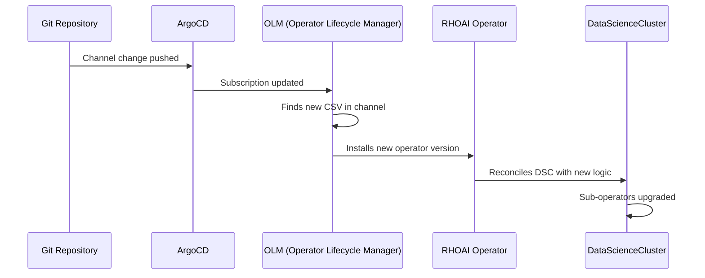

# Upgrading RHOAI Versions

This guide explains how to upgrade between RHOAI versions using this GitOps repository. Because the entire platform is declared in Git, upgrades are controlled, reversible, and auditable.

## Upgrade Strategy

RHOAI upgrades are driven by the **operator channel**. The RHOAI operator subscription specifies which release stream to track:

| Channel | Delivers | Use Case |
|---------|---------|----------|
| `beta` | Early Access releases (3.5 EA1, EA2, ...) | Testing new features |
| `stable` | GA releases | Production deployments |
| `fast` | Rapid release cycle | When available |

**To upgrade:** Change the channel in Git, push, and let ArgoCD + OLM handle the rest.

## How OLM Upgrades Work



OLM handles the operator binary upgrade. The operator itself handles upgrading all internal components (KServe, Knative, etc.) when it reconciles the DSC.

## Step-by-Step Upgrade

### 1. Review Release Notes

Before upgrading, read the release notes for the target version:

- [RHOAI 3.5 Release Notes](https://docs.redhat.com/en/documentation/red_hat_openshift_ai_self-managed/3-latest/html/release_notes)
- Check for breaking changes, deprecated features, and new requirements

### 2. Update the Channel

Edit `components/operators/rhoai-operator/patch-channel.yaml`:

```yaml
- op: replace
  path: /spec/channel
  value: beta    # Change to target channel
```

### 3. Update DSC if Needed

New RHOAI versions may introduce new DSC components or change existing ones. Update your overlay accordingly:

```yaml
spec:
  components:
    # New in 3.5: batch gateway
    batchGateway:
      managementState: Managed
    # Changed in 3.5: kueue must be Unmanaged
    kueue:
      managementState: Unmanaged
```

### 4. Update Dependencies

New RHOAI versions may require additional operators. Check the release notes and add any new operator subscriptions:

```bash
# Example: RHOAI 3.5 requires LeaderWorkerSet for batch inference
components/operators/lws-operator/
```

### 5. Commit and Push

```bash
git add -A
git commit -m "Upgrade RHOAI to 3.5 EA2"
git push
```

### 6. Monitor the Upgrade

```bash
# Watch operator CSV transition
watch "oc get csv -n redhat-ods-operator"

# Watch DSC reconciliation
watch "oc get datasciencecluster default-dsc -o jsonpath='{.status.conditions[?(@.type==\"Ready\")].status}'"

# Watch all ArgoCD apps
watch "oc get applications.argoproj.io -n openshift-gitops"
```

## Upgrading from 3.4 to 3.5

### Key Changes

| Area | 3.4 | 3.5 |
|------|-----|-----|
| Kueue management | `Managed` allowed | Must be `Unmanaged` |
| Batch inference | Not available | `batchGateway` component |
| Distributed inference | Not available | `advancedkserve` component |
| New operators needed | None | LWS, CMA, AI Gateway, RHCL |
| DSC API | v2 | v2 (unchanged) |

### Migration Steps

1. **Add new operator directories:**
   ```
   components/operators/lws-operator/
   components/operators/cma-operator/
   components/operators/ai-gateway-operator/
   components/operators/rhcl-operator/
   ```

2. **Update DSC overlay:** Change `kueue.managementState` from `Managed` to `Unmanaged`

3. **Add new components to DSC (optional):**
   ```yaml
   batchGateway:
     managementState: Managed
   advancedkserve:
     managementState: Managed
   ```

4. **Update channel:** Change to `beta` for 3.5 Early Access

5. **Push and monitor**

### Known Issues During 3.4 → 3.5 Upgrade

- **AI Gateway OOMKilled:** The operator may need increased memory limits (1Gi). The PostSync hook in this repo handles this automatically.
- **Kueue validation error:** If DSC still has `kueue: Managed`, the admission webhook rejects it. Change to `Unmanaged` first.
- **ServiceMesh operator:** Ensure `servicemeshoperator3` (not the deprecated v2) is installed.

## Rollback

Because everything is in Git, rollback is straightforward:

```bash
# Revert the upgrade commit
git revert HEAD
git push

# ArgoCD reverts the subscription channel
# OLM does NOT automatically downgrade operators
```

!!! warning "OLM does not downgrade"
    Reverting the channel in Git prevents further upgrades but does NOT roll back the operator binary. To truly downgrade, you must:
    
    1. Delete the operator CSV and Subscription
    2. Reinstall with the older channel
    3. The RHOAI operator will reconcile the DSC to the older version's state

## Pinning a Specific Version

To prevent automatic upgrades within a channel, pin the `startingCSV`:

```yaml
# In the Subscription
spec:
  channel: beta
  startingCSV: rhods-operator.3.5.0-ea2   # Pin to specific version
  installPlanApproval: Manual              # Require manual approval
```

!!! warning "Portability impact"
    Pinning `startingCSV` reduces portability -- the exact CSV version may not exist on all clusters. Prefer using `installPlanApproval: Manual` without pinning for production clusters.

## Version Compatibility Matrix

| RHOAI Version | OpenShift | GPU Operator | Kueue | cert-manager |
|--------------|-----------|--------------|-------|-------------|
| 3.5 EA2 | 4.18, 4.19, 4.20 | 25.x | 1.4 | 1.x |
| 3.4 EA | 4.18, 4.19 | 24.x, 25.x | 1.2 | 1.x |
