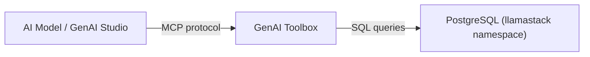

# GenAI Toolbox MCP Server

GenAI Toolbox is Google's open-source [MCP Toolbox for Databases](https://github.com/googleapis/genai-toolbox) -- a lightweight server that exposes database operations as MCP-compatible tools. AI models can use these tools to list tables, describe schemas, and run SQL queries against a PostgreSQL database via natural language.

## Architecture



GenAI Toolbox connects to the LlamaStack PostgreSQL database at `postgres.llamastack.svc.cluster.local:5432`. The RHOAI dashboard registers it as an MCP server, making it available in GenAI Studio for interactive use.

## What Gets Deployed

| Component | Resource | Description |
|-----------|----------|-------------|
| `genai-toolbox` | Deployment | Toolbox server (v0.28.0) exposing MCP tools on port 5000 |
| `genai-toolbox-config` | ConfigMap | Tool definitions (list-tables, describe-table, run-query) |
| `genai-toolbox-pg-credentials` | Secret | PostgreSQL connection credentials |
| `genai-toolbox` | Service + Route | In-cluster service and external TLS route |
| `genai-toolbox-sa` | ServiceAccount | Dedicated service account |

## Prerequisites

| Requirement | Why |
|-------------|-----|
| RHOAI platform (DSC Ready) | Namespace and dashboard integration |
| LlamaStack PostgreSQL | Toolbox connects to `postgres.llamastack.svc.cluster.local` |
| `dashboard-config` instance | Enables GenAI Studio in the RHOAI dashboard (Tech Preview, not enabled by default) |
| `mcp-servers` instance | Registers GenAI Toolbox as an MCP server in the dashboard |

!!! warning "Secrets required"
    The included `pg-secret.yaml` contains placeholder credentials (`PG_PASSWORD: CHANGE_ME`). Update `usecases/services/genai-toolbox/manifests/server/pg-secret.yaml` with your LlamaStack PostgreSQL password before deploying. For production, use SealedSecrets or ExternalSecrets.

## Deploy

=== "GitOps"

    GenAI Toolbox is auto-deployed by the `cluster-services` ApplicationSet when using the `tier1-minimal` profile.

    After bootstrapping the cluster, the `service-genai-toolbox` Application is created automatically. The `instance-dashboard-config` and `instance-mcp-servers` Applications (auto-discovered by the `cluster-instances` AppSet) register it in the RHOAI dashboard.

=== "Manual"

    ```bash
    # 1. Ensure LlamaStack is deployed (GenAI Toolbox uses its PostgreSQL)
    oc apply -k usecases/services/llamastack/profiles/tier1-minimal/

    # 2. Update the PostgreSQL credentials secret
    #    Edit usecases/services/genai-toolbox/manifests/server/pg-secret.yaml

    # 3. Deploy GenAI Toolbox
    oc apply -k usecases/services/genai-toolbox/profiles/tier1-minimal/

    # 4. Register as MCP server in the RHOAI dashboard
    oc apply -k components/instances/dashboard-config/
    oc apply -k components/instances/mcp-servers/
    ```

## Verify

```bash
# Check the deployment is running
oc get pods -n genai-toolbox -l app=genai-toolbox

# Check the route
oc get route genai-toolbox -n genai-toolbox

# Test the MCP endpoint
curl -s "https://$(oc get route genai-toolbox -n genai-toolbox -o jsonpath='{.spec.host}')/api/toolsets" | python -m json.tool
```

## Available Tools

The `tools.yaml` ConfigMap defines three tools bundled into a `database-explorer` toolset:

| Tool | Type | Description |
|------|------|-------------|
| `list-tables` | `postgres-sql` | Lists all tables in the `public` schema |
| `describe-table` | `postgres-sql` | Describes columns of a specific table (takes `table_name` parameter) |
| `run-query` | `postgres-execute-sql` | Executes arbitrary SQL queries |

## MCP Server Registration

Two additional instances register GenAI Toolbox in the RHOAI dashboard:

- **`components/instances/dashboard-config/`** -- Sets `genAiStudio: true` in the OdhDashboardConfig, enabling the GenAI Studio UI
- **`components/instances/mcp-servers/`** -- Creates a ConfigMap in `redhat-ods-applications` that registers the toolbox at `http://genai-toolbox.genai-toolbox.svc.cluster.local:5000/mcp`

Both are auto-discovered by the `cluster-instances` ApplicationSet in GitOps mode.

## Sync Wave Ordering

| Wave | Resources | Purpose |
|------|-----------|---------|
| -1 (default) | Namespace, ServiceAccount, Secret, ConfigMap, Service | Infrastructure ready first |
| 1 | Deployment | Server starts after config is available |
| 2 | Route | External access created after service exists |

## Customization

To add new tools or connect to a different database, edit the `tools.yaml` ConfigMap in `usecases/services/genai-toolbox/manifests/server/tools-configmap.yaml`. See the [GenAI Toolbox documentation](https://github.com/googleapis/genai-toolbox) for the full tool definition format.

To connect to a different PostgreSQL instance, update:

1. The `host`, `port`, and `database` fields in `tools-configmap.yaml`
2. The credentials in `pg-secret.yaml`
