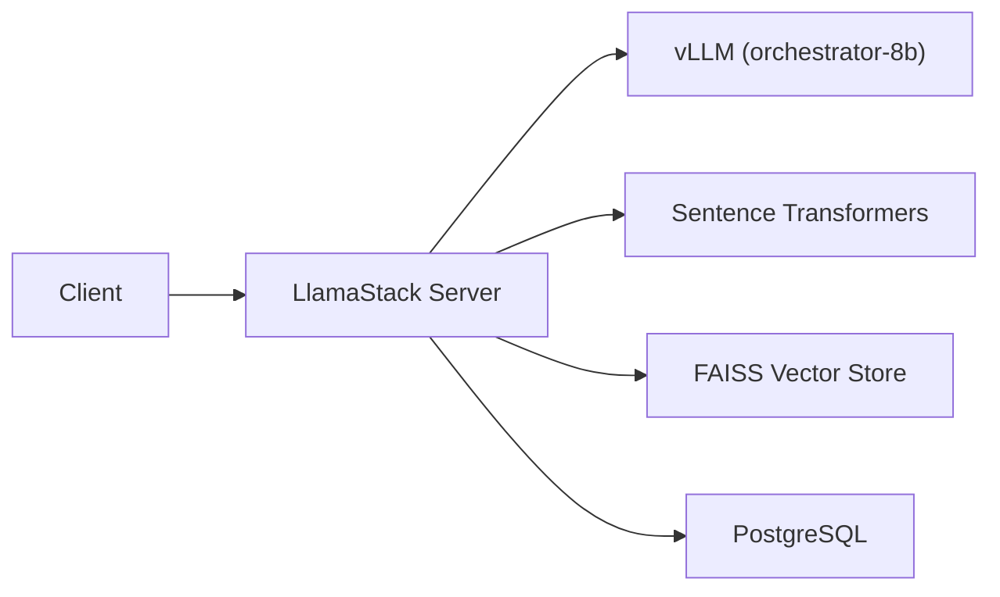

# LlamaStack Distribution

LlamaStack is Meta's open framework for building AI applications. This use case deploys a [LlamaStack Distribution](https://github.com/meta-llama/llama-stack) on OpenShift AI, backed by PostgreSQL for persistence and connected to vLLM-served models for inference.

## Components

| Component | Description |
|-----------|-------------|
| `llamastack` | LlamaStackDistribution CR -- runs the LlamaStack server with agents, inference, safety, eval, and vector I/O APIs |
| `postgres` | PostgreSQL 16 -- persistent storage for agent state, conversations, vector DBs, and metadata |

## Architecture



LlamaStack connects to the ToolOrchestra `orchestrator-8b` model via the in-cluster service endpoint for inference, and uses local sentence-transformers for embeddings and FAISS for vector storage.

## Prerequisites

!!! warning "Official dependencies (per RHOAI 3.3 Installation Guide)"
    The official Red Hat documentation lists these requirements for the `llamastackoperator` DSC component:

    - **Red Hat OpenShift Service Mesh Operator 3.x** -- required for LlamaStack networking
    - **cert-manager Operator** -- required for TLS certificate management
    - **GPU-enabled nodes** -- NFD Operator + NVIDIA GPU Operator must be installed and GPU worker nodes available
    - **S3-compatible object storage** -- required for model artifacts and data persistence

    Ensure all of these are installed and configured before enabling `llamastackoperator` in the DSC.

!!! warning "Secrets required"
    This use case requires three Secrets that are **not** included in the repository (they contain credentials):

    - `postgres-secret` -- key: `password` (PostgreSQL password)
    - `llama-stack-secret` -- keys: `INFERENCE_MODEL`, `VLLM_URL`, `VLLM_TLS_VERIFY`, `VLLM_API_TOKEN`, `VLLM_MAX_TOKENS`
    - `gemini-secret` -- key: `api_key` (optional, for Gemini provider)

    Create these in the `llamastack` namespace before deploying.

!!! info "Dependency on ToolOrchestra"
    The LlamaStack config references `orchestrator-8b-predictor.orchestrator-rhoai.svc.cluster.local`. Deploy ToolOrchestra first, or update the vLLM endpoint in the ConfigMap to point to your own model.

## Deploy

=== "GitOps"

    LlamaStack is auto-deployed by the `cluster-usecases` ApplicationSet when using the `tier1-minimal` profile.

    After bootstrapping the cluster, the `usecase-llamastack` Application is created automatically. Ensure the required Secrets exist in the `llamastack` namespace.

=== "Manual"

    ```bash
    # Create the namespace and secrets first
    oc new-project llamastack
    oc create secret generic postgres-secret --from-literal=password=<your-password> -n llamastack
    oc create secret generic llama-stack-secret \
      --from-literal=INFERENCE_MODEL=<model-id> \
      --from-literal=VLLM_URL=<vllm-endpoint> \
      --from-literal=VLLM_TLS_VERIFY=false \
      --from-literal=VLLM_API_TOKEN=<token> \
      --from-literal=VLLM_MAX_TOKENS=4096 \
      -n llamastack

    # Deploy
    oc apply -k usecases/llamastack/profiles/tier1-minimal/
    ```

## Verify

```bash
# Check PostgreSQL is running
oc get pods -n llamastack -l app=postgres

# Check LlamaStack distribution is ready
oc get llamastackdistribution -n llamastack

# Check the route
oc get route -n llamastack
```

## Sync Wave Ordering

| Wave | Resources | Purpose |
|------|-----------|---------|
| -1 (default) | Namespace, PostgreSQL (Deployment, PVC, Service) | Infrastructure and database ready first |
| 0 | ConfigMap (`llamastack-custom-config`) | Configuration available before server starts |
| 1 | LlamaStackDistribution CR | Server starts after database and config are ready |

## Capabilities

The LlamaStack server exposes these APIs:

| API | Provider | Description |
|-----|----------|-------------|
| Inference | `remote::vllm` | Proxies to vLLM-served models |
| Agents | `inline::meta-reference` | Stateful agent conversations with tool use |
| Vector I/O | `inline::faiss` | In-memory vector storage for RAG |
| Safety | `inline::llama-guard` | Content safety filtering |
| Eval | `inline::meta-reference` | Model evaluation benchmarks |
| Tool Runtime | `remote::tavily-search`, `inline::rag-runtime` | Web search and RAG tools |
| Embeddings | `inline::sentence-transformers` | Local embedding model (`nomic-embed-text-v1.5`) |

## Customization

To change the inference backend, edit the `llamastack-custom-config` ConfigMap in `usecases/llamastack/manifests/instance/llamastack-custom-config.yaml`. The `vllm-inference` provider section controls the model endpoint:

```yaml
providers:
  inference:
  - provider_id: vllm-inference
    provider_type: remote::vllm
    config:
      base_url: ${env.VLLM_URL}
      max_tokens: ${env.VLLM_MAX_TOKENS:=4096}
      api_token: ${env.VLLM_API_TOKEN:=fake}
```

Update the `llama-stack-secret` with your model's endpoint and credentials.
