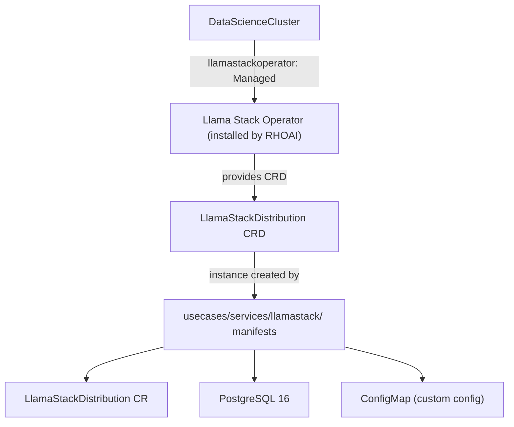
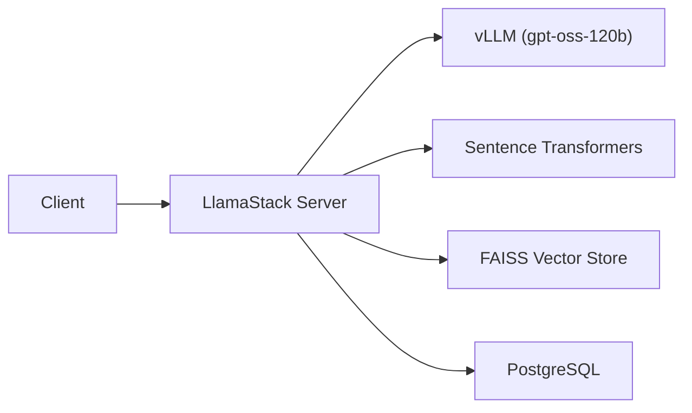

# LlamaStack

LlamaStack is Meta's open framework for building AI applications with agents, RAG, tool use, and safety. RHOAI 3.3 includes a **Llama Stack Operator** as a DSC component (`llamastackoperator`) that installs the operator and its `LlamaStackDistribution` CRD. This use case deploys a **specific LlamaStack instance** on top of that operator.

## How It Works -- Two Layers



| Layer | What | Who manages it | Path in this repo |
|-------|------|----------------|-------------------|
| **Operator** (DSC component) | Installs the Llama Stack Operator and `LlamaStackDistribution` CRD | RHOAI Operator via the DSC | `components/instances/rhoai-instance/` -- set `llamastackoperator: Managed` |
| **Instance** (use case) | Creates a `LlamaStackDistribution` CR, PostgreSQL database, and custom config | This repo's use case manifests | `usecases/services/llamastack/` |

The operator must be installed first (via the DSC) before the use case manifests can create an instance.

## What This Use Case Deploys

| Component | Resource | Description |
|-----------|----------|-------------|
| `llamastack` | `LlamaStackDistribution` CR | Runs the LlamaStack server (agents, inference, safety, eval, vector I/O) using a custom patched image |
| `postgres` | Deployment + PVC + Service | PostgreSQL 16 for agent state, conversations, and metadata |
| `llamastack-custom-config` | ConfigMap | LlamaStack v2 config with vLLM inference providers, FAISS, sentence-transformers, and tool runtimes |

## Architecture



LlamaStack connects to **GPT-OSS-120B** for inference. By default, the config points to a remote vLLM endpoint; when the local model is running, you can switch to the in-cluster service endpoint. Embeddings use local sentence-transformers (`nomic-embed-text-v1.5`) and vector storage uses FAISS.

## Prerequisites

### 1. RHOAI Platform with LlamaStack Operator Enabled

The `llamastackoperator` DSC component must be set to `Managed`. This is included in the `full` and `dev` DSC overlays. If using a custom overlay, add:

```yaml
- op: replace
  path: /spec/components/llamastackoperator/managementState
  value: Managed
```

### 2. Official Dependencies (per RHOAI 3.3 Installation Guide)

!!! warning "Required before enabling `llamastackoperator` in the DSC"
    The [official RHOAI 3.3 documentation](https://docs.redhat.com/en/documentation/red_hat_openshift_ai_self-managed/3.3/html/installing_and_uninstalling_openshift_ai_self-managed/installing-and-deploying-openshift-ai_install) (Section 3.1.2) lists these requirements:

    - **Red Hat OpenShift Service Mesh Operator 3.x**
    - **cert-manager Operator**
    - **GPU-enabled nodes** -- NFD Operator + NVIDIA GPU Operator installed, GPU worker nodes available
    - **S3-compatible object storage** -- for model artifacts and data persistence

### 3. Secrets

!!! info "Secret placeholders are in Git -- real values are patched on the cluster"
    This use case includes two Secret manifests with `CHANGE_ME` placeholder values. ArgoCD's `ignoreDifferences` for Secret `data`/`stringData` prevents it from overwriting manually-patched values on the cluster. After the first GitOps sync, patch the secrets with real values:

    **`postgres-secret`** (key: `password`):

    ```bash
    oc patch secret postgres-secret -n llamastack \
      -p '{"stringData":{"password":"<your-password>"}}'
    oc rollout restart deployment/postgres -n llamastack
    ```

    **`llama-stack-secret`** (keys: `INFERENCE_MODEL`, `VLLM_URL`, `VLLM_TLS_VERIFY`, `VLLM_API_TOKEN`, `VLLM_MAX_TOKENS`):

    ```bash
    oc patch secret llama-stack-secret -n llamastack \
      -p '{"stringData":{
        "INFERENCE_MODEL":"gpt-oss-120b",
        "VLLM_URL":"<vllm-endpoint-url>",
        "VLLM_TLS_VERIFY":"false",
        "VLLM_API_TOKEN":"fake",
        "VLLM_MAX_TOKENS":"4096"
      }}'
    oc rollout restart deployment/llamastack -n llamastack
    ```

### 4. Inference Backend

!!! info "Default: remote GPT-OSS-120B endpoint"
    The default config points both vLLM providers to a remote GPT-OSS-120B endpoint. To use a local model instead, update the `VLLM_URL` in `llama-stack-secret` and the `vllm-orchestrator` `base_url` in `llamastack-custom-config.yaml` to point to your in-cluster InferenceService:

    ```
    http://<model>-predictor.<namespace>.svc.cluster.local:8080/v1
    ```

## Inference Providers

The config defines two vLLM providers for different roles:

| Provider | Role | URL Source | Purpose |
|----------|------|-----------|---------|
| `vllm-inference` | Primary inference | `${env.VLLM_URL}` (from `llama-stack-secret`) | Main model for chat completions |
| `vllm-orchestrator` | Orchestration / agents | Hard-coded in ConfigMap | Model for agent orchestration and tool routing |

Both can point to the same model endpoint. Keeping them separate allows swapping one independently (e.g., using a smaller model for orchestration while keeping a large model for inference).

## Deploy

=== "GitOps"

    LlamaStack is auto-deployed by the `cluster-services` ApplicationSet when using the `tier1-minimal` profile.

    After bootstrapping the cluster, the `service-llamastack` Application is created automatically. After the first sync, patch the secrets with real values (see Prerequisites above).

=== "Manual"

    ```bash
    # 1. Deploy GPT-OSS-120B model (or use a remote endpoint)
    oc apply -k usecases/models/gpt-oss-120b/profiles/tier1-minimal/
    oc wait --for=condition=Ready inferenceservice/gpt-oss-120b \
      -n gpt-oss-120b --timeout=3600s

    # 2. Ensure the LlamaStack Operator is installed (DSC component)
    oc apply -k components/instances/rhoai-instance/overlays/full/

    # 3. Deploy the LlamaStack instance (creates namespace, secrets, config, CR)
    oc apply -k usecases/services/llamastack/profiles/tier1-minimal/

    # 4. Patch secrets with real values
    oc patch secret postgres-secret -n llamastack \
      -p '{"stringData":{"password":"<your-password>"}}'
    oc patch secret llama-stack-secret -n llamastack \
      -p '{"stringData":{
        "VLLM_URL":"http://gpt-oss-120b-predictor.gpt-oss-120b.svc.cluster.local:8080/v1"
      }}'
    oc rollout restart deployment/postgres deployment/llamastack -n llamastack
    ```

## Verify

```bash
# Check the LlamaStack Operator is running (installed by DSC)
oc get pods -n redhat-ods-applications -l app.kubernetes.io/name=llama-stack-operator

# Check PostgreSQL is running
oc get pods -n llamastack -l app=postgres

# Check LlamaStack distribution is ready
oc get llamastackdistribution -n llamastack

# Check the route
oc get route -n llamastack

# Test inference
curl -sk https://$(oc get route llamastack -n llamastack -o jsonpath='{.spec.host}')/v1/chat/completions \
  -H "Content-Type: application/json" \
  -d '{"model":"vllm-orchestrator/gpt-oss-120b","messages":[{"role":"user","content":"Hello!"}],"max_tokens":50}'
```

## Sync Wave Ordering

| Wave | Resources | Purpose |
|------|-----------|---------|
| -1 (default) | Namespace, PostgreSQL (Deployment, PVC, Service), Secrets | Infrastructure and database ready first |
| 0 | ConfigMap (`llamastack-custom-config`) | Configuration available before server starts |
| 1 | LlamaStackDistribution CR | Server starts after database and config are ready |

## Capabilities

The LlamaStack server exposes these APIs:

| API | Provider | Description |
|-----|----------|-------------|
| Inference | `remote::vllm` (x2) | Proxies to vLLM-served models (inference + orchestrator) |
| Agents | `inline::meta-reference` | Stateful agent conversations with tool use |
| Vector I/O | `inline::faiss` | In-memory vector storage for RAG |
| Safety | `inline::llama-guard` | Content safety filtering (requires `SAFETY_MODEL` env var) |
| Eval | `inline::meta-reference` | Model evaluation benchmarks |
| Tool Runtime | `remote::tavily-search`, `remote::brave-search`, `inline::rag-runtime`, `remote::model-context-protocol` | Web search, RAG, and MCP tools |
| Embeddings | `inline::sentence-transformers` | Local embedding model (`nomic-embed-text-v1.5`) |

## Customization

### Changing the Inference Backend

Edit `llama-stack-secret` to change the `VLLM_URL` for the primary inference provider, or edit the `llamastack-custom-config` ConfigMap to change the `vllm-orchestrator` base URL:

```yaml
providers:
  inference:
  - provider_id: vllm-inference
    provider_type: remote::vllm
    config:
      base_url: ${env.VLLM_URL}          # from llama-stack-secret
  - provider_id: vllm-orchestrator
    provider_type: remote::vllm
    config:
      base_url: <hard-coded-endpoint>     # edit in ConfigMap
```

### Enabling Safety (Llama Guard)

To enable content safety filtering, deploy a Llama Guard model and set the `SAFETY_MODEL` environment variable in the `LlamaStackDistribution` CR. Without this, the safety provider is registered but non-functional.

### Gemini Provider

The Gemini inference provider is included in the default config but activates conditionally -- only when `GEMINI_API_KEY` is set (via `gemini-secret`). After deploying, patch the secret with your real API key:

```bash
oc patch secret gemini-secret -n llamastack \
  -p '{"stringData":{"api_key":"<your-gemini-api-key>"}}'
oc rollout restart deployment/llamastack -n llamastack
```

Gemini models (up to 1M token context) are auto-discovered and appear in `/v1/models` once the provider is active.

### Adding OpenAI Provider

To add OpenAI as an inference provider, add the provider block to `llamastack-custom-config.yaml`, create an `openai-secret`, and add the `OPENAI_API_KEY` env var to the Distribution CR.
