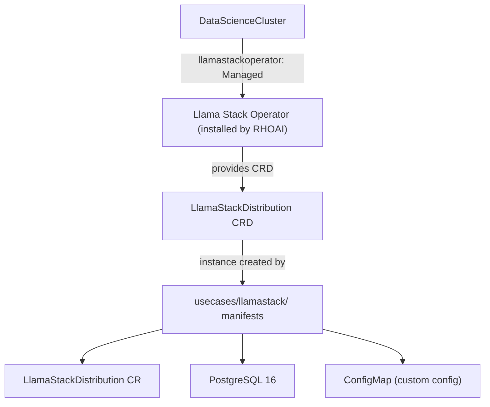
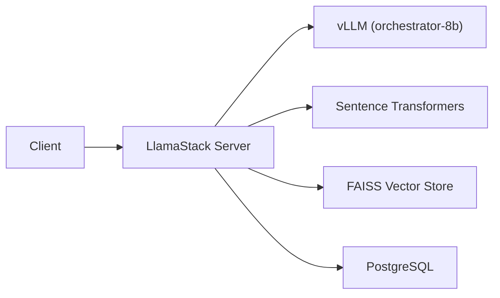

# LlamaStack

LlamaStack is Meta's open framework for building AI applications with agents, RAG, tool use, and safety. RHOAI 3.3 includes a **Llama Stack Operator** as a DSC component (`llamastackoperator`) that installs the operator and its `LlamaStackDistribution` CRD. This use case deploys a **specific LlamaStack instance** on top of that operator.

## How It Works -- Two Layers



| Layer | What | Who manages it | Path in this repo |
|-------|------|----------------|-------------------|
| **Operator** (DSC component) | Installs the Llama Stack Operator and `LlamaStackDistribution` CRD | RHOAI Operator via the DSC | `components/instances/rhoai-instance/` -- set `llamastackoperator: Managed` |
| **Instance** (use case) | Creates a `LlamaStackDistribution` CR, PostgreSQL database, and custom config | This repo's use case manifests | `usecases/llamastack/` |

The operator must be installed first (via the DSC) before the use case manifests can create an instance.

## What This Use Case Deploys

| Component | Resource | Description |
|-----------|----------|-------------|
| `llamastack` | `LlamaStackDistribution` CR | Runs the LlamaStack server (agents, inference, safety, eval, vector I/O) using a custom patched image |
| `postgres` | Deployment + PVC + Service | PostgreSQL 16 for agent state, conversations, and metadata |
| `llamastack-custom-config` | ConfigMap | LlamaStack v2 config with vLLM inference, FAISS, sentence-transformers, and tool runtimes |

## Architecture



LlamaStack connects to the ToolOrchestra `orchestrator-8b` model via the in-cluster service endpoint for inference, and uses local sentence-transformers for embeddings and FAISS for vector storage.

## Prerequisites

### 1. RHOAI Platform with LlamaStack Operator Enabled

The `llamastackoperator` DSC component must be set to `Managed`. This is included in the `full` and `dev` DSC overlays. If using a custom overlay, add:

```yaml
- op: replace
  path: /spec/components/llamastackoperator/managementState
  value: Managed
```

### 2. Official Dependencies (per RHOAI 3.3 Installation Guide)

!!! warning "Required before enabling `llamastackoperator` in the DSC"
    The [official RHOAI 3.3 documentation](https://docs.redhat.com/en/documentation/red_hat_openshift_ai_self-managed/3.3/html/installing_and_uninstalling_openshift_ai_self-managed/installing-and-deploying-openshift-ai_install) (Section 3.1.2) lists these requirements:

    - **Red Hat OpenShift Service Mesh Operator 3.x**
    - **cert-manager Operator**
    - **GPU-enabled nodes** -- NFD Operator + NVIDIA GPU Operator installed, GPU worker nodes available
    - **S3-compatible object storage** -- for model artifacts and data persistence

### 3. Secrets

!!! warning "Secrets required"
    This use case requires three Secrets that are **not** included in the repository (they contain credentials):

    - `postgres-secret` -- key: `password` (PostgreSQL password)
    - `llama-stack-secret` -- keys: `INFERENCE_MODEL`, `VLLM_URL`, `VLLM_TLS_VERIFY`, `VLLM_API_TOKEN`, `VLLM_MAX_TOKENS`
    - `gemini-secret` -- key: `api_key` (optional, for Gemini provider)

    Create these in the `llamastack` namespace before deploying.

### 4. Inference Backend

!!! info "Dependency on ToolOrchestra"
    The LlamaStack config references `orchestrator-8b-predictor.orchestrator-rhoai.svc.cluster.local`. Deploy ToolOrchestra first, or update the vLLM endpoint in the ConfigMap to point to your own model.

## Deploy

=== "GitOps"

    LlamaStack is auto-deployed by the `cluster-usecases` ApplicationSet when using the `tier1-minimal` profile.

    After bootstrapping the cluster, the `usecase-llamastack` Application is created automatically. Ensure the required Secrets exist in the `llamastack` namespace.

=== "Manual"

    ```bash
    # 1. Ensure the LlamaStack Operator is installed (DSC component)
    #    Use the full or dev overlay, or a custom overlay with llamastackoperator: Managed
    oc apply -k components/instances/rhoai-instance/overlays/full/

    # 2. Create the namespace and secrets
    oc new-project llamastack
    oc create secret generic postgres-secret --from-literal=password=<your-password> -n llamastack
    oc create secret generic llama-stack-secret \
      --from-literal=INFERENCE_MODEL=<model-id> \
      --from-literal=VLLM_URL=<vllm-endpoint> \
      --from-literal=VLLM_TLS_VERIFY=false \
      --from-literal=VLLM_API_TOKEN=<token> \
      --from-literal=VLLM_MAX_TOKENS=4096 \
      -n llamastack

    # 3. Deploy the LlamaStack instance
    oc apply -k usecases/llamastack/profiles/tier1-minimal/
    ```

## Verify

```bash
# Check the LlamaStack Operator is running (installed by DSC)
oc get pods -n redhat-ods-applications -l app.kubernetes.io/name=llama-stack-operator

# Check PostgreSQL is running
oc get pods -n llamastack -l app=postgres

# Check LlamaStack distribution is ready
oc get llamastackdistribution -n llamastack

# Check the route
oc get route -n llamastack
```

## Sync Wave Ordering

| Wave | Resources | Purpose |
|------|-----------|---------|
| -1 (default) | Namespace, PostgreSQL (Deployment, PVC, Service) | Infrastructure and database ready first |
| 0 | ConfigMap (`llamastack-custom-config`) | Configuration available before server starts |
| 1 | LlamaStackDistribution CR | Server starts after database and config are ready |

## Capabilities

The LlamaStack server exposes these APIs:

| API | Provider | Description |
|-----|----------|-------------|
| Inference | `remote::vllm` | Proxies to vLLM-served models |
| Agents | `inline::meta-reference` | Stateful agent conversations with tool use |
| Vector I/O | `inline::faiss` | In-memory vector storage for RAG |
| Safety | `inline::llama-guard` | Content safety filtering |
| Eval | `inline::meta-reference` | Model evaluation benchmarks |
| Tool Runtime | `remote::tavily-search`, `inline::rag-runtime` | Web search and RAG tools |
| Embeddings | `inline::sentence-transformers` | Local embedding model (`nomic-embed-text-v1.5`) |

## Customization

To change the inference backend, edit the `llamastack-custom-config` ConfigMap in `usecases/llamastack/manifests/instance/llamastack-custom-config.yaml`. The `vllm-inference` provider section controls the model endpoint:

```yaml
providers:
  inference:
  - provider_id: vllm-inference
    provider_type: remote::vllm
    config:
      base_url: ${env.VLLM_URL}
      max_tokens: ${env.VLLM_MAX_TOKENS:=4096}
      api_token: ${env.VLLM_API_TOKEN:=fake}
```

Update the `llama-stack-secret` with your model's endpoint and credentials.
