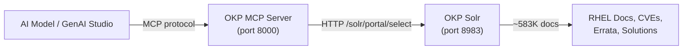

# Red Hat OKP MCP Server

The Red Hat Offline Knowledge Portal (OKP) MCP server bridges LLM tool calls to a Solr index containing ~583K Red Hat knowledge base documents. AI models can search RHEL documentation, CVEs, errata, solutions, and technical articles via natural language.

## Architecture



Two containers work together:

- **OKP Solr** -- The indexed Red Hat knowledge base (`registry.redhat.io/offline-knowledge-portal/rhokp-rhel9`), containing documentation, CVEs, errata, solutions, and articles in a Solr core
- **OKP MCP Server** -- A Python FastMCP application (`quay.io/redhat-user-workloads/rhel-lightspeed-tenant/okp-mcp`) that exposes search tools over the MCP protocol

## What Gets Deployed

| Component | Resource | Description |
|-----------|----------|-------------|
| `rhokp-solr` | Deployment + PVC (10Gi) | OKP Solr index with ~583K RHEL documents |
| `rhokp-mcp` | Deployment | MCP server exposing search tools on port 8000 |
| `rhokp-solr` | Service | In-cluster access to Solr on port 8983 |
| `rhokp-mcp` | Service + Route | In-cluster service and external TLS route for MCP |
| `okp-access-secret` | Secret | OKP access key for the Solr image |
| `rhokp-sa` | ServiceAccount | Dedicated service account |

## MCP Tools

The OKP MCP server exposes 6 search tools:

| Tool | Description |
|------|-------------|
| `search_documentation` | Search RHEL documentation with product/version boosting and deprecation detection |
| `search_solutions` | Search troubleshooting content, error messages, and known issues |
| `search_cves` | Search CVE security advisories with optional severity filter |
| `search_errata` | Search errata (security, bug fix, enhancement) with type/severity filters |
| `search_articles` | Search general technical articles and best practices |
| `get_document` | Fetch full document content by ID with BM25-scored passage extraction |

## Prerequisites

| Requirement | Why |
|-------------|-----|
| RHOAI platform (DSC Ready) | Namespace and dashboard integration |
| `registry.redhat.io` pull access | OKP Solr image requires Red Hat registry authentication |
| OKP access key | Required by the Solr image (`OKP_ACCESS_KEY`) |
| `dashboard-config` instance | Enables GenAI Studio in the RHOAI dashboard |
| `mcp-servers` instance | Registers OKP as an MCP server in the dashboard |

!!! warning "Secrets required"
    The included `okp-access-secret.yaml` contains a placeholder value (`OKP_ACCESS_KEY: CHANGE_ME`). Update `usecases/services/rhokp/manifests/server/okp-access-secret.yaml` with your OKP access key before deploying. For production, use SealedSecrets or ExternalSecrets.

!!! warning "Pull secret for registry.redhat.io"
    The OKP Solr image is pulled from `registry.redhat.io`. OpenShift clusters typically have a global pull secret configured for Red Hat registries. If not, create a pull secret in the `rhokp` namespace with your Red Hat registry credentials.

## Deploy

=== "GitOps"

    OKP is auto-deployed by the `cluster-services` ApplicationSet when using the `tier1-minimal` profile.

    After bootstrapping the cluster, the `service-rhokp` Application is created automatically. The `instance-mcp-servers` Application (auto-discovered by the `cluster-instances` AppSet) registers it in the RHOAI dashboard.

=== "Manual"

    ```bash
    # 1. Update the OKP access key secret
    #    Edit usecases/services/rhokp/manifests/server/okp-access-secret.yaml

    # 2. Deploy OKP (Solr + MCP server)
    oc apply -k usecases/services/rhokp/profiles/tier1-minimal/

    # 3. Wait for Solr to be ready (index loading takes a few minutes)
    oc wait --for=condition=Available deployment/rhokp-solr \
      -n rhokp --timeout=600s

    # 4. Wait for MCP server to be ready
    oc wait --for=condition=Available deployment/rhokp-mcp \
      -n rhokp --timeout=300s

    # 5. Register as MCP server in the RHOAI dashboard
    oc apply -k components/instances/dashboard-config/
    oc apply -k components/instances/mcp-servers/
    ```

## Verify

```bash
# Check pods are running
oc get pods -n rhokp

# Check the route
oc get route rhokp-mcp -n rhokp

# Test the MCP endpoint
curl -s "https://$(oc get route rhokp-mcp -n rhokp -o jsonpath='{.spec.host}')/mcp" \
  -H "Content-Type: application/json" \
  -d '{"jsonrpc":"2.0","method":"tools/list","id":1}'
```

## Sync Wave Ordering

| Wave | Resources | Purpose |
|------|-----------|---------|
| 0 (default) | Namespace, ServiceAccount, Secret, PVC, Solr Deployment, Solr Service | Solr infrastructure ready first |
| 1 | MCP Deployment, MCP Service | MCP server starts after Solr is available |
| 2 | Route | External access created after MCP service exists |

## Customization

The OKP MCP server connects to Solr via the `SOLR_URL` environment variable. To point at a different Solr instance, update the `SOLR_URL` and `MCP_SOLR_URL` values in `usecases/services/rhokp/manifests/server/mcp-deployment.yaml`.

The Solr PVC defaults to 10Gi. Increase this if the OKP index grows beyond the default allocation by editing `usecases/services/rhokp/manifests/server/solr-pvc.yaml`.
